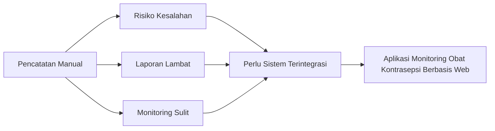

# BAB I
# PENDAHULUAN

## 1.1 Latar Belakang

Perkembangan teknologi informasi pada era digital saat ini telah membawa perubahan yang sangat signifikan dalam berbagai sektor kehidupan, termasuk dalam bidang kesehatan dan pelayanan publik. Kemajuan teknologi informasi memungkinkan berbagai aktivitas pengolahan data dan penyampaian informasi dapat dilakukan secara lebih cepat, akurat, dan efisien. Dalam konteks organisasi modern, teknologi informasi tidak hanya berfungsi sebagai alat bantu administrasi, tetapi juga sebagai sarana strategis dalam mendukung proses pengambilan keputusan. Pemanfaatan sistem informasi yang terintegrasi mampu membantu organisasi dalam mengelola data secara sistematis, memantau kegiatan operasional, serta meningkatkan kualitas pelayanan kepada masyarakat. Salah satu bentuk pemanfaatan teknologi informasi yang berkembang pesat saat ini adalah sistem informasi berbasis web, yang memungkinkan akses informasi secara real-time, fleksibel, dan dapat digunakan oleh banyak pengguna secara bersamaan tanpa terbatas oleh lokasi maupun waktu.

Dalam sektor kesehatan masyarakat, pemanfaatan teknologi informasi memiliki peran yang sangat penting dalam mendukung efektivitas pelayanan kesehatan serta pengelolaan berbagai program kesehatan yang dijalankan oleh pemerintah. Salah satu program kesehatan yang menjadi prioritas pemerintah Indonesia adalah program Keluarga Berencana (KB). Program Keluarga Berencana merupakan upaya pemerintah dalam mengendalikan laju pertumbuhan penduduk serta meningkatkan kualitas hidup masyarakat melalui pengaturan jumlah dan jarak kelahiran. Program ini tidak hanya berperan dalam pengendalian jumlah penduduk, tetapi juga berkontribusi dalam meningkatkan kesejahteraan keluarga, kesehatan ibu dan anak, serta pembangunan sosial dan ekonomi masyarakat secara berkelanjutan.

Pelaksanaan program Keluarga Berencana dilakukan melalui berbagai kegiatan pelayanan kesehatan reproduksi, salah satunya melalui penyediaan alat dan obat kontrasepsi bagi masyarakat. Alat dan obat kontrasepsi tersebut didistribusikan melalui berbagai fasilitas pelayanan kesehatan seperti puskesmas, klinik, rumah sakit, serta bidan praktik mandiri yang berada di bawah koordinasi instansi terkait, salah satunya Dinas Pengendalian Penduduk dan Keluarga Berencana Kota Sukabumi. Dalam pelaksanaan program tersebut, ketersediaan stok alat dan obat kontrasepsi menjadi faktor yang sangat penting dalam menjamin kelancaran pelayanan kepada masyarakat. Apabila ketersediaan stok tidak terkelola dengan baik, maka dapat mengakibatkan terjadinya kekurangan stok (*stock out*) yang dapat menghambat pelayanan kepada masyarakat. Sebaliknya, apabila pengelolaan stok tidak terkontrol dengan baik juga dapat menyebabkan terjadinya penumpukan stok yang berpotensi mengakibatkan obat menjadi kedaluwarsa sehingga menimbulkan kerugian bagi instansi terkait.

Pengelolaan stok obat kontrasepsi yang efektif dan efisien sangat diperlukan untuk memastikan bahwa setiap fasilitas pelayanan kesehatan memiliki ketersediaan stok yang cukup sesuai dengan kebutuhan masyarakat. Proses monitoring stok yang baik juga dapat membantu instansi terkait dalam melakukan perencanaan distribusi obat secara tepat, sehingga tidak terjadi ketimpangan distribusi antara satu fasilitas kesehatan dengan fasilitas kesehatan lainnya. Oleh karena itu, sistem pengelolaan stok yang terstruktur dan terintegrasi menjadi salah satu faktor penting dalam menunjang keberhasilan program keluarga berencana.

Namun demikian, dalam praktiknya pengelolaan stok obat kontrasepsi pada beberapa instansi pemerintah masih dilakukan secara manual atau menggunakan pencatatan sederhana seperti lembar kerja Microsoft Excel. Sistem pencatatan manual tersebut sering kali menimbulkan berbagai permasalahan, seperti kesalahan pencatatan data, keterlambatan dalam proses pelaporan, kesulitan dalam memantau ketersediaan stok secara berkala, serta kurang efektifnya proses pengambilan keputusan dalam hal distribusi obat kontrasepsi. Selain itu, sistem manual juga memiliki keterbatasan dalam hal integrasi data dan akses informasi, sehingga proses monitoring stok tidak dapat dilakukan secara real-time oleh pihak yang berkepentingan. Penelitian yang dilakukan oleh Firdaus Dika Permana dkk. (2025) menunjukkan bahwa sistem pencatatan persediaan obat yang masih dilakukan secara manual memiliki tingkat risiko kesalahan yang cukup tinggi, terutama dalam hal pencatatan keluar masuknya barang serta penyusunan laporan stok. Hal tersebut dapat menyebabkan ketidaksesuaian antara data stok yang tercatat dengan kondisi stok yang sebenarnya di lapangan, sehingga berdampak pada kurang efektifnya proses pengelolaan persediaan obat.

Oleh karena itu, diperlukan suatu sistem informasi yang mampu membantu proses pencatatan dan pemantauan stok secara lebih akurat dan sistematis. Penelitian lain yang dilakukan oleh Surono dan Yulia (2023) menunjukkan bahwa penerapan sistem informasi *inventory* obat berbasis komputer mampu meningkatkan efisiensi proses pengelolaan stok obat serta mempermudah proses monitoring ketersediaan obat secara lebih terstruktur. Dengan adanya sistem informasi tersebut, proses pencatatan keluar masuknya obat dapat dilakukan secara otomatis sehingga risiko kesalahan pencatatan dapat diminimalkan. Selain itu, sistem informasi juga memungkinkan penyusunan laporan stok obat dilakukan secara lebih cepat dan akurat.

Selanjutnya, penelitian yang dilakukan oleh Nabila Pramesti Evykasari dkk. (2025) mengenai sistem informasi manajemen persediaan obat berbasis web menunjukkan bahwa penerapan sistem informasi berbasis web mampu meningkatkan efektivitas pengelolaan obat melalui penyediaan informasi stok secara real-time. Sistem tersebut juga dilengkapi dengan fitur notifikasi yang dapat memberikan peringatan apabila stok mendekati batas minimum atau masa kedaluwarsa, sehingga dapat membantu pihak pengelola dalam melakukan pengambilan keputusan secara lebih cepat dan tepat. Selain itu, penelitian yang dilakukan oleh Zainudin dkk. (2024) juga menunjukkan bahwa sistem informasi persediaan berbasis web mampu meningkatkan akurasi data persediaan serta mempermudah proses distribusi obat pada fasilitas kesehatan. Dengan adanya sistem monitoring berbasis web, pihak pengelola dapat memantau kondisi obat secara langsung tanpa harus melakukan pengecekan secara manual di setiap fasilitas pelayanan kesehatan.

Berdasarkan berbagai penelitian terdahulu tersebut dapat diketahui bahwa penerapan sistem informasi berbasis web dalam pengelolaan persediaan obat memiliki banyak manfaat, antara lain meningkatkan efisiensi pengelolaan stok, meningkatkan akurasi data, mempercepat proses pelaporan, serta mempermudah proses monitoring dan pengambilan keputusan. Namun demikian, sebagian besar penelitian sebelumnya lebih banyak berfokus pada sistem informasi persediaan obat di apotek, rumah sakit, maupun fasilitas pelayanan kesehatan secara umum. Sementara itu, penelitian yang secara khusus membahas mengenai sistem monitoring obat kontrasepsi pada instansi pemerintah yang bertanggung jawab dalam pengelolaan program keluarga berencana masih relatif terbatas.

Kondisi tersebut menunjukkan adanya *research gap*, yaitu masih terbatasnya penelitian yang secara khusus mengkaji dan merancang sistem informasi monitoring obat kontrasepsi pada instansi pemerintah seperti Dinas Pengendalian Penduduk dan Keluarga Berencana Kota Sukabumi. Padahal, pengelolaan obat kontrasepsi yang efektif merupakan salah satu faktor penting dalam menunjang keberhasilan pelaksanaan program keluarga berencana serta dalam memastikan bahwa masyarakat dapat memperoleh pelayanan kontrasepsi secara optimal. Secara teoritis, penelitian ini didasarkan pada *grand theory* sistem informasi yang menyatakan bahwa sistem informasi merupakan suatu sistem yang terdiri dari berbagai komponen yang saling berinteraksi untuk mengumpulkan, mengolah, menyimpan, serta mendistribusikan informasi guna mendukung kegiatan operasional dan proses pengambilan keputusan dalam suatu organisasi. Sistem informasi yang dirancang dengan baik mampu membantu organisasi dalam mengelola data secara lebih efektif serta menyediakan informasi yang akurat dan tepat waktu bagi pihak yang membutuhkan.

Selain itu, penelitian ini juga didukung oleh teori manajemen persediaan (*inventory management*) yang menjelaskan bahwa pengelolaan persediaan bertujuan untuk memastikan ketersediaan barang dalam jumlah yang tepat, pada waktu yang tepat, serta dengan biaya yang efisien (Zwaida dkk., 2021). Dalam konteks pelayanan kesehatan, pengelolaan persediaan obat merupakan aspek yang sangat penting karena berkaitan langsung dengan kualitas pelayanan yang diberikan kepada masyarakat. Dengan memanfaatkan teknologi sistem informasi berbasis web, proses monitoring stok obat kontrasepsi dapat dilakukan secara lebih efektif karena data dapat disimpan secara terintegrasi, diakses secara real-time, serta dapat menghasilkan laporan secara otomatis. Selain itu, sistem berbasis web juga memungkinkan pihak pengelola untuk melakukan pemantauan stok secara lebih mudah dan cepat tanpa harus melakukan pengecekan manual di setiap fasilitas pelayanan kesehatan.

Berdasarkan uraian latar belakang tersebut, dapat disimpulkan bahwa pengelolaan monitoring obat kontrasepsi yang masih dilakukan secara manual memiliki berbagai keterbatasan dalam hal pencatatan, monitoring, serta pelaporan. Oleh karena itu, diperlukan suatu sistem informasi yang mampu membantu proses monitoring obat kontrasepsi secara lebih efektif, efisien, dan terintegrasi. Dengan demikian, penulis tertarik untuk melakukan penelitian dengan judul **“Perancangan Aplikasi Monitoring Obat Kontrasepsi di Dinas Pengendalian Penduduk dan Keluarga Berencana Kota Sukabumi Berbasis Web.”** Penelitian ini diharapkan dapat menghasilkan sebuah aplikasi yang mampu membantu proses pengelolaan data obat kontrasepsi secara lebih terstruktur, meningkatkan akurasi data, serta mempermudah proses monitoring sehingga dapat mendukung keberhasilan pelaksanaan program keluarga berencana di Kota Sukabumi.

Gambar 1.1. Alur permasalahan dan kebutuhan sistem.

## 1.2 Identifikasi Masalah

Berdasarkan latar belakang yang telah diuraikan, maka dapat diidentifikasi beberapa permasalahan sebagai berikut:

- proses pengelolaan stok obat kontrasepsi masih dilakukan secara manual,
- pencatatan stok masuk dan stok keluar belum terintegrasi dalam satu sistem,
- monitoring jumlah stok dan kondisi kedaluwarsa obat masih sulit dilakukan secara cepat,
- penyusunan laporan stok memerlukan waktu yang lebih lama karena dilakukan secara manual,
- risiko kesalahan pencatatan dan selisih stok masih cukup tinggi.

## 1.3 Rumusan Masalah

Berdasarkan identifikasi masalah tersebut, maka rumusan masalah dalam penelitian ini adalah sebagai berikut:

- bagaimana merancang aplikasi monitoring obat kontrasepsi berbasis web yang dapat membantu pengelolaan stok secara terintegrasi,
- bagaimana membangun sistem yang mampu mencatat stok masuk, stok keluar, dan penyesuaian stok secara akurat,
- bagaimana menyediakan fitur monitoring stok dan kedaluwarsa obat secara lebih cepat dan informatif,
- bagaimana menghasilkan laporan stok obat kontrasepsi yang lebih terstruktur dan mudah digunakan.

## 1.4 Batasan Masalah

Agar penelitian lebih terarah dan tidak menyimpang dari tujuan yang ingin dicapai, maka penelitian ini dibatasi pada hal-hal berikut:

- aplikasi yang dibangun berbasis web,
- sistem dikembangkan menggunakan framework Laravel,
- basis data yang digunakan adalah MySQL atau MariaDB,
- aplikasi difokuskan pada pengelolaan data obat kontrasepsi,
- proses yang dibahas meliputi master data, stok masuk, stok keluar, penyesuaian stok, monitoring stok, monitoring batch dan kedaluwarsa, laporan, dan manajemen pengguna,
- aplikasi tidak membahas integrasi dengan sistem eksternal lain,
- aplikasi ditujukan untuk penggunaan internal pada instansi pengelola stok obat kontrasepsi.

## 1.5 Tujuan Penelitian

Tujuan yang ingin dicapai dalam penelitian ini adalah:

- merancang sistem informasi monitoring obat kontrasepsi berbasis web,
- membangun aplikasi yang dapat mengelola data obat, transaksi stok, dan laporan secara terintegrasi,
- mempermudah proses monitoring stok obat kontrasepsi secara real-time,
- mengurangi risiko kesalahan pencatatan dalam pengelolaan stok,
- membantu penyusunan laporan stok secara lebih cepat dan akurat.

## 1.6 Manfaat Penelitian

Penelitian ini diharapkan memberikan manfaat sebagai berikut:

### 1.6.1 Bagi Instansi

- membantu instansi dalam mengelola stok obat kontrasepsi secara lebih terstruktur,
- mempermudah proses monitoring persediaan obat,
- mempercepat proses penyusunan laporan,
- mendukung pengambilan keputusan berdasarkan data yang lebih akurat.

### 1.6.2 Bagi Pengguna

- mempermudah petugas dalam melakukan pencatatan stok masuk dan stok keluar,
- membantu pengguna dalam mengetahui kondisi stok terkini,
- mempermudah pengguna dalam menelusuri data batch dan kedaluwarsa obat.

### 1.6.3 Bagi Peneliti

- menambah pengalaman dalam merancang dan membangun aplikasi berbasis web,
- menerapkan ilmu yang diperoleh selama perkuliahan ke dalam kasus nyata,
- menjadi bahan referensi untuk pengembangan penelitian sejenis di masa mendatang.

## 1.7 Metode Penelitian

Metode penelitian yang digunakan dalam penyusunan tugas akhir ini meliputi beberapa tahapan, yaitu:

- analisis kebutuhan, yaitu mengidentifikasi masalah, pengguna, dan kebutuhan sistem,
- perancangan sistem, yaitu menyusun rancangan basis data, alur proses, dan antarmuka,
- implementasi sistem, yaitu membangun aplikasi menggunakan Laravel dan MySQL/MariaDB,
- pengujian sistem, yaitu menguji fungsi aplikasi menggunakan metode *black box testing*.

Gambar 1.2. Tahapan metode penelitian.

## 1.8 Sistematika Penulisan

Sistematika penulisan tugas akhir ini disusun agar pembahasan lebih terarah, dengan uraian sebagai berikut:

- **BAB I Pendahuluan**, berisi latar belakang, identifikasi masalah, rumusan masalah, batasan masalah, tujuan penelitian, manfaat penelitian, metode penelitian, dan sistematika penulisan.
- **BAB II Landasan Teoritis**, berisi teori-teori yang mendukung penelitian, seperti konsep sistem, sistem informasi, persediaan, monitoring, aplikasi web, Laravel, basis data, dan konsep lain yang relevan.
- **BAB III Metodologi Penelitian atau Analisis dan Perancangan Sistem**, berisi penjelasan mengenai metode pengumpulan data, analisis kebutuhan sistem, perancangan proses, perancangan basis data, dan rancangan antarmuka.
- **BAB IV Hasil dan Pembahasan**, berisi implementasi sistem, hasil pengujian, pembahasan fitur aplikasi, serta analisis terhadap hasil yang diperoleh.
- **BAB V Penutup**, berisi kesimpulan dan saran berdasarkan hasil penelitian yang telah dilakukan.
