# BAB II
# LANDASAN TEORITIS

## 2.1 Konsep Sistem

Sistem adalah sekumpulan elemen yang saling berhubungan dan bekerja sama untuk mencapai tujuan tertentu. Elemen-elemen dalam sistem dapat berupa manusia, prosedur, data, perangkat keras, maupun perangkat lunak. Suatu sistem dikatakan berjalan dengan baik apabila setiap elemen di dalamnya saling mendukung dan menghasilkan keluaran yang sesuai dengan tujuan yang telah ditetapkan.

Secara umum, sistem memiliki beberapa karakteristik, yaitu:

- mempunyai komponen atau elemen,
- memiliki batas sistem,
- mempunyai lingkungan luar,
- memiliki masukan (*input*),
- memiliki proses pengolahan,
- menghasilkan keluaran (*output*),
- memiliki tujuan atau sasaran tertentu.

Dengan adanya sistem, suatu pekerjaan dapat dilakukan secara lebih teratur, terstruktur, dan mudah dikendalikan.

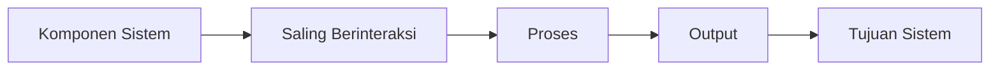

Gambar 2.1. Diagram umum konsep sistem.

## 2.2 Konsep Informasi

Informasi adalah data yang telah diolah sehingga memiliki makna dan dapat digunakan untuk membantu proses pengambilan keputusan. Data yang masih mentah belum dapat langsung digunakan, sehingga perlu diproses terlebih dahulu agar menjadi informasi yang berguna.

Informasi yang baik harus memenuhi beberapa kriteria, yaitu:

- akurat,
- relevan,
- tepat waktu,
- lengkap,
- dapat dipercaya.

Informasi memiliki peranan penting dalam suatu organisasi karena menjadi dasar untuk menjalankan kegiatan operasional, melakukan pengawasan, dan menetapkan kebijakan.

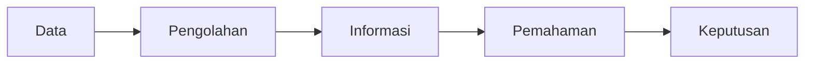

Gambar 2.2. Diagram perubahan data menjadi informasi.

## 2.3 Konsep Sistem Informasi

Sistem informasi adalah kombinasi dari manusia, perangkat keras, perangkat lunak, prosedur, jaringan, dan basis data yang bekerja bersama untuk mengumpulkan, mengolah, menyimpan, dan menyajikan informasi.

Tujuan utama sistem informasi adalah menyediakan informasi yang dibutuhkan oleh pengguna secara cepat dan tepat. Dengan adanya sistem informasi, proses kerja yang sebelumnya dilakukan secara manual dapat diubah menjadi lebih efektif dan efisien.

Komponen sistem informasi secara umum terdiri atas:

- input,
- process,
- output,
- database,
- control,
- technology,
- user.

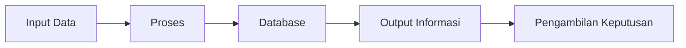

Gambar 2.3. Diagram umum alur kerja sistem informasi.

## 2.4 Konsep Sistem Informasi Manajemen

Sistem Informasi Manajemen adalah sistem informasi yang digunakan untuk mendukung kegiatan manajerial dalam organisasi. Sistem ini menyediakan informasi yang dibutuhkan untuk perencanaan, pengendalian, pelaksanaan, dan pengambilan keputusan.

Sistem Informasi Manajemen berfungsi untuk:

- menyediakan informasi bagi manajemen,
- mendukung kegiatan operasional,
- membantu pengawasan terhadap aktivitas organisasi,
- meningkatkan efektivitas pengambilan keputusan.

Dengan adanya Sistem Informasi Manajemen, organisasi dapat mengelola data dengan lebih baik dan menghasilkan informasi yang lebih cepat dibandingkan metode manual.

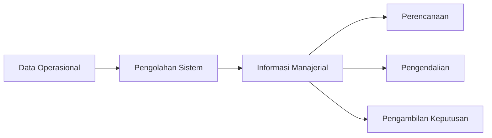

Gambar 2.4. Diagram umum Sistem Informasi Manajemen.

## 2.5 Konsep Aplikasi

Aplikasi adalah perangkat lunak yang dirancang untuk membantu pengguna menyelesaikan tugas atau pekerjaan tertentu. Aplikasi dibuat sesuai kebutuhan pengguna dan dapat digunakan untuk berbagai bidang, seperti pendidikan, kesehatan, pemerintahan, bisnis, dan industri.

Karakteristik umum aplikasi adalah:

- memiliki fungsi tertentu,
- dapat menerima input,
- dapat melakukan proses pengolahan,
- menghasilkan output,
- mempermudah pekerjaan pengguna.

Berdasarkan platformnya, aplikasi dapat dibedakan menjadi aplikasi desktop, aplikasi web, dan aplikasi mobile.

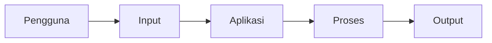

Gambar 2.5. Diagram umum alur kerja aplikasi.

## 2.6 Konsep Persediaan

Persediaan adalah sejumlah barang yang disimpan untuk digunakan atau didistribusikan pada waktu tertentu. Persediaan memegang peranan penting dalam kegiatan operasional karena berhubungan langsung dengan ketersediaan barang yang dibutuhkan.

Tujuan pengelolaan persediaan antara lain:

- menjamin ketersediaan barang,
- menghindari kekurangan stok,
- mencegah kelebihan stok,
- menjaga kelancaran operasional,
- membantu pengendalian barang.

Persediaan yang dikelola dengan baik dapat mendukung kelancaran proses kerja dan mengurangi risiko gangguan pelayanan.

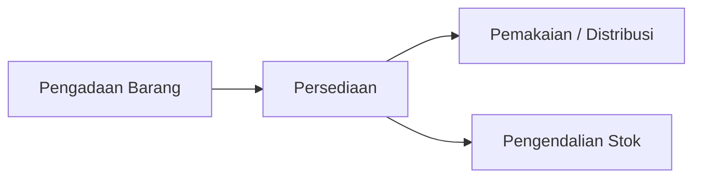

Gambar 2.6. Diagram umum konsep persediaan.

## 2.7 Konsep Sistem Informasi Persediaan

Sistem informasi persediaan adalah sistem yang digunakan untuk mengelola data persediaan barang, mulai dari pencatatan barang masuk, barang keluar, stok tersisa, hingga pelaporan. Sistem ini membantu organisasi dalam mengetahui kondisi persediaan secara cepat dan akurat.

Sistem informasi persediaan umumnya mencakup:

- pengelolaan data barang,
- pencatatan barang masuk,
- pencatatan barang keluar,
- penyesuaian stok,
- monitoring persediaan,
- penyusunan laporan.

Penerapan sistem informasi persediaan dapat mengurangi kesalahan pencatatan dan meningkatkan efisiensi pengelolaan stok.

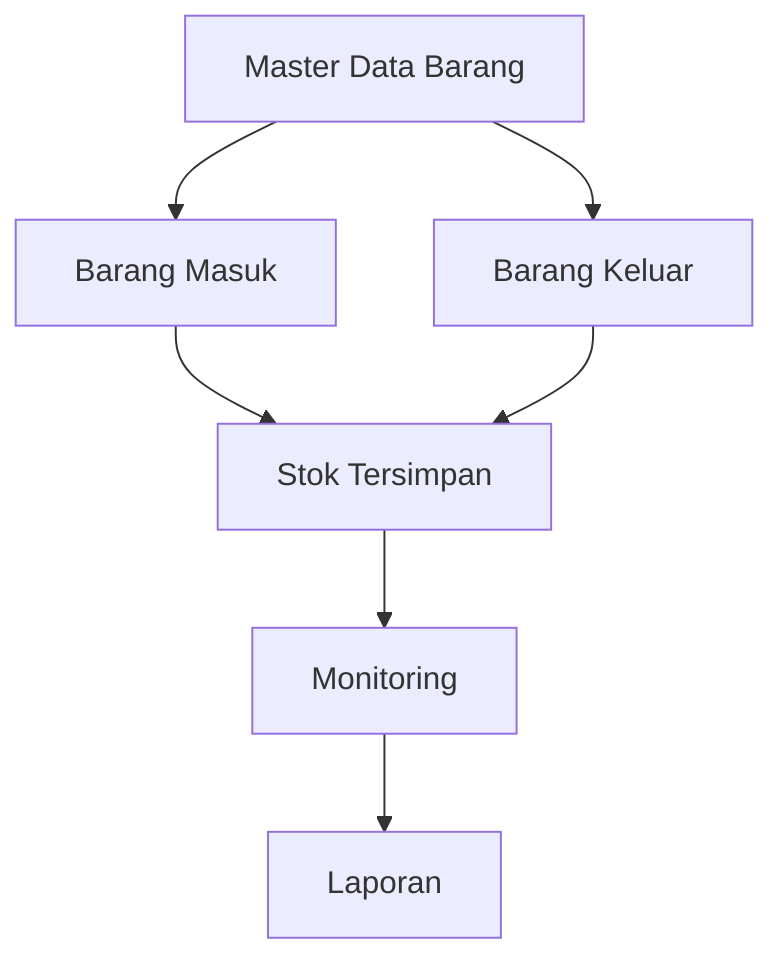

Gambar 2.7. Diagram umum sistem informasi persediaan.

## 2.8 Konsep Monitoring

Monitoring adalah kegiatan pengamatan dan pengawasan yang dilakukan secara terus-menerus terhadap suatu proses atau objek tertentu. Tujuan monitoring adalah memastikan bahwa suatu kegiatan berjalan sesuai rencana serta mendeteksi masalah sejak dini.

Dalam konteks persediaan, monitoring dilakukan untuk mengetahui:

- jumlah stok yang tersedia,
- kondisi stok yang menipis,
- barang yang sudah atau hampir kedaluwarsa,
- riwayat pergerakan barang.

Monitoring yang baik akan membantu organisasi melakukan tindakan korektif secara cepat apabila terjadi penyimpangan.

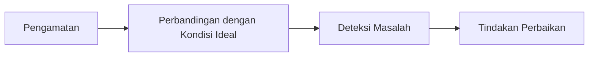

Gambar 2.8. Diagram umum proses monitoring.

## 2.9 Konsep Obat Kontrasepsi

Obat kontrasepsi adalah produk yang digunakan dalam program keluarga berencana untuk membantu mencegah atau menjarangkan kehamilan. Pengelolaan obat kontrasepsi harus dilakukan dengan baik karena berhubungan langsung dengan pelayanan kesehatan masyarakat.

Dalam pengelolaan logistik kesehatan, obat kontrasepsi memiliki karakteristik khusus, yaitu:

- memiliki masa kedaluwarsa,
- memerlukan pencatatan yang akurat,
- harus tersedia secara berkesinambungan,
- memerlukan pengawasan distribusi.

Oleh karena itu, pengelolaan obat kontrasepsi perlu didukung oleh sistem informasi yang mampu mencatat stok dan distribusi secara terstruktur.

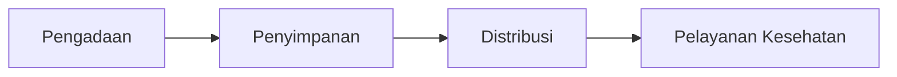

Gambar 2.9. Diagram umum alur pengelolaan obat kontrasepsi.

## 2.10 Konsep Batch

Batch adalah kelompok barang yang diproduksi, diterima, atau disimpan dalam satu kelompok tertentu dan biasanya memiliki nomor identifikasi yang sama. Nomor batch digunakan untuk mempermudah penelusuran barang, terutama pada produk kesehatan dan farmasi.

Pencatatan batch penting karena:

- mempermudah pelacakan asal barang,
- membantu pengendalian jumlah stok per kelompok,
- memudahkan pemantauan tanggal kedaluwarsa,
- mendukung audit dan pengawasan distribusi.

Dalam sistem persediaan obat, data batch menjadi salah satu komponen penting agar stok tidak hanya dilihat sebagai jumlah total, tetapi juga sebagai stok per kelompok barang.

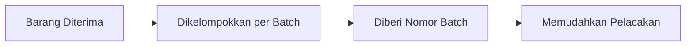

Gambar 2.10. Diagram umum konsep batch.

## 2.11 Konsep Kedaluwarsa

Kedaluwarsa adalah batas waktu suatu produk masih layak digunakan. Setelah melewati tanggal kedaluwarsa, suatu produk dapat mengalami penurunan kualitas atau tidak lagi aman digunakan.

Pada pengelolaan persediaan, data tanggal kedaluwarsa penting untuk:

- menentukan prioritas pengeluaran barang,
- mencegah penggunaan barang yang sudah tidak layak,
- memantau barang yang mendekati masa kedaluwarsa,
- membantu pengambilan keputusan distribusi atau pemusnahan.

Pencatatan tanggal kedaluwarsa sangat diperlukan terutama pada pengelolaan obat dan barang medis.

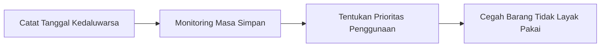

Gambar 2.11. Diagram umum konsep kedaluwarsa.

## 2.12 Konsep FEFO (First Expired First Out)

FEFO (*First Expired First Out*) adalah metode pengeluaran barang berdasarkan tanggal kedaluwarsa terdekat. Artinya, barang yang lebih cepat kedaluwarsa harus dikeluarkan lebih dahulu.

Metode FEFO banyak digunakan dalam pengelolaan produk kesehatan, makanan, dan barang lain yang memiliki batas masa pakai. Tujuan metode ini adalah meminimalkan risiko barang rusak atau kedaluwarsa di tempat penyimpanan.

Keunggulan metode FEFO antara lain:

- mengurangi risiko barang kedaluwarsa,
- meningkatkan efisiensi distribusi,
- menjaga kualitas barang yang digunakan,
- mendukung pengendalian stok yang lebih baik.

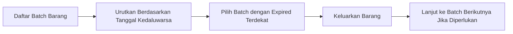

Gambar 2.12. Diagram umum metode FEFO pada pengelolaan persediaan.

## 2.13 Konsep Stok Masuk

Stok masuk adalah proses pencatatan barang yang diterima dan ditambahkan ke dalam persediaan. Barang masuk dapat berasal dari supplier, pusat distribusi, atau sumber lain yang sah.

Pencatatan stok masuk umumnya memuat:

- nomor transaksi,
- tanggal penerimaan,
- sumber barang,
- jenis barang,
- jumlah barang,
- batch barang,
- tanggal kedaluwarsa apabila diperlukan.

Pencatatan stok masuk yang baik menjadi dasar dalam pengendalian persediaan karena menambah jumlah stok yang tersedia.


Gambar 2.13. Diagram umum proses stok masuk.

## 2.14 Konsep Stok Keluar

Stok keluar adalah proses pencatatan barang yang dikeluarkan dari tempat penyimpanan untuk digunakan, dipindahkan, atau didistribusikan. Pencatatan ini penting agar jumlah persediaan di sistem tetap sesuai dengan kondisi sebenarnya.

Data yang biasanya dicatat pada stok keluar meliputi:

- nomor transaksi,
- tanggal pengeluaran,
- tujuan pengeluaran,
- jenis barang,
- jumlah barang,
- batch yang digunakan apabila diperlukan.

Stok keluar yang tercatat dengan baik membantu pengawasan distribusi dan mempermudah pelacakan penggunaan barang.

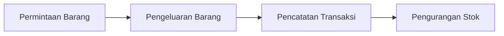

Gambar 2.14. Diagram umum proses stok keluar.

## 2.15 Konsep Penyesuaian Stok

Penyesuaian stok adalah proses koreksi data persediaan di dalam sistem agar sesuai dengan kondisi fisik yang sebenarnya. Penyesuaian biasanya dilakukan saat terjadi selisih antara data di sistem dengan hasil pengecekan langsung di lapangan.

Penyesuaian stok dapat disebabkan oleh beberapa hal, seperti:

- kesalahan pencatatan,
- barang rusak,
- barang kedaluwarsa,
- hasil stok opname yang berbeda dengan data sistem.

Penyesuaian stok penting dilakukan agar data persediaan tetap akurat dan dapat dipercaya.

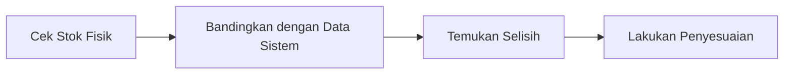

Gambar 2.15. Diagram umum proses penyesuaian stok.

## 2.16 Konsep Kartu Stok

Kartu stok adalah catatan yang menunjukkan riwayat pergerakan suatu barang dalam periode tertentu. Kartu stok memuat transaksi masuk, transaksi keluar, penyesuaian, dan saldo stok setelah setiap transaksi.

Kartu stok berfungsi untuk:

- mengetahui histori pergerakan barang,
- menelusuri perubahan jumlah stok,
- membantu audit persediaan,
- mempermudah pengecekan selisih stok.

Dengan kartu stok, pengguna dapat melihat perjalanan persediaan secara kronologis dari waktu ke waktu.

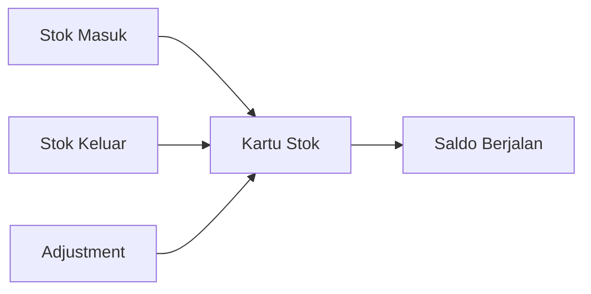

Gambar 2.16. Diagram umum konsep kartu stok.

## 2.17 Konsep Aplikasi Berbasis Web

Aplikasi berbasis web adalah aplikasi yang dijalankan melalui browser dan diakses menggunakan jaringan komputer, baik lokal maupun internet. Aplikasi web tidak memerlukan instalasi di setiap perangkat pengguna karena proses utamanya berjalan pada server.

Keunggulan aplikasi berbasis web antara lain:

- dapat diakses melalui browser,
- mendukung penggunaan multi-user,
- memudahkan pemeliharaan sistem,
- data terpusat pada server,
- lebih mudah diperbarui.

Aplikasi berbasis web banyak digunakan karena fleksibel, praktis, dan efisien untuk lingkungan kerja yang membutuhkan akses bersama.

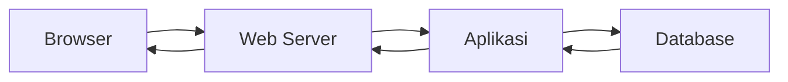

Gambar 2.17. Diagram umum aplikasi berbasis web.

## 2.18 Konsep Framework Laravel

Laravel adalah framework PHP yang digunakan untuk membangun aplikasi web dengan struktur yang rapi dan modern. Laravel menerapkan pola pengembangan MVC (*Model, View, Controller*) sehingga logika aplikasi dapat dipisahkan berdasarkan fungsinya.

Keunggulan Laravel antara lain:

- struktur project yang terorganisasi,
- routing yang jelas,
- dukungan migration dan seeder,
- ORM Eloquent untuk pengelolaan basis data,
- middleware untuk pengaturan hak akses,
- Blade sebagai template engine.

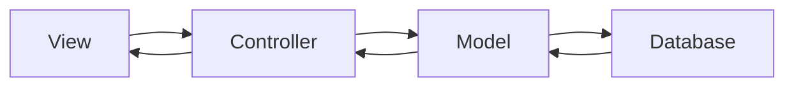

Gambar 2.18. Diagram pola kerja framework Laravel berbasis MVC.

## 2.19 Konsep MySQL

MySQL adalah sistem manajemen basis data relasional yang digunakan untuk menyimpan, mengolah, dan menampilkan data secara terstruktur. MySQL banyak digunakan dalam pengembangan aplikasi web karena stabil, mendukung relasi data, dan mudah diintegrasikan dengan berbagai bahasa pemrograman.

Beberapa kelebihan MySQL antara lain:

- mampu menangani data dalam jumlah besar,
- mendukung relasi antar tabel,
- mudah digunakan,
- memiliki performa yang baik,
- banyak digunakan dalam aplikasi web.

Dalam pengembangan sistem informasi, MySQL berfungsi sebagai tempat penyimpanan data utama yang akan diakses oleh aplikasi.

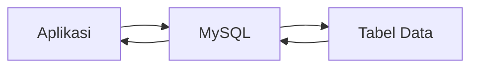

Gambar 2.19. Diagram umum peran MySQL dalam sistem informasi.

## 2.20 Konsep Basis Data

Basis data adalah kumpulan data yang saling berhubungan dan disimpan secara sistematis agar mudah diolah, dicari, dan dikelola kembali. Basis data digunakan untuk menghindari duplikasi data dan meningkatkan konsistensi informasi.

Tujuan penggunaan basis data antara lain:

- menyimpan data secara terpusat,
- memudahkan pencarian data,
- mengurangi redundansi data,
- meningkatkan keamanan data,
- mendukung integritas data.

Pada sistem informasi, basis data menjadi komponen utama karena hampir seluruh proses pengolahan data bergantung pada penyimpanan yang baik.

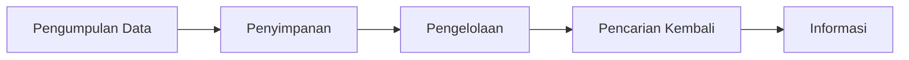

Gambar 2.20. Diagram umum konsep basis data.

## 2.21 Konsep Basis Data Relasional

Basis data relasional adalah basis data yang menyimpan data dalam bentuk tabel yang saling berhubungan. Hubungan antar tabel dibentuk melalui *primary key* dan *foreign key*.

Karakteristik basis data relasional adalah:

- data disimpan dalam bentuk tabel,
- setiap tabel memiliki atribut,
- terdapat relasi antar tabel,
- mendukung konsistensi data,
- memudahkan proses query.

Model relasional sangat sesuai untuk sistem informasi persediaan karena data barang, transaksi, pengguna, dan laporan biasanya memiliki keterkaitan yang jelas.

```mermaid
flowchart LR
    A["Tabel A\nPrimary Key"] --> B["Tabel B\nForeign Key"]
    B --> C["Relasi Data"]
    C --> D["Integritas Data"]
```

Gambar 2.21. Diagram umum konsep basis data relasional.

## 2.22 Konsep ERD (Entity Relationship Diagram)

ERD adalah diagram yang digunakan untuk menggambarkan entitas, atribut, dan hubungan antar entitas dalam basis data. ERD membantu pengembang memahami struktur data yang akan dibangun sebelum proses implementasi basis data dilakukan.

Fungsi ERD antara lain:

- menggambarkan hubungan antar data,
- memudahkan perancangan basis data,
- membantu analisis kebutuhan data,
- menjadi acuan dalam pembuatan tabel.

Berikut adalah contoh sederhana relasi entitas dalam sistem informasi persediaan:

```mermaid
erDiagram
    USER ||--o{ TRANSAKSI_MASUK : mencatat
    USER ||--o{ TRANSAKSI_KELUAR : mencatat
    BARANG ||--o{ TRANSAKSI_MASUK : masuk
    BARANG ||--o{ TRANSAKSI_KELUAR : keluar
    KATEGORI ||--o{ BARANG : memiliki
    PEMASOK ||--o{ TRANSAKSI_MASUK : sumber
```

Gambar 2.22. Contoh diagram ERD sederhana pada sistem informasi persediaan.

## 2.23 Konsep Hak Akses Pengguna

Hak akses pengguna adalah pembatasan wewenang penggunaan sistem berdasarkan peran tertentu. Hak akses digunakan untuk menjaga keamanan sistem dan memastikan setiap pengguna hanya dapat mengakses fitur sesuai tugasnya.

Penerapan hak akses dalam sistem informasi bertujuan untuk:

- menjaga keamanan data,
- membatasi tindakan pengguna,
- menghindari penyalahgunaan sistem,
- memperjelas tanggung jawab pengguna.

Hak akses biasanya dibedakan berdasarkan level tertentu, seperti administrator, operator, dan pengguna biasa.

```mermaid
flowchart TD
    A["Hak Akses Pengguna"] --> B["Administrator"]
    A --> C["Operator"]
    A --> D["Pengguna Biasa"]
    B --> E["Akses Penuh"]
    C --> F["Akses Operasional"]
    D --> G["Akses Terbatas"]
```

Gambar 2.23. Diagram umum konsep hak akses pengguna.

## 2.24 Kesimpulan Landasan Teoritis

Berdasarkan uraian di atas, dapat disimpulkan bahwa landasan teoritis yang mendukung penelitian ini meliputi konsep sistem, informasi, sistem informasi, sistem informasi manajemen, aplikasi, persediaan, monitoring, obat kontrasepsi, batch, kedaluwarsa, FEFO, stok masuk, stok keluar, penyesuaian stok, kartu stok, aplikasi berbasis web, Laravel, MySQL, basis data, basis data relasional, ERD, dan hak akses pengguna.

Seluruh teori tersebut menjadi dasar dalam memahami dan merancang sistem informasi yang mampu membantu proses pengelolaan persediaan secara lebih efektif, terstruktur, dan terintegrasi.
