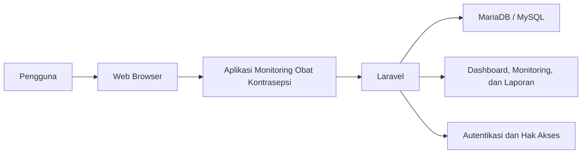
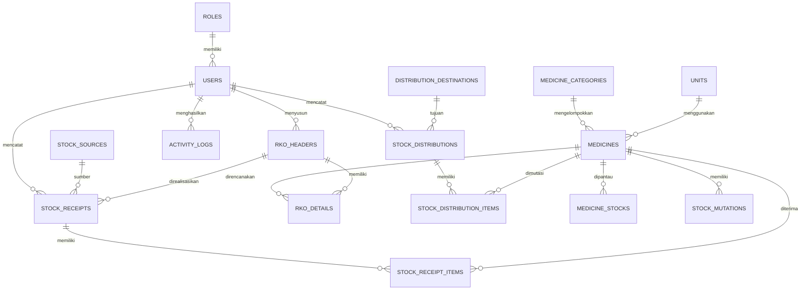
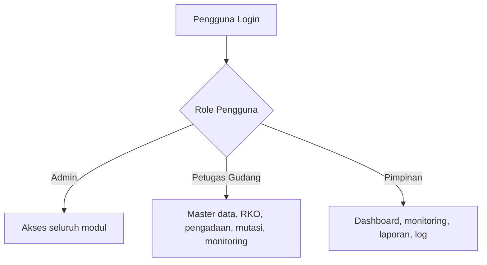
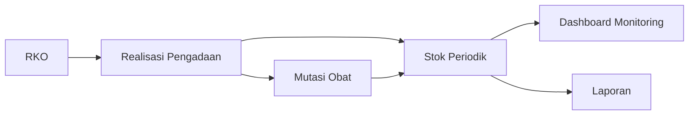
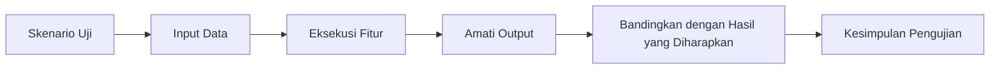

# BAB IV
# HASIL DAN PEMBAHASAN

## 4.1 Gambaran Umum Hasil Penelitian

Hasil dari penelitian ini adalah sebuah aplikasi monitoring obat kontrasepsi berbasis web yang dibangun untuk mendukung proses pencatatan, pemantauan, dan pelaporan data obat kontrasepsi pada Dinas Pengendalian Penduduk dan Keluarga Berencana Kota Sukabumi. Aplikasi dikembangkan menggunakan framework Laravel dan basis data MariaDB/MySQL sehingga dapat diakses melalui browser dan digunakan oleh lebih dari satu pengguna sesuai hak akses masing-masing.

Berbeda dengan sistem pencatatan manual yang sebelumnya banyak bergantung pada lembar kerja spreadsheet, aplikasi yang dibangun pada penelitian ini menempatkan data dalam satu sistem terintegrasi. Dengan demikian, proses pengelolaan data obat, penyusunan RKO, pencatatan realisasi pengadaan, pencatatan mutasi obat, monitoring stok, dan penyusunan laporan dapat dilakukan secara lebih terstruktur, lebih cepat, dan lebih mudah ditelusuri.

Secara umum, modul utama yang berhasil diimplementasikan dalam aplikasi ini meliputi:

- autentikasi pengguna,
- dashboard monitoring,
- manajemen data faskes,
- manajemen master obat,
- rencana kebutuhan obat (RKO),
- realisasi pengadaan,
- mutasi obat,
- monitoring stok,
- laporan,
- manajemen pengguna, dan
- log aktivitas.

## 4.2 Implementasi Sistem

### 4.2.1 Implementasi Perangkat Lunak

Implementasi perangkat lunak pada penelitian ini menggunakan pendekatan pengembangan aplikasi web. Sistem dibangun menggunakan bahasa pemrograman PHP dengan framework Laravel, sedangkan antarmuka dikembangkan menggunakan Blade Template, CSS, dan JavaScript yang terintegrasi pada ekosistem Laravel. Basis data yang digunakan adalah MariaDB/MySQL.

Perangkat lunak yang digunakan dalam implementasi sistem ini meliputi:

- sistem operasi untuk pengembangan,
- web server Apache atau Laravel development server,
- PHP,
- Composer,
- Node.js dan NPM,
- framework Laravel,
- database MariaDB/MySQL, dan
- web browser.

Gambar 4.1. Arsitektur umum implementasi perangkat lunak aplikasi.

### 4.2.2 Implementasi Basis Data

Basis data pada aplikasi ini dirancang untuk mendukung kebutuhan monitoring obat kontrasepsi, mulai dari data master, perencanaan kebutuhan, realisasi pengadaan, mutasi obat, hingga pemantauan stok per periode. Struktur basis data tidak hanya menyimpan data pokok, tetapi juga menyediakan relasi yang memudahkan proses pencarian, penyaringan, dan penyusunan laporan.

Secara umum, kelompok tabel yang digunakan dalam implementasi sistem ini meliputi:

- tabel master: `roles`, `users`, `medicine_categories`, `units`, `medicines`, `stock_sources`, `distribution_destinations`,
- tabel perencanaan: `rko_headers`, `rko_details`,
- tabel transaksi dan monitoring: `stock_receipts`, `stock_receipt_items`, `stock_distributions`, `stock_distribution_items`, `medicine_stocks`, `stock_mutations`,
- tabel audit: `activity_logs`.

Dalam implementasinya, tabel `medicines` digunakan untuk menyimpan data obat, tabel `rko_headers` dan `rko_details` digunakan untuk menyimpan rencana kebutuhan obat, tabel `stock_receipts` dan `stock_receipt_items` digunakan untuk mencatat realisasi pengadaan, tabel `stock_distributions` dan `stock_distribution_items` digunakan untuk mencatat mutasi obat ke faskes, tabel `medicine_stocks` digunakan untuk menyimpan snapshot stok per periode, sedangkan tabel `stock_mutations` digunakan untuk mencatat riwayat mutasi masuk dan keluar.

Gambar 4.2. Diagram konseptual relasi data pada aplikasi.

### 4.2.3 Implementasi Hak Akses Pengguna

Hak akses pengguna pada aplikasi ini dibedakan berdasarkan peran masing-masing pengguna. Pembagian hak akses dilakukan agar pengguna hanya dapat mengakses menu dan fungsi yang sesuai dengan tugasnya.

Hak akses utama dalam aplikasi ini terdiri atas:

- `admin`, yaitu pengguna yang memiliki akses penuh terhadap seluruh modul sistem,
- `petugas_gudang`, yaitu pengguna yang berfokus pada pengelolaan data master, RKO, realisasi pengadaan, mutasi obat, monitoring, dan laporan,
- `pimpinan`, yaitu pengguna yang berfokus pada pemantauan dashboard, monitoring, laporan, dan log aktivitas.

Implementasi hak akses dilakukan melalui autentikasi dan middleware pada Laravel, sehingga sistem dapat membatasi route, menu, dan tindakan tertentu berdasarkan role pengguna.

Gambar 4.3. Diagram pembagian hak akses pengguna.

## 4.3 Pembahasan Fitur Aplikasi

### 4.3.1 Halaman Login

Halaman login berfungsi sebagai pintu masuk pengguna ke dalam sistem. Pada halaman ini, pengguna harus memasukkan kredensial yang sesuai agar dapat mengakses aplikasi. Fitur login penting untuk menjaga keamanan data dan memastikan bahwa hanya pengguna yang berwenang yang dapat menggunakan sistem.

Ketika proses login berhasil, pengguna akan diarahkan ke dashboard sesuai hak akses yang dimilikinya. Sebaliknya, apabila data login tidak sesuai, sistem akan menampilkan pesan kesalahan.

### 4.3.2 Dashboard Monitoring

Dashboard merupakan halaman utama setelah pengguna berhasil login. Dashboard menampilkan ringkasan informasi penting yang dibutuhkan pengguna secara cepat, seperti jumlah obat aktif, total stok yang tercatat, jumlah dokumen RKO, realisasi pengadaan, mutasi obat, serta indikator kondisi stok.

Dashboard membantu pengguna memperoleh gambaran umum kondisi obat kontrasepsi tanpa harus membuka setiap halaman secara terpisah. Dengan demikian, dashboard berfungsi sebagai media monitoring awal bagi admin, petugas, maupun pimpinan.

### 4.3.3 Manajemen Data Faskes

Modul data faskes digunakan untuk menyimpan data fasilitas kesehatan yang menjadi tujuan mutasi obat. Data ini meliputi identitas faskes, jenis faskes, informasi kontak, serta status aktif atau nonaktif.

Data faskes penting karena menjadi acuan pada proses mutasi obat. Dengan data faskes yang terkelola dengan baik, proses pencatatan mutasi menjadi lebih rapi dan tujuan penyaluran obat dapat ditelusuri dengan lebih mudah.

### 4.3.4 Manajemen Master Obat

Modul master obat digunakan untuk mengelola data obat kontrasepsi yang akan dipantau dalam sistem. Data yang dikelola meliputi kode obat, nama obat, jenis obat, kategori, satuan, harga standar, status aktif, dan stok minimum.

Ketersediaan master obat yang akurat sangat berpengaruh terhadap modul lain, terutama RKO, realisasi pengadaan, mutasi obat, monitoring stok, dan laporan. Oleh karena itu, modul ini menjadi fondasi utama dalam implementasi sistem.

### 4.3.5 Rencana Kebutuhan Obat (RKO)

Modul RKO digunakan untuk mencatat rencana kebutuhan obat pada periode tertentu. Implementasi RKO dibagi menjadi dua bagian, yaitu header dan detail. Bagian header berisi informasi umum seperti nomor RKO, periode, tahun, total anggaran, status dokumen, tanggal pengajuan, tanggal persetujuan, dan keterangan. Sementara itu, bagian detail berisi rincian item obat, jumlah kebutuhan, estimasi harga satuan, total estimasi, prioritas, dan keterangan.

Dengan adanya modul ini, proses perencanaan kebutuhan obat dapat didokumentasikan secara sistematis. RKO juga berperan sebagai acuan dalam proses realisasi pengadaan sehingga hubungan antara rencana dan pelaksanaan dapat dipantau.

### 4.3.6 Realisasi Pengadaan

Modul realisasi pengadaan digunakan untuk mencatat obat yang benar-benar diterima oleh instansi pada suatu periode. Setiap realisasi pengadaan dapat dihubungkan dengan dokumen RKO tertentu sehingga pengguna dapat membandingkan antara kebutuhan yang direncanakan dan pengadaan yang benar-benar terealisasi.

Informasi yang dicatat pada modul ini meliputi nomor realisasi, tanggal penerimaan, sumber pengadaan, referensi RKO, daftar item obat, jumlah realisasi, harga satuan realisasi, total realisasi, serta catatan transaksi. Dengan demikian, modul ini menjadi jembatan antara perencanaan dan kondisi nyata pengadaan obat.

### 4.3.7 Mutasi Obat

Modul mutasi obat digunakan untuk mencatat perpindahan atau penyaluran obat ke fasilitas kesehatan. Pada implementasi ini, mutasi obat berfungsi sebagai pencatatan obat keluar dari instansi menuju faskes tertentu.

Data mutasi obat sangat penting dalam konteks monitoring karena menunjukkan bagaimana obat yang telah diterima kemudian disalurkan. Riwayat mutasi tersebut juga menjadi salah satu sumber data bagi penyusunan snapshot stok dan histori pergerakan obat.

### 4.3.8 Monitoring Stok

Modul monitoring stok berfungsi untuk menampilkan kondisi stok obat secara ringkas dan terstruktur. Pada aplikasi ini, monitoring berfokus pada stok per obat dan stok per periode, bukan pada pelacakan teknis yang terlalu rinci. Dengan pendekatan ini, aplikasi lebih menekankan fungsi pemantauan, evaluasi, dan pelaporan.

Monitoring stok menampilkan jumlah stok yang tersedia, status kondisi stok, dan ringkasan mutasi yang terjadi. Selain itu, pengguna juga dapat melihat detail obat melalui popup sehingga informasi penting tetap dapat diakses dengan cepat tanpa harus berpindah halaman.

Gambar 4.4. Diagram alur utama data monitoring pada aplikasi.

### 4.3.9 Laporan

Modul laporan digunakan untuk menyajikan data dalam bentuk yang lebih terstruktur dan mudah dibaca. Laporan yang tersedia pada aplikasi ini meliputi laporan stok, laporan realisasi pengadaan, laporan mutasi obat, dan laporan RKO vs realisasi.

Khusus laporan RKO vs realisasi, sistem menampilkan perbandingan antara kebutuhan yang direncanakan dan realisasi pengadaan yang telah dicatat. Fitur ini menjadi bagian penting dari monitoring karena membantu pengguna melihat capaian pengadaan serta selisih yang masih perlu ditindaklanjuti.

### 4.3.10 Manajemen Pengguna

Modul manajemen pengguna digunakan untuk mengelola akun yang dapat mengakses sistem. Admin dapat menambah pengguna baru, mengubah data pengguna, melihat detail pengguna, serta mengatur status aktif atau nonaktif akun.

Pengelolaan akun penting untuk menjaga keamanan sistem dan memastikan bahwa pembagian hak akses berjalan sesuai kebutuhan organisasi.

### 4.3.11 Log Aktivitas

Modul log aktivitas digunakan untuk mencatat tindakan penting yang dilakukan oleh pengguna di dalam sistem. Informasi yang dicatat meliputi nama pengguna, modul yang diakses, aksi yang dilakukan, deskripsi aktivitas, waktu kejadian, dan alamat IP.

Keberadaan log aktivitas membantu proses pengawasan dan audit, serta mempermudah penelusuran apabila terjadi perubahan data tertentu pada sistem.

## 4.4 Pengujian Sistem

### 4.4.1 Metode Pengujian

Pengujian sistem dilakukan menggunakan metode *black box testing*. Metode ini digunakan untuk menguji fungsi sistem berdasarkan masukan dan keluaran yang dihasilkan tanpa melihat kode program secara langsung.

Fokus pengujian pada penelitian ini meliputi:

- validasi login,
- pengelolaan master data,
- pengelolaan RKO,
- pencatatan realisasi pengadaan,
- pencatatan mutasi obat,
- monitoring stok,
- pembuatan laporan,
- manajemen pengguna, dan
- log aktivitas.

Gambar 4.5. Diagram alur pengujian sistem dengan metode black box.

### 4.4.2 Hasil Pengujian Login

Tabel 4.1. Hasil pengujian login.

| No | Skenario Pengujian | Input | Hasil yang Diharapkan | Hasil Pengujian | Kesimpulan |
| --- | --- | --- | --- | --- | --- |
| 1 | Login dengan data valid | Email dan password benar | Sistem menampilkan dashboard | Sesuai harapan | Berhasil |
| 2 | Login dengan password salah | Email benar, password salah | Sistem menolak login dan menampilkan pesan kesalahan | Sesuai harapan | Berhasil |
| 3 | Login dengan akun nonaktif | Data login akun nonaktif | Sistem menolak akses | Sesuai harapan | Berhasil |

Tempat screenshot hasil pengujian login.

Gambar 4.6. Tampilan halaman login aplikasi.

Tempat screenshot hasil login berhasil.

Gambar 4.7. Tampilan dashboard setelah login berhasil.

### 4.4.3 Hasil Pengujian Master Data

Tabel 4.2. Hasil pengujian master data.

| No | Skenario Pengujian | Input | Hasil yang Diharapkan | Hasil Pengujian | Kesimpulan |
| --- | --- | --- | --- | --- | --- |
| 1 | Menambah kategori obat | Data kategori baru | Data kategori tersimpan | Sesuai harapan | Berhasil |
| 2 | Menambah satuan obat | Data satuan baru | Data satuan tersimpan | Sesuai harapan | Berhasil |
| 3 | Menambah data obat | Kode, nama, jenis, kategori, satuan, dan harga standar | Data obat tersimpan | Sesuai harapan | Berhasil |
| 4 | Menambah data faskes | Data identitas faskes baru | Data faskes tersimpan | Sesuai harapan | Berhasil |
| 5 | Mengubah sumber pengadaan | Perubahan data sumber | Data sumber pengadaan diperbarui | Sesuai harapan | Berhasil |

Tempat screenshot halaman data obat.

Gambar 4.8. Halaman manajemen data obat.

Tempat screenshot form tambah data obat.

Gambar 4.9. Form tambah data obat.

### 4.4.4 Hasil Pengujian RKO

Tabel 4.3. Hasil pengujian RKO.

| No | Skenario Pengujian | Input | Hasil yang Diharapkan | Hasil Pengujian | Kesimpulan |
| --- | --- | --- | --- | --- | --- |
| 1 | Menambah dokumen RKO | Data header dan detail item obat | Dokumen RKO tersimpan | Sesuai harapan | Berhasil |
| 2 | Menghitung total estimasi | Jumlah kebutuhan dan estimasi harga satuan | Sistem menghitung total estimasi item | Sesuai harapan | Berhasil |
| 3 | Menampilkan detail RKO | Memilih salah satu nomor RKO | Sistem menampilkan informasi header dan item | Sesuai harapan | Berhasil |

Tempat screenshot halaman RKO.

Gambar 4.10. Halaman daftar RKO.

Tempat screenshot form input RKO.

Gambar 4.11. Form input RKO.

### 4.4.5 Hasil Pengujian Realisasi Pengadaan

Tabel 4.4. Hasil pengujian realisasi pengadaan.

| No | Skenario Pengujian | Input | Hasil yang Diharapkan | Hasil Pengujian | Kesimpulan |
| --- | --- | --- | --- | --- | --- |
| 1 | Menambah realisasi pengadaan | Data transaksi dan item obat | Data realisasi pengadaan tersimpan | Sesuai harapan | Berhasil |
| 2 | Menghubungkan realisasi ke RKO | Memilih referensi RKO pada form | Realisasi terhubung dengan dokumen RKO | Sesuai harapan | Berhasil |
| 3 | Menampilkan detail realisasi | Memilih transaksi pengadaan tertentu | Sistem menampilkan detail transaksi | Sesuai harapan | Berhasil |

Tempat screenshot halaman realisasi pengadaan.

Gambar 4.12. Halaman daftar realisasi pengadaan.

Tempat screenshot form realisasi pengadaan.

Gambar 4.13. Form input realisasi pengadaan.

### 4.4.6 Hasil Pengujian Mutasi Obat

Tabel 4.5. Hasil pengujian mutasi obat.

| No | Skenario Pengujian | Input | Hasil yang Diharapkan | Hasil Pengujian | Kesimpulan |
| --- | --- | --- | --- | --- | --- |
| 1 | Menambah mutasi obat | Data faskes tujuan dan item obat | Data mutasi tersimpan | Sesuai harapan | Berhasil |
| 2 | Validasi stok tidak mencukupi | Jumlah mutasi melebihi stok yang tersedia | Sistem menolak transaksi | Sesuai harapan | Berhasil |
| 3 | Menampilkan detail mutasi | Memilih transaksi mutasi tertentu | Sistem menampilkan detail mutasi | Sesuai harapan | Berhasil |

Tempat screenshot halaman mutasi obat.

Gambar 4.14. Halaman daftar mutasi obat.

Tempat screenshot form mutasi obat.

Gambar 4.15. Form input mutasi obat.

### 4.4.7 Hasil Pengujian Monitoring

Tabel 4.6. Hasil pengujian monitoring.

| No | Skenario Pengujian | Input | Hasil yang Diharapkan | Hasil Pengujian | Kesimpulan |
| --- | --- | --- | --- | --- | --- |
| 1 | Menampilkan stok terkini | Membuka menu monitoring stok | Sistem menampilkan stok per obat | Sesuai harapan | Berhasil |
| 2 | Menampilkan detail obat | Memilih tombol detail pada data obat | Sistem menampilkan popup detail obat | Sesuai harapan | Berhasil |
| 3 | Menampilkan status stok | Data snapshot stok tersedia | Sistem menampilkan status aman, kurang, atau berlebih | Sesuai harapan | Berhasil |

Tempat screenshot halaman stok terkini.

Gambar 4.16. Halaman monitoring stok terkini.

Tempat screenshot popup detail obat.

Gambar 4.17. Tampilan detail obat pada monitoring.

### 4.4.8 Hasil Pengujian Laporan

Tabel 4.7. Hasil pengujian laporan.

| No | Skenario Pengujian | Input | Hasil yang Diharapkan | Hasil Pengujian | Kesimpulan |
| --- | --- | --- | --- | --- | --- |
| 1 | Menampilkan laporan stok | Filter laporan stok | Sistem menampilkan data stok sesuai filter | Sesuai harapan | Berhasil |
| 2 | Menampilkan laporan realisasi pengadaan | Filter tanggal dan sumber | Sistem menampilkan data pengadaan sesuai filter | Sesuai harapan | Berhasil |
| 3 | Menampilkan laporan mutasi obat | Filter tanggal dan faskes | Sistem menampilkan data mutasi sesuai filter | Sesuai harapan | Berhasil |
| 4 | Menampilkan laporan RKO vs realisasi | Filter periode dan status | Sistem menampilkan perbandingan rencana dan realisasi | Sesuai harapan | Berhasil |

Tempat screenshot halaman laporan stok.

Gambar 4.18. Halaman laporan stok.

Tempat screenshot halaman laporan realisasi pengadaan.

Gambar 4.19. Halaman laporan realisasi pengadaan.

Tempat screenshot halaman laporan mutasi obat.

Gambar 4.20. Halaman laporan mutasi obat.

Tempat screenshot halaman laporan RKO vs realisasi.

Gambar 4.21. Halaman laporan RKO vs realisasi.

### 4.4.9 Hasil Pengujian Manajemen Pengguna

Tabel 4.8. Hasil pengujian manajemen pengguna.

| No | Skenario Pengujian | Input | Hasil yang Diharapkan | Hasil Pengujian | Kesimpulan |
| --- | --- | --- | --- | --- | --- |
| 1 | Menambah pengguna baru | Data akun dan role | Data pengguna tersimpan | Sesuai harapan | Berhasil |
| 2 | Mengubah status pengguna | Aktif atau nonaktif | Status pengguna diperbarui | Sesuai harapan | Berhasil |
| 3 | Menampilkan detail pengguna | Memilih salah satu akun | Sistem menampilkan profil pengguna | Sesuai harapan | Berhasil |

Tempat screenshot halaman manajemen pengguna.

Gambar 4.22. Halaman manajemen pengguna.

Tempat screenshot form tambah pengguna.

Gambar 4.23. Form tambah pengguna.

### 4.4.10 Hasil Pengujian Log Aktivitas

Tabel 4.9. Hasil pengujian log aktivitas.

| No | Skenario Pengujian | Input | Hasil yang Diharapkan | Hasil Pengujian | Kesimpulan |
| --- | --- | --- | --- | --- | --- |
| 1 | Menampilkan daftar log aktivitas | Membuka menu log aktivitas | Sistem menampilkan catatan aktivitas pengguna | Sesuai harapan | Berhasil |
| 2 | Filter log aktivitas | Filter modul, pengguna, dan tanggal | Sistem menampilkan log sesuai filter | Sesuai harapan | Berhasil |

Tempat screenshot halaman log aktivitas.

Gambar 4.24. Halaman log aktivitas.

## 4.5 Pembahasan Hasil Sistem

Berdasarkan hasil implementasi dan pengujian yang telah dilakukan, aplikasi monitoring obat kontrasepsi berbasis web ini mampu mendukung proses pencatatan dan pemantauan data secara lebih terstruktur dibandingkan dengan metode manual. Sistem tidak hanya menyimpan data master, tetapi juga menghubungkan proses perencanaan kebutuhan obat dengan realisasi pengadaan dan mutasi obat.

Penerapan modul RKO memberikan nilai tambah karena sistem dapat digunakan bukan hanya untuk mencatat kondisi saat ini, tetapi juga untuk memantau hubungan antara rencana kebutuhan dan pengadaan yang benar-benar terjadi. Selain itu, keberadaan laporan RKO vs realisasi membantu pengguna melihat tingkat ketercapaian pengadaan secara lebih jelas.

Fitur monitoring stok, mutasi obat, dan laporan periodik juga menunjukkan bahwa sistem telah menjalankan fungsi monitoring secara nyata. Informasi yang ditampilkan tidak lagi sekadar data mentah, tetapi telah diolah menjadi ringkasan yang dapat membantu proses evaluasi dan pengambilan keputusan.

## 4.6 Kelebihan dan Keterbatasan Sistem

Kelebihan aplikasi yang berhasil diimplementasikan dalam penelitian ini antara lain:

- mendukung pencatatan master data obat, faskes, dan sumber pengadaan,
- mendukung penyusunan RKO beserta detail kebutuhan obat,
- mendukung pencatatan realisasi pengadaan yang dapat dihubungkan dengan RKO,
- mendukung pencatatan mutasi obat ke fasilitas kesehatan,
- menyediakan monitoring stok per obat dan snapshot stok per periode,
- menyediakan laporan monitoring, termasuk laporan RKO vs realisasi,
- menyediakan hak akses pengguna dan log aktivitas.

Adapun keterbatasan sistem pada implementasi saat ini antara lain:

- integrasi otomatis dengan sistem lain belum diterapkan, sehingga data masih diinput pada aplikasi ini,
- snapshot stok per periode masih bergantung pada proses pencatatan dan pembaruan data yang dilakukan pengguna,
- fitur notifikasi otomatis untuk status stok belum menjadi fokus utama,
- ekspor laporan ke format dokumen tertentu belum menjadi fokus implementasi utama penelitian ini.

## 4.7 Kesimpulan Bab

Berdasarkan pembahasan pada bab ini dapat disimpulkan bahwa aplikasi yang dibangun telah berhasil diimplementasikan sebagai aplikasi monitoring obat kontrasepsi berbasis web. Implementasi sistem telah mencakup modul utama yang dibutuhkan, yaitu master data, RKO, realisasi pengadaan, mutasi obat, monitoring stok, laporan, manajemen pengguna, dan log aktivitas.

Hasil pengujian menunjukkan bahwa fungsi-fungsi utama sistem dapat berjalan sesuai dengan kebutuhan. Dengan demikian, aplikasi ini dapat digunakan sebagai sarana untuk membantu Dinas Pengendalian Penduduk dan Keluarga Berencana dalam memantau data obat kontrasepsi secara lebih efektif, terstruktur, dan mudah dilaporkan.
