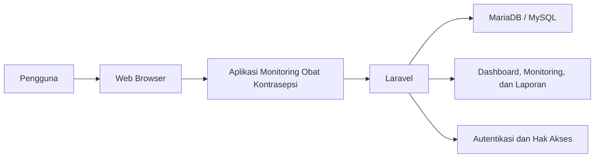
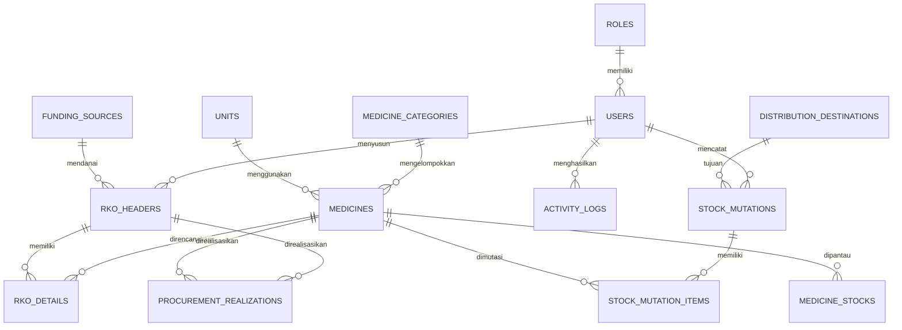
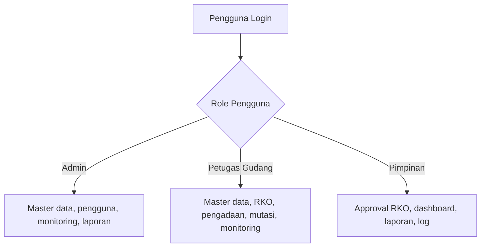
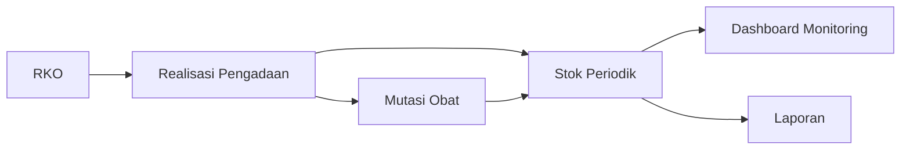
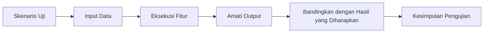

# BAB IV
# HASIL DAN PEMBAHASAN

## 4.1 Analisa dan Perancangan Sistem

Bagian ini menjelaskan hasil analisa kebutuhan serta rancangan sistem usulan yang digunakan sebagai dasar pembangunan aplikasi monitoring obat kontrasepsi. Analisa dan perancangan dilakukan agar kebutuhan pengguna, fungsi sistem, serta alur kerja antar aktor dapat tergambar secara jelas sebelum masuk ke tahap implementasi.

### 4.1.1 Analisa Kebutuhan

Analisa kebutuhan dilakukan untuk mengidentifikasi kebutuhan utama dari pengguna dan sistem pada aplikasi monitoring obat kontrasepsi. Hasil analisa ini digunakan sebagai acuan dalam menentukan fitur, hak akses, dan alur proses pada aplikasi.

#### Kebutuhan Pengguna

Kebutuhan pengguna pada aplikasi monitoring obat kontrasepsi dibedakan berdasarkan peran masing-masing aktor, yaitu admin, pimpinan, dan gudang.

- **Admin** membutuhkan akses untuk mengelola data faskes, data obat, sumber dana, pengguna, laporan, monitoring, serta melakukan pengawasan terhadap aktivitas sistem.
- **Gudang** membutuhkan fitur untuk mengelola data operasional seperti pengajuan RKO, pencatatan mutasi obat, peninjauan realisasi pengadaan, monitoring stok, dan penyusunan laporan.
- **Pimpinan** membutuhkan fitur untuk meninjau pengajuan RKO, memberikan persetujuan, memantau kondisi stok, serta melihat laporan dan log aktivitas sebagai bahan pengambilan keputusan.

#### Kebutuhan Sistem

Kebutuhan sistem pada aplikasi monitoring obat kontrasepsi meliputi fungsi-fungsi utama yang harus tersedia agar proses monitoring dapat berjalan dengan baik.

- Sistem harus menyediakan autentikasi login dan pembatasan hak akses berdasarkan peran pengguna.
- Sistem harus mampu mengelola data master seperti faskes, kategori obat, satuan, obat, dan sumber dana.
- Sistem harus menyediakan proses pengajuan RKO dan persetujuan RKO secara terpisah agar data usulan dan data persetujuan tidak tercampur.
- Sistem harus membatasi proses persetujuan RKO hanya untuk pengguna dengan role pimpinan.
- Sistem harus dapat membentuk data realisasi pengadaan berdasarkan hasil persetujuan RKO.
- Sistem harus mampu mencatat mutasi obat keluar dan memperbarui stok terkini secara otomatis.
- Sistem harus menyediakan fitur monitoring stok, laporan, cetak laporan PDF/Excel, manajemen pengguna, serta log aktivitas.

### 4.1.2 Rancangan Use Case Diagram Usulan

Rancangan use case diagram usulan digunakan untuk menggambarkan hubungan antara aktor dengan fungsi-fungsi utama yang tersedia pada aplikasi. Diagram ini menunjukkan bahwa setiap aktor memiliki hak akses dan tanggung jawab yang berbeda sesuai dengan peran masing-masing dalam proses monitoring obat kontrasepsi.

Use case diagram usulan pada penelitian ini dibuat menggunakan Draw.io dan disimpan pada file [bab-4-perancangan.drawio](/Users/mochjuang/projects/php/gudang-obat-kb/docs/bab-4-perancangan.drawio).

Gambar 4.1. Rancangan use case diagram usulan.

### 4.1.3 Rancangan Diagram Aktivitas

Rancangan diagram aktivitas pada penelitian ini dibuat dalam bentuk flowmap agar alur interaksi antara admin, pimpinan, gudang, dan sistem dapat terlihat dengan lebih jelas. Setiap flowmap menggambarkan tahapan aktivitas pada fitur utama aplikasi, mulai dari input data oleh pengguna hingga respons yang diberikan oleh sistem.

Seluruh diagram aktivitas pada subbab ini dibuat menggunakan Draw.io dan disimpan pada file [bab-4-perancangan.drawio](/Users/mochjuang/projects/php/gudang-obat-kb/docs/bab-4-perancangan.drawio).

#### 4.1.3.1 Flowmap Login

Flowmap login menggambarkan proses ketika admin, pimpinan, atau gudang membuka halaman login, memasukkan kredensial, lalu sistem melakukan validasi sebelum mengarahkan pengguna ke dashboard sesuai hak aksesnya.

Gambar 4.2. Flowmap login.

#### 4.1.3.2 Flowmap Kelola Master Data

Flowmap kelola master data menggambarkan proses admin atau gudang saat mengelola data referensi seperti faskes, obat, dan sumber dana. Pada alur ini sistem menerima aksi tambah, ubah, atau nonaktifkan data, lalu menyimpan perubahan sesuai input pengguna.

Gambar 4.3. Flowmap kelola master data.

#### 4.1.3.3 Flowmap Pengajuan RKO

Flowmap pengajuan RKO menggambarkan proses gudang saat membuat draft RKO, mengisi data header dan detail kebutuhan obat, lalu mengajukan dokumen agar dapat diproses lebih lanjut oleh pimpinan melalui sistem.

Gambar 4.4. Flowmap pengajuan RKO.

#### 4.1.3.4 Flowmap Persetujuan RKO

Flowmap persetujuan RKO menggambarkan proses pimpinan saat meninjau usulan RKO, memeriksa jumlah dan harga yang disetujui, lalu memberikan keputusan pada dokumen. Sistem kemudian memperbarui status dokumen dan membentuk data lanjutan apabila pengajuan disetujui.

Gambar 4.5. Flowmap persetujuan RKO.

#### 4.1.3.5 Flowmap Realisasi Pengadaan

Flowmap realisasi pengadaan menggambarkan alur admin, pimpinan, atau gudang saat membuka data realisasi pengadaan dan menggunakan filter tertentu, kemudian sistem menampilkan hasil realisasi pengadaan berdasarkan parameter yang dimasukkan.

Gambar 4.6. Flowmap realisasi pengadaan.

#### 4.1.3.6 Flowmap Mutasi Obat

Flowmap mutasi obat menggambarkan proses gudang saat mencatat penyaluran obat keluar, menambahkan item obat dan jumlah distribusi, lalu sistem menyimpan mutasi dan memperbarui stok terkini.

Gambar 4.7. Flowmap mutasi obat.

#### 4.1.3.7 Flowmap Monitoring Stok

Flowmap monitoring stok menggambarkan proses admin, pimpinan, atau gudang saat membuka menu monitoring untuk melihat kondisi stok per obat, kemudian sistem menampilkan data stok terkini beserta detail informasi obat yang dipilih.

Gambar 4.8. Flowmap monitoring stok.

#### 4.1.3.8 Flowmap Laporan

Flowmap laporan menggambarkan proses admin, pimpinan, atau gudang saat memilih jenis laporan dan parameter filter, kemudian sistem memproses data dan menampilkan hasil laporan sesuai kebutuhan pengguna.

Gambar 4.9. Flowmap laporan.

#### 4.1.3.9 Flowmap Manajemen Pengguna

Flowmap manajemen pengguna menggambarkan proses admin saat membuka daftar pengguna, menambah akun baru, mengubah status akun, atau melihat detail pengguna, lalu sistem memvalidasi dan menyimpan perubahan tersebut.

Gambar 4.10. Flowmap manajemen pengguna.

#### 4.1.3.10 Flowmap Log Aktivitas

Flowmap log aktivitas menggambarkan proses ketika sistem mencatat aktivitas penting pengguna secara otomatis, kemudian admin atau pimpinan membuka menu log aktivitas untuk meninjau riwayat tersebut melalui daftar dan filter yang tersedia.

Gambar 4.11. Flowmap log aktivitas.

## 4.2 Implementasi Sistem

### 4.2.1 Implementasi Perangkat Lunak

Implementasi perangkat lunak pada penelitian ini menggunakan pendekatan pengembangan aplikasi web. Sistem dibangun menggunakan bahasa pemrograman PHP dengan framework Laravel, sedangkan antarmuka dikembangkan menggunakan Blade Template, CSS, dan JavaScript yang terintegrasi pada ekosistem Laravel. Basis data yang digunakan adalah MariaDB/MySQL.

Perangkat lunak yang digunakan dalam implementasi sistem ini meliputi:

- sistem operasi untuk pengembangan,
- web server Apache atau Laravel development server,
- PHP,
- Composer,
- Node.js dan NPM,
- framework Laravel,
- database MariaDB/MySQL, dan
- web browser.

Gambar 4.12. Arsitektur umum implementasi perangkat lunak aplikasi.

### 4.2.2 Implementasi Basis Data

Basis data pada aplikasi ini dirancang untuk mendukung kebutuhan monitoring obat kontrasepsi, mulai dari data master, perencanaan kebutuhan, realisasi pengadaan, mutasi obat, hingga pemantauan stok per periode. Struktur basis data tidak hanya menyimpan data pokok, tetapi juga menyediakan relasi yang memudahkan proses pencarian, penyaringan, dan penyusunan laporan.

Secara umum, kelompok tabel yang digunakan dalam implementasi sistem ini meliputi:

- tabel master: `roles`, `users`, `medicine_categories`, `units`, `medicines`, `funding_sources`, `distribution_destinations`,
- tabel perencanaan: `rko_headers`, `rko_details`,
- tabel transaksi dan monitoring: `procurement_realizations`, `stock_mutations`, `stock_mutation_items`, `medicine_stocks`,
- tabel audit: `activity_logs`.

Dalam implementasinya, tabel `medicines` digunakan untuk menyimpan data obat. Tabel `rko_headers` dan `rko_details` digunakan untuk menyimpan rencana kebutuhan obat, termasuk pemisahan data usulan (estimasi) dan data persetujuan (jumlah serta harga disetujui). Saat RKO disetujui, sistem membentuk data `procurement_realizations` sebagai catatan realisasi pengadaan. Selanjutnya, transaksi stok pada sistem dicatat pada tabel `stock_mutations` sebagai header mutasi dan tabel `stock_mutation_items` sebagai rincian item obat. Tabel `medicine_stocks` digunakan untuk menyimpan stok terkini (snapshot) per obat yang dapat diperbarui berdasarkan mutasi.

Gambar 4.13. Diagram konseptual relasi data pada aplikasi.

#### 4.2.2.1 Struktur Tabel Utama

Untuk memperjelas implementasi basis data, berikut disajikan struktur beberapa tabel utama yang digunakan pada aplikasi monitoring obat kontrasepsi. Penyajian struktur tabel ini memudahkan pembaca memahami atribut, tipe data, panjang data, serta nilai bawaan yang digunakan pada masing-masing tabel.

Tabel 4.1. Struktur tabel `roles`.

| No | Key | Column Name | Data Type | Length | Default |
| --- | --- | --- | --- | --- | --- |
| 1 | PK | id | BigInt | 20 | Auto Increment |
| 2 |  | name | Varchar | 50 | Not Null |
| 3 |  | description | Varchar | 255 | Null |
| 4 |  | created_at | Timestamp | - | Null |
| 5 |  | updated_at | Timestamp | - | Null |

Tabel 4.2. Struktur tabel `users`.

| No | Key | Column Name | Data Type | Length | Default |
| --- | --- | --- | --- | --- | --- |
| 1 | PK | id | BigInt | 20 | Auto Increment |
| 2 | FK | role_id | BigInt | 20 | Null |
| 3 |  | name | Varchar | 255 | Not Null |
| 4 |  | username | Varchar | 50 | Null |
| 5 |  | email | Varchar | 255 | Not Null |
| 6 |  | phone | Varchar | 20 | Null |
| 7 |  | email_verified_at | Timestamp | - | Null |
| 8 |  | password | Varchar | 255 | Not Null |
| 9 |  | is_active | Boolean | 1 | 1 |
| 10 |  | remember_token | Varchar | 100 | Null |
| 11 |  | last_login_at | Timestamp | - | Null |
| 12 |  | created_at | Timestamp | - | Null |
| 13 |  | updated_at | Timestamp | - | Null |

Tabel 4.3. Struktur tabel `medicine_categories`.

| No | Key | Column Name | Data Type | Length | Default |
| --- | --- | --- | --- | --- | --- |
| 1 | PK | id | BigInt | 20 | Auto Increment |
| 2 |  | name | Varchar | 100 | Not Null |
| 3 |  | description | Varchar | 255 | Null |
| 4 |  | created_at | Timestamp | - | Null |
| 5 |  | updated_at | Timestamp | - | Null |

Tabel 4.4. Struktur tabel `units`.

| No | Key | Column Name | Data Type | Length | Default |
| --- | --- | --- | --- | --- | --- |
| 1 | PK | id | BigInt | 20 | Auto Increment |
| 2 |  | name | Varchar | 50 | Not Null |
| 3 |  | symbol | Varchar | 20 | Not Null |
| 4 |  | created_at | Timestamp | - | Null |
| 5 |  | updated_at | Timestamp | - | Null |

Tabel 4.5. Struktur tabel `medicines`.

| No | Key | Column Name | Data Type | Length | Default |
| --- | --- | --- | --- | --- | --- |
| 1 | PK | id | BigInt | 20 | Auto Increment |
| 2 | FK | category_id | BigInt | 20 | Not Null |
| 3 | FK | unit_id | BigInt | 20 | Not Null |
| 4 |  | code | Varchar | 50 | Not Null |
| 5 |  | name | Varchar | 150 | Not Null |
| 6 |  | medicine_type | Varchar | 100 | Null |
| 7 |  | brand | Varchar | 100 | Null |
| 8 |  | dosage | Varchar | 100 | Null |
| 9 |  | minimum_stock | Unsigned Integer | 10 | 0 |
| 10 |  | standard_price | Decimal | 15,2 | 0 |
| 11 |  | description | Text | - | Null |
| 12 |  | is_active | Boolean | 1 | 1 |
| 13 |  | created_at | Timestamp | - | Null |
| 14 |  | updated_at | Timestamp | - | Null |

Tabel 4.6. Struktur tabel `funding_sources`.

| No | Key | Column Name | Data Type | Length | Default |
| --- | --- | --- | --- | --- | --- |
| 1 | PK | id | BigInt | 20 | Auto Increment |
| 2 |  | code | Varchar | 50 | Not Null |
| 3 |  | name | Varchar | 150 | Not Null |
| 4 |  | source_type | Varchar | 100 | Null |
| 5 |  | notes | Text | - | Null |
| 6 |  | is_active | Boolean | 1 | 1 |
| 7 |  | created_at | Timestamp | - | Null |
| 8 |  | updated_at | Timestamp | - | Null |

Tabel 4.7. Struktur tabel `distribution_destinations`.

| No | Key | Column Name | Data Type | Length | Default |
| --- | --- | --- | --- | --- | --- |
| 1 | PK | id | BigInt | 20 | Auto Increment |
| 2 |  | code | Varchar | 50 | Not Null |
| 3 |  | name | Varchar | 150 | Not Null |
| 4 |  | destination_type | Varchar | 50 | Not Null |
| 5 |  | address | Text | - | Null |
| 6 |  | phone | Varchar | 20 | Null |
| 7 |  | contact_person | Varchar | 100 | Null |
| 8 |  | is_active | Boolean | 1 | 1 |
| 9 |  | created_at | Timestamp | - | Null |
| 10 |  | updated_at | Timestamp | - | Null |

Tabel 4.8. Struktur tabel `rko_headers`.

| No | Key | Column Name | Data Type | Length | Default |
| --- | --- | --- | --- | --- | --- |
| 1 | PK | id | BigInt | 20 | Auto Increment |
| 2 |  | rko_number | Varchar | 50 | Not Null |
| 3 | FK | funding_source_id | BigInt | 20 | Null |
| 4 |  | period_month | Unsigned TinyInt | 3 | Not Null |
| 5 |  | period_year | Unsigned SmallInt | 5 | Not Null |
| 6 |  | total_budget | Decimal | 15,2 | 0 |
| 7 |  | status | Enum | - | draft |
| 8 |  | submitted_at | Date | - | Null |
| 9 |  | approved_at | Date | - | Null |
| 10 | FK | submitted_by | BigInt | 20 | Null |
| 11 | FK | approved_by | BigInt | 20 | Null |
| 12 |  | notes | Text | - | Null |
| 13 |  | created_at | Timestamp | - | Null |
| 14 |  | updated_at | Timestamp | - | Null |

Tabel 4.9. Struktur tabel `rko_details`.

| No | Key | Column Name | Data Type | Length | Default |
| --- | --- | --- | --- | --- | --- |
| 1 | PK | id | BigInt | 20 | Auto Increment |
| 2 | FK | rko_header_id | BigInt | 20 | Not Null |
| 3 | FK | medicine_id | BigInt | 20 | Not Null |
| 4 |  | planned_quantity | Unsigned Integer | 10 | Not Null |
| 5 |  | approved_quantity | Unsigned Integer | 10 | Null |
| 6 |  | estimated_unit_price | Decimal | 15,2 | 0 |
| 7 |  | approved_unit_price | Decimal | 15,2 | Null |
| 8 |  | total_estimate | Decimal | 15,2 | 0 |
| 9 |  | priority | Varchar | 20 | sedang |
| 10 |  | notes | Text | - | Null |
| 11 |  | created_at | Timestamp | - | Null |
| 12 |  | updated_at | Timestamp | - | Null |

Tabel 4.10. Struktur tabel `procurement_realizations`.

| No | Key | Column Name | Data Type | Length | Default |
| --- | --- | --- | --- | --- | --- |
| 1 | PK | id | BigInt | 20 | Auto Increment |
| 2 | FK | rko_header_id | BigInt | 20 | Not Null |
| 3 | FK | funding_source_id | BigInt | 20 | Not Null |
| 4 | FK | medicine_id | BigInt | 20 | Not Null |
| 5 |  | period_month | Unsigned TinyInt | 3 | Not Null |
| 6 |  | period_year | Unsigned SmallInt | 5 | Not Null |
| 7 |  | realization_date | Date | - | Not Null |
| 8 |  | realized_quantity | Unsigned Integer | 10 | Not Null |
| 9 |  | unit_price | Decimal | 15,2 | 0 |
| 10 |  | total_amount | Decimal | 15,2 | 0 |
| 11 |  | notes | Text | - | Null |
| 12 |  | created_at | Timestamp | - | Null |
| 13 |  | updated_at | Timestamp | - | Null |

Tabel 4.11. Struktur tabel `stock_mutations`.

| No | Key | Column Name | Data Type | Length | Default |
| --- | --- | --- | --- | --- | --- |
| 1 | PK | id | BigInt | 20 | Auto Increment |
| 2 |  | mutation_number | Varchar | 50 | Null |
| 3 | FK | medicine_id | BigInt | 20 | Not Null |
| 4 | FK | rko_header_id | BigInt | 20 | Null |
| 5 | FK | distribution_destination_id | BigInt | 20 | Null |
| 6 | FK | created_by | BigInt | 20 | Null |
| 7 |  | is_auto_generated | Boolean | 1 | 0 |
| 8 |  | mutation_date | Date | - | Not Null |
| 9 |  | mutation_type | Enum | - | Not Null |
| 10 |  | quantity | Unsigned Integer | 10 | Not Null |
| 11 |  | reference | Varchar | 150 | Null |
| 12 |  | notes | Text | - | Null |
| 13 |  | created_at | Timestamp | - | Null |
| 14 |  | updated_at | Timestamp | - | Null |

Tabel 4.12. Struktur tabel `stock_mutation_items`.

| No | Key | Column Name | Data Type | Length | Default |
| --- | --- | --- | --- | --- | --- |
| 1 | PK | id | BigInt | 20 | Auto Increment |
| 2 | FK | stock_mutation_id | BigInt | 20 | Not Null |
| 3 | FK | medicine_id | BigInt | 20 | Not Null |
| 4 |  | quantity | Unsigned Integer | 10 | Not Null |
| 5 |  | notes | Text | - | Null |
| 6 |  | created_at | Timestamp | - | Null |
| 7 |  | updated_at | Timestamp | - | Null |

Tabel 4.13. Struktur tabel `medicine_stocks`.

| No | Key | Column Name | Data Type | Length | Default |
| --- | --- | --- | --- | --- | --- |
| 1 | PK | id | BigInt | 20 | Auto Increment |
| 2 | FK | medicine_id | BigInt | 20 | Not Null |
| 3 |  | period | Varchar | 20 | Not Null |
| 4 |  | quantity | Unsigned Integer | 10 | Not Null |
| 5 |  | input_date | Date | - | Not Null |
| 6 |  | status_note | Varchar | 20 | Not Null |
| 7 |  | created_at | Timestamp | - | Null |
| 8 |  | updated_at | Timestamp | - | Null |

Tabel 4.14. Struktur tabel `activity_logs`.

| No | Key | Column Name | Data Type | Length | Default |
| --- | --- | --- | --- | --- | --- |
| 1 | PK | id | BigInt | 20 | Auto Increment |
| 2 | FK | user_id | BigInt | 20 | Null |
| 3 |  | module | Varchar | 100 | Not Null |
| 4 |  | action | Varchar | 50 | Not Null |
| 5 |  | description | Text | - | Null |
| 6 |  | ip_address | Varchar | 45 | Null |
| 7 |  | created_at | Timestamp | - | Current Timestamp |

### 4.2.3 Implementasi Hak Akses Pengguna

Hak akses pengguna pada aplikasi ini dibedakan berdasarkan peran masing-masing pengguna. Pembagian hak akses dilakukan agar pengguna hanya dapat mengakses menu dan fungsi yang sesuai dengan tugasnya.

Hak akses utama dalam aplikasi ini terdiri atas:

- `admin`, yaitu pengguna yang berfokus pada pengelolaan data master, sumber dana, pengguna, monitoring, laporan, dan pengawasan aktivitas sistem,
- `petugas_gudang`, yaitu pengguna yang berfokus pada pengelolaan data master, RKO, realisasi pengadaan, mutasi obat, monitoring, dan laporan,
- `pimpinan`, yaitu pengguna yang berfokus pada pemantauan dashboard, persetujuan RKO, monitoring, laporan, dan log aktivitas.

Implementasi hak akses dilakukan melalui autentikasi, middleware, dan gate pada Laravel, sehingga sistem dapat membatasi route, menu, dan tindakan tertentu berdasarkan role pengguna. Khusus proses persetujuan RKO, sistem hanya memberikan akses kepada role `pimpinan` agar proses approval tidak dilakukan oleh admin maupun petugas gudang.

Gambar 4.14. Diagram pembagian hak akses pengguna.

## 4.3 Pembahasan Fitur Aplikasi

### 4.3.1 Halaman Login

Halaman login berfungsi sebagai pintu masuk pengguna ke dalam sistem. Pada halaman ini, pengguna harus memasukkan kredensial yang sesuai agar dapat mengakses aplikasi. Fitur login penting untuk menjaga keamanan data dan memastikan bahwa hanya pengguna yang berwenang yang dapat menggunakan sistem.

Ketika proses login berhasil, pengguna akan diarahkan ke dashboard sesuai hak akses yang dimilikinya. Sebaliknya, apabila data login tidak sesuai, sistem akan menampilkan pesan kesalahan.

Tempat screenshot halaman login.

Gambar 4.15. Tampilan halaman login aplikasi.

Tempat screenshot halaman dashboard.

Gambar 4.16. Tampilan dashboard setelah login berhasil.

### 4.3.2 Dashboard Monitoring

Dashboard merupakan halaman utama setelah pengguna berhasil login. Dashboard menampilkan ringkasan informasi penting yang dibutuhkan pengguna secara cepat, seperti jumlah obat aktif, total stok yang tercatat, jumlah dokumen RKO, realisasi pengadaan, mutasi obat, serta indikator kondisi stok.

Dashboard membantu pengguna memperoleh gambaran umum kondisi obat kontrasepsi tanpa harus membuka setiap halaman secara terpisah. Dengan demikian, dashboard berfungsi sebagai media monitoring awal bagi admin, petugas, maupun pimpinan.

### 4.3.3 Manajemen Data Faskes

Modul data faskes digunakan untuk menyimpan data fasilitas kesehatan yang menjadi tujuan mutasi obat. Data ini meliputi identitas faskes, jenis faskes, informasi kontak, serta status aktif atau nonaktif.

Data faskes penting karena menjadi acuan pada proses mutasi obat. Dengan data faskes yang terkelola dengan baik, proses pencatatan mutasi menjadi lebih rapi dan tujuan penyaluran obat dapat ditelusuri dengan lebih mudah.

Tempat screenshot halaman data faskes.

Gambar 4.17. Halaman manajemen data faskes.

### 4.3.4 Manajemen Master Obat

Modul master obat digunakan untuk mengelola data obat kontrasepsi yang akan dipantau dalam sistem. Data yang dikelola meliputi kode obat, nama obat, jenis obat, kategori, satuan, harga standar, status aktif, dan stok minimum.

Ketersediaan master obat yang akurat sangat berpengaruh terhadap modul lain, terutama RKO, realisasi pengadaan, mutasi obat, monitoring stok, dan laporan. Oleh karena itu, modul ini menjadi fondasi utama dalam implementasi sistem.

Tempat screenshot halaman data obat.

Gambar 4.18. Halaman manajemen data obat.

Tempat screenshot form tambah data obat.

Gambar 4.19. Form tambah data obat.

Tempat screenshot halaman sumber dana.

Gambar 4.20. Halaman manajemen sumber dana.

### 4.3.5 Rencana Kebutuhan Obat (RKO)

Modul RKO digunakan untuk mencatat rencana kebutuhan obat pada periode tertentu. Implementasi RKO dibagi menjadi dua bagian, yaitu header dan detail. Bagian header berisi informasi umum seperti nomor RKO, periode, tahun, sumber dana, total anggaran usulan, status dokumen, tanggal pengajuan, tanggal persetujuan, dan catatan. Sementara itu, bagian detail berisi rincian item obat, jumlah rencana, estimasi harga satuan, prioritas, serta catatan item.

Pada implementasi aplikasi ini, proses RKO dibuat dalam dua alur form agar data usulan dan data persetujuan tidak tercampur, yaitu:

- form *pengajuan RKO* untuk memasukkan data usulan (jumlah rencana dan estimasi harga satuan), dan
- form *persetujuan RKO* untuk memasukkan data hasil persetujuan (jumlah disetujui dan harga disetujui).

Dengan adanya modul ini, proses perencanaan kebutuhan obat dapat didokumentasikan secara sistematis. Pada form RKO, nilai anggaran dan harga obat ditampilkan menggunakan format Rupiah secara otomatis agar lebih mudah dibaca pengguna. RKO juga berperan sebagai acuan dalam proses realisasi pengadaan sehingga hubungan antara rencana dan pelaksanaan dapat dipantau.

Tempat screenshot halaman daftar RKO.

Gambar 4.21. Halaman daftar RKO.

Tempat screenshot form input RKO.

Gambar 4.22. Form input RKO.

### 4.3.6 Realisasi Pengadaan

Modul realisasi pengadaan digunakan untuk menampilkan data obat yang terealisasi pada suatu periode berdasarkan hasil persetujuan RKO. Pada implementasi ini, realisasi pengadaan dibentuk otomatis saat RKO disetujui, sehingga pengguna tidak perlu melakukan input transaksi pengadaan secara manual.

Informasi yang ditampilkan pada modul ini meliputi nomor RKO, periode, sumber dana, item obat, jumlah realisasi, harga satuan disetujui, total nilai, serta catatan item. Dengan demikian, modul ini menjadi jembatan antara perencanaan dan kondisi persetujuan yang kemudian digunakan untuk monitoring.

Tempat screenshot halaman realisasi pengadaan.

Gambar 4.23. Halaman daftar realisasi pengadaan.

Tempat screenshot form realisasi pengadaan.

Gambar 4.24. Form input realisasi pengadaan.

### 4.3.7 Mutasi Obat

Modul mutasi obat digunakan untuk mencatat perpindahan atau penyaluran obat ke fasilitas kesehatan. Pada implementasi ini, transaksi manual pada menu mutasi stok dibatasi untuk *mutasi keluar* agar aplikasi tetap fokus pada monitoring (bukan inventory detail). Mutasi masuk dibentuk otomatis saat dokumen RKO disetujui.

Data mutasi obat sangat penting dalam konteks monitoring karena menunjukkan bagaimana obat yang telah diterima kemudian disalurkan. Riwayat mutasi tersebut juga menjadi salah satu sumber data bagi penyusunan snapshot stok dan histori pergerakan obat.

Tempat screenshot halaman mutasi obat.

Gambar 4.25. Halaman daftar mutasi obat.

Tempat screenshot form mutasi obat.

Gambar 4.26. Form input mutasi obat.

### 4.3.8 Monitoring Stok

Modul monitoring stok berfungsi untuk menampilkan kondisi stok obat secara ringkas dan terstruktur. Pada aplikasi ini, monitoring berfokus pada stok per obat dan stok per periode, bukan pada pelacakan teknis yang terlalu rinci. Dengan pendekatan ini, aplikasi lebih menekankan fungsi pemantauan, evaluasi, dan pelaporan.

Monitoring stok menampilkan jumlah stok yang tersedia, status kondisi stok, dan ringkasan mutasi yang terjadi. Selain itu, pengguna juga dapat melihat detail obat melalui popup sehingga informasi penting tetap dapat diakses dengan cepat tanpa harus berpindah halaman.

Tempat screenshot halaman stok terkini.

Gambar 4.27. Halaman monitoring stok terkini.

Tempat screenshot popup detail obat.

Gambar 4.28. Tampilan detail obat pada monitoring.

Gambar 4.29. Diagram alur utama data monitoring pada aplikasi.

### 4.3.9 Laporan

Modul laporan digunakan untuk menyajikan data dalam bentuk yang lebih terstruktur dan mudah dibaca. Laporan yang tersedia pada aplikasi ini meliputi laporan stok, laporan realisasi pengadaan, laporan mutasi obat, dan laporan RKO vs realisasi.

Khusus laporan RKO vs realisasi, sistem menampilkan perbandingan antara kebutuhan yang direncanakan dan realisasi pengadaan yang telah dicatat. Fitur ini menjadi bagian penting dari monitoring karena membantu pengguna melihat capaian pengadaan serta selisih yang masih perlu ditindaklanjuti. Setiap laporan juga dilengkapi fitur cetak PDF dan Excel agar data lebih mudah dilampirkan pada dokumen pelaporan.

Tempat screenshot halaman laporan stok.

Gambar 4.30. Halaman laporan stok.

Tempat screenshot halaman laporan realisasi pengadaan.

Gambar 4.31. Halaman laporan realisasi pengadaan.

Tempat screenshot halaman laporan mutasi obat.

Gambar 4.32. Halaman laporan mutasi obat.

Tempat screenshot halaman laporan RKO vs realisasi.

Gambar 4.33. Halaman laporan RKO vs realisasi.

### 4.3.10 Manajemen Pengguna

Modul manajemen pengguna digunakan untuk mengelola akun yang dapat mengakses sistem. Admin dapat menambah pengguna baru, mengubah data pengguna, melihat detail pengguna, serta mengatur status aktif atau nonaktif akun.

Pengelolaan akun penting untuk menjaga keamanan sistem dan memastikan bahwa pembagian hak akses berjalan sesuai kebutuhan organisasi.

Tempat screenshot halaman manajemen pengguna.

Gambar 4.34. Halaman manajemen pengguna.

Tempat screenshot form tambah pengguna.

Gambar 4.35. Form tambah pengguna.

### 4.3.11 Log Aktivitas

Modul log aktivitas digunakan untuk mencatat tindakan penting yang dilakukan oleh pengguna di dalam sistem. Informasi yang dicatat meliputi nama pengguna, modul yang diakses, aksi yang dilakukan, deskripsi aktivitas, waktu kejadian, dan alamat IP.

Keberadaan log aktivitas membantu proses pengawasan dan audit, serta mempermudah penelusuran apabila terjadi perubahan data tertentu pada sistem.

Tempat screenshot halaman log aktivitas.

Gambar 4.36. Halaman log aktivitas.

## 4.4 Pengujian Sistem

### 4.4.1 Metode Pengujian

Pengujian sistem dilakukan menggunakan metode *black box testing*. Metode ini digunakan untuk menguji fungsi sistem berdasarkan masukan dan keluaran yang dihasilkan tanpa melihat kode program secara langsung.

Fokus pengujian pada penelitian ini meliputi:

- validasi login,
- pengelolaan master data,
- pengelolaan RKO,
- pencatatan realisasi pengadaan,
- pencatatan mutasi obat,
- monitoring stok,
- pembuatan laporan,
- manajemen pengguna, dan
- log aktivitas.

Gambar 4.37. Diagram alur pengujian sistem dengan metode black box.

### 4.4.2 Hasil Pengujian Login

Tabel 4.15. Hasil pengujian login.

| No | Skenario Pengujian | Input | Hasil yang Diharapkan | Hasil Pengujian | Kesimpulan |
| --- | --- | --- | --- | --- | --- |
| 1 | Login dengan data valid | Email dan password benar | Sistem menampilkan dashboard | Sesuai harapan | Berhasil |
| 2 | Login dengan password salah | Email benar, password salah | Sistem menolak login dan menampilkan pesan kesalahan | Sesuai harapan | Berhasil |
| 3 | Login dengan akun nonaktif | Data login akun nonaktif | Sistem menolak akses | Sesuai harapan | Berhasil |

### 4.4.3 Hasil Pengujian Master Data

Tabel 4.16. Hasil pengujian master data.

| No | Skenario Pengujian | Input | Hasil yang Diharapkan | Hasil Pengujian | Kesimpulan |
| --- | --- | --- | --- | --- | --- |
| 1 | Menambah kategori obat | Data kategori baru | Data kategori tersimpan | Sesuai harapan | Berhasil |
| 2 | Menambah satuan obat | Data satuan baru | Data satuan tersimpan | Sesuai harapan | Berhasil |
| 3 | Menambah data obat | Kode, nama, jenis, kategori, satuan, dan harga standar | Data obat tersimpan | Sesuai harapan | Berhasil |
| 4 | Mengubah data obat tanpa mengubah kode | Edit data obat, kode tidak diubah | Sistem menyimpan perubahan tanpa error validasi kode duplikat | Sesuai harapan | Berhasil |
| 5 | Menambah data faskes | Data identitas faskes baru | Data faskes tersimpan | Sesuai harapan | Berhasil |
| 6 | Mengubah data faskes | Edit data faskes | Data faskes diperbarui | Sesuai harapan | Berhasil |
| 7 | Menonaktifkan faskes | Ubah status faskes menjadi nonaktif | Faskes tidak muncul pada pilihan tujuan mutasi keluar (jika sistem memfilter hanya yang aktif) | Sesuai harapan | Berhasil |
| 8 | Menambah sumber dana | Kode, nama, jenis, status | Data sumber dana tersimpan | Sesuai harapan | Berhasil |
| 9 | Mengubah sumber dana | Edit data sumber dana | Data sumber dana diperbarui | Sesuai harapan | Berhasil |
| 10 | Menonaktifkan sumber dana | Ubah status sumber dana menjadi nonaktif | Sumber dana tidak muncul pada pilihan sumber dana saat membuat RKO (jika sistem memfilter hanya yang aktif) | Sesuai harapan | Berhasil |

### 4.4.4 Hasil Pengujian RKO

Tabel 4.17. Hasil pengujian RKO.

| No | Skenario Pengujian | Input | Hasil yang Diharapkan | Hasil Pengujian | Kesimpulan |
| --- | --- | --- | --- | --- | --- |
| 1 | Membuat pengajuan RKO | Data header dan detail item obat (rencana + estimasi) | Pengajuan RKO tersimpan dengan status draft/diajukan | Sesuai harapan | Berhasil |
| 2 | Menampilkan format Rupiah pada form RKO | Mengisi total anggaran dan harga satuan | Sistem menampilkan nilai dalam format Rupiah dan menyimpan angka bersih | Sesuai harapan | Berhasil |
| 3 | Menghitung total estimasi | Jumlah rencana dan estimasi harga satuan | Sistem menghitung total estimasi item | Sesuai harapan | Berhasil |
| 4 | Membatasi akses persetujuan RKO | Pengguna selain pimpinan membuka form persetujuan | Sistem menolak akses persetujuan RKO | Sesuai harapan | Berhasil |
| 5 | Melakukan persetujuan RKO | Status persetujuan, qty disetujui, harga disetujui | Data persetujuan tersimpan terpisah dari pengajuan | Sesuai harapan | Berhasil |
| 6 | Membentuk output approval | RKO disetujui | Sistem membentuk realisasi pengadaan dan mutasi masuk otomatis | Sesuai harapan | Berhasil |

### 4.4.5 Hasil Pengujian Realisasi Pengadaan

Tabel 4.18. Hasil pengujian realisasi pengadaan.

| No | Skenario Pengujian | Input | Hasil yang Diharapkan | Hasil Pengujian | Kesimpulan |
| --- | --- | --- | --- | --- | --- |
| 1 | Membentuk realisasi pengadaan otomatis | RKO disetujui | Sistem membuat baris realisasi sesuai item yang disetujui | Sesuai harapan | Berhasil |
| 2 | Menampilkan daftar realisasi | Membuka menu realisasi pengadaan | Sistem menampilkan daftar data realisasi | Sesuai harapan | Berhasil |
| 3 | Filter realisasi pengadaan | Filter sumber dana/tahun/pencarian | Sistem menampilkan data sesuai filter | Sesuai harapan | Berhasil |

### 4.4.6 Hasil Pengujian Mutasi Obat

Tabel 4.19. Hasil pengujian mutasi obat.

| No | Skenario Pengujian | Input | Hasil yang Diharapkan | Hasil Pengujian | Kesimpulan |
| --- | --- | --- | --- | --- | --- |
| 1 | Menambah mutasi keluar | Data faskes tujuan (opsional) dan item obat | Data mutasi keluar tersimpan | Sesuai harapan | Berhasil |
| 2 | Membatasi mutasi masuk manual | Memilih jenis mutasi masuk pada form | Sistem menolak karena mutasi masuk hanya melalui approval RKO | Sesuai harapan | Berhasil |
| 3 | Menampilkan detail mutasi | Memilih transaksi mutasi tertentu | Sistem menampilkan detail mutasi | Sesuai harapan | Berhasil |

### 4.4.7 Hasil Pengujian Monitoring

Tabel 4.20. Hasil pengujian monitoring.

| No | Skenario Pengujian | Input | Hasil yang Diharapkan | Hasil Pengujian | Kesimpulan |
| --- | --- | --- | --- | --- | --- |
| 1 | Menampilkan stok terkini | Membuka menu monitoring stok | Sistem menampilkan stok per obat | Sesuai harapan | Berhasil |
| 2 | Menampilkan detail obat | Memilih tombol detail pada data obat | Sistem menampilkan popup detail obat | Sesuai harapan | Berhasil |
| 3 | Menampilkan status stok | Data snapshot stok tersedia | Sistem menampilkan status aman, kurang, atau berlebih | Sesuai harapan | Berhasil |

### 4.4.8 Hasil Pengujian Laporan

Tabel 4.21. Hasil pengujian laporan.

| No | Skenario Pengujian | Input | Hasil yang Diharapkan | Hasil Pengujian | Kesimpulan |
| --- | --- | --- | --- | --- | --- |
| 1 | Menampilkan laporan stok | Filter laporan stok | Sistem menampilkan data stok sesuai filter | Sesuai harapan | Berhasil |
| 2 | Menampilkan laporan realisasi pengadaan | Filter tanggal dan sumber | Sistem menampilkan data pengadaan sesuai filter | Sesuai harapan | Berhasil |
| 3 | Menampilkan laporan mutasi obat | Filter tanggal dan faskes | Sistem menampilkan data mutasi sesuai filter | Sesuai harapan | Berhasil |
| 4 | Menampilkan laporan RKO vs realisasi | Filter periode dan status | Sistem menampilkan perbandingan rencana dan realisasi | Sesuai harapan | Berhasil |
| 5 | Mencetak laporan PDF | Memilih tombol cetak PDF pada laporan | Sistem menampilkan halaman cetak laporan sesuai filter | Sesuai harapan | Berhasil |
| 6 | Mengekspor laporan Excel | Memilih tombol cetak Excel pada laporan | Sistem mengunduh file Excel sesuai data laporan yang difilter | Sesuai harapan | Berhasil |

### 4.4.9 Hasil Pengujian Manajemen Pengguna

Tabel 4.22. Hasil pengujian manajemen pengguna.

| No | Skenario Pengujian | Input | Hasil yang Diharapkan | Hasil Pengujian | Kesimpulan |
| --- | --- | --- | --- | --- | --- |
| 1 | Menambah pengguna baru | Data akun dan role | Data pengguna tersimpan | Sesuai harapan | Berhasil |
| 2 | Mengubah status pengguna | Aktif atau nonaktif | Status pengguna diperbarui | Sesuai harapan | Berhasil |
| 3 | Menampilkan detail pengguna | Memilih salah satu akun | Sistem menampilkan profil pengguna | Sesuai harapan | Berhasil |

### 4.4.10 Hasil Pengujian Log Aktivitas

Tabel 4.23. Hasil pengujian log aktivitas.

| No | Skenario Pengujian | Input | Hasil yang Diharapkan | Hasil Pengujian | Kesimpulan |
| --- | --- | --- | --- | --- | --- |
| 1 | Menampilkan daftar log aktivitas | Membuka menu log aktivitas | Sistem menampilkan catatan aktivitas pengguna | Sesuai harapan | Berhasil |
| 2 | Filter log aktivitas | Filter modul, pengguna, dan tanggal | Sistem menampilkan log sesuai filter | Sesuai harapan | Berhasil |

## 4.5 Pembahasan Hasil Sistem

Berdasarkan hasil implementasi dan pengujian yang telah dilakukan, aplikasi monitoring obat kontrasepsi berbasis web ini mampu mendukung proses pencatatan dan pemantauan data secara lebih terstruktur dibandingkan dengan metode manual. Sistem tidak hanya menyimpan data master, tetapi juga menghubungkan proses perencanaan kebutuhan obat dengan realisasi pengadaan dan mutasi obat.

Penerapan modul RKO memberikan nilai tambah karena sistem dapat digunakan bukan hanya untuk mencatat kondisi saat ini, tetapi juga untuk memantau hubungan antara rencana kebutuhan dan pengadaan yang benar-benar terjadi. Selain itu, keberadaan laporan RKO vs realisasi membantu pengguna melihat tingkat ketercapaian pengadaan secara lebih jelas.

Fitur monitoring stok, mutasi obat, dan laporan periodik juga menunjukkan bahwa sistem telah menjalankan fungsi monitoring secara nyata. Informasi yang ditampilkan tidak lagi sekadar data mentah, tetapi telah diolah menjadi ringkasan yang dapat membantu proses evaluasi dan pengambilan keputusan.

## 4.6 Kelebihan dan Keterbatasan Sistem

Kelebihan aplikasi yang berhasil diimplementasikan dalam penelitian ini antara lain:

- mendukung pencatatan master data obat, faskes, dan sumber dana,
- mendukung penyusunan RKO beserta detail kebutuhan obat,
- mendukung proses persetujuan RKO dengan pemisahan data estimasi dan data persetujuan,
- membentuk realisasi pengadaan otomatis berdasarkan persetujuan RKO,
- mendukung pencatatan mutasi keluar obat ke fasilitas kesehatan,
- menyediakan monitoring stok per obat dan snapshot stok per periode,
- menyediakan laporan monitoring, termasuk laporan RKO vs realisasi serta cetak PDF/Excel,
- menyediakan hak akses pengguna dan log aktivitas.

Adapun keterbatasan sistem pada implementasi saat ini antara lain:

- integrasi otomatis dengan sistem lain belum diterapkan, sehingga data masih diinput pada aplikasi ini,
- snapshot stok per periode masih bergantung pada proses pencatatan dan pembaruan data yang dilakukan pengguna,
- fitur notifikasi otomatis untuk status stok belum menjadi fokus utama,
- integrasi tanda tangan digital pada dokumen laporan belum menjadi fokus implementasi utama penelitian ini.

## 4.7 Kesimpulan Bab

Berdasarkan pembahasan pada bab ini dapat disimpulkan bahwa aplikasi yang dibangun telah berhasil diimplementasikan sebagai aplikasi monitoring obat kontrasepsi berbasis web. Implementasi sistem telah mencakup modul utama yang dibutuhkan, yaitu master data, RKO, realisasi pengadaan, mutasi obat, monitoring stok, laporan, manajemen pengguna, dan log aktivitas.

Hasil pengujian menunjukkan bahwa fungsi-fungsi utama sistem dapat berjalan sesuai dengan kebutuhan. Dengan demikian, aplikasi ini dapat digunakan sebagai sarana untuk membantu Dinas Pengendalian Penduduk dan Keluarga Berencana dalam memantau data obat kontrasepsi secara lebih efektif, terstruktur, dan mudah dilaporkan.
