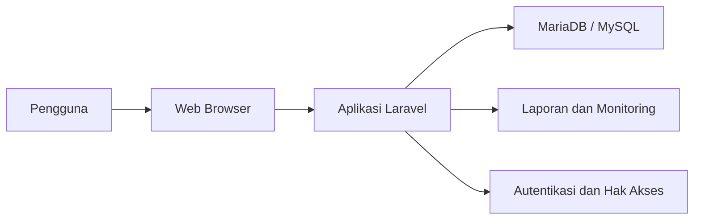
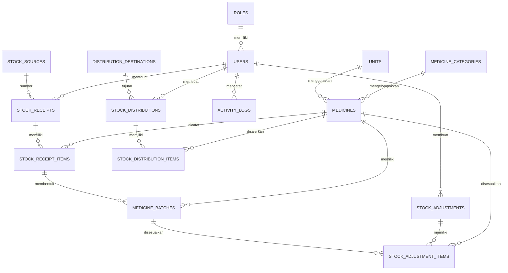
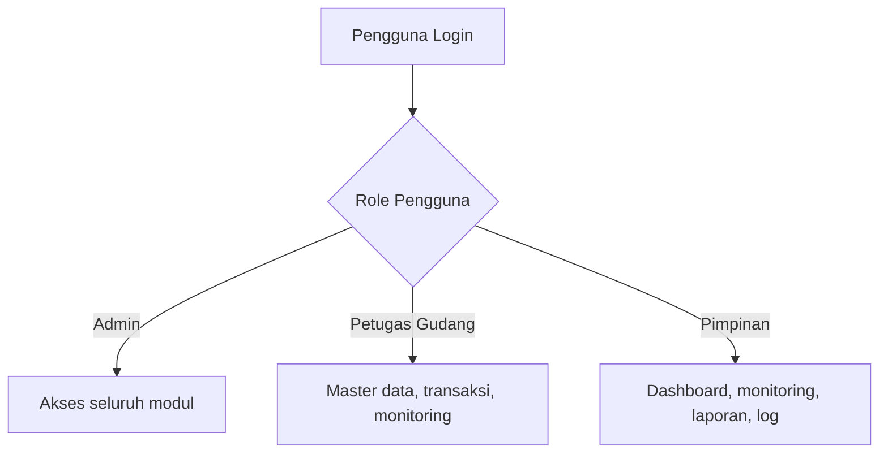
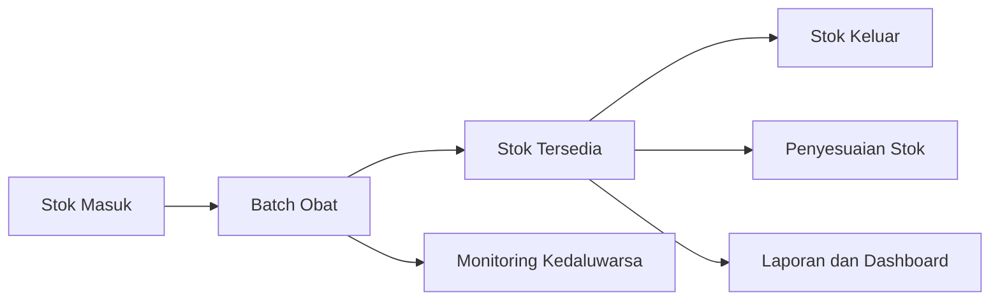
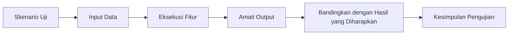

# BAB IV
# HASIL DAN PEMBAHASAN

## 4.1 Gambaran Umum Hasil Penelitian

Hasil dari penelitian ini adalah sebuah aplikasi monitoring obat kontrasepsi berbasis web yang dibangun menggunakan framework Laravel dan database MariaDB/MySQL. Aplikasi ini dirancang untuk membantu proses pengelolaan data obat, pencatatan transaksi stok masuk dan stok keluar, penyesuaian stok, monitoring kondisi stok, penyusunan laporan, serta pengelolaan pengguna pada lingkungan Dinas Pengendalian Penduduk dan Keluarga Berencana.

Secara umum, aplikasi yang dibangun telah mengintegrasikan proses pencatatan persediaan ke dalam satu sistem terpusat. Dengan demikian, data stok dapat diperbarui secara lebih cepat, proses pencarian data menjadi lebih mudah, dan risiko kesalahan pencatatan manual dapat dikurangi.

Adapun modul utama yang berhasil diimplementasikan dalam aplikasi ini meliputi:

- autentikasi pengguna,
- dashboard,
- manajemen master data,
- transaksi stok masuk,
- transaksi stok keluar,
- penyesuaian stok,
- monitoring stok,
- laporan,
- manajemen pengguna, dan
- log aktivitas.

## 4.2 Implementasi Sistem

### 4.2.1 Implementasi Perangkat Lunak

Implementasi perangkat lunak yang digunakan dalam pembangunan aplikasi ini terdiri atas beberapa komponen utama. Sistem dikembangkan menggunakan bahasa pemrograman PHP dengan framework Laravel. Untuk pengelolaan basis data digunakan MariaDB/MySQL. Antarmuka aplikasi dibangun menggunakan Blade Template, CSS, dan JavaScript yang terintegrasi dalam ekosistem Laravel.

Perangkat lunak yang digunakan dalam implementasi sistem ini adalah sebagai berikut:

- sistem operasi untuk pengembangan,
- web server Apache atau Laravel development server,
- PHP,
- Composer,
- Node.js dan NPM,
- framework Laravel,
- database MariaDB/MySQL, dan
- web browser.

Gambar 4.1. Arsitektur umum implementasi perangkat lunak aplikasi.

### 4.2.2 Implementasi Basis Data

Basis data pada aplikasi ini dirancang untuk mendukung seluruh proses bisnis utama dalam pengelolaan stok obat kontrasepsi. Struktur basis data terdiri atas tabel master, tabel transaksi, dan tabel pendukung audit.

Tabel master digunakan untuk menyimpan data dasar yang relatif jarang berubah, seperti data obat, kategori obat, satuan, sumber stok, tujuan distribusi, role, dan pengguna. Tabel transaksi digunakan untuk mencatat pergerakan stok, baik stok masuk, stok keluar, maupun penyesuaian stok. Selain itu, terdapat tabel log aktivitas yang digunakan untuk mencatat jejak aktivitas pengguna dalam sistem.

Secara umum, kelompok tabel dalam sistem ini meliputi:

- tabel master: `roles`, `users`, `medicine_categories`, `units`, `medicines`, `stock_sources`, `distribution_destinations`,
- tabel transaksi: `stock_receipts`, `stock_receipt_items`, `medicine_batches`, `stock_distributions`, `stock_distribution_items`, `stock_adjustments`, `stock_adjustment_items`,
- tabel audit: `activity_logs`.

Gambar 4.2. Diagram konseptual relasi data pada aplikasi.

### 4.2.3 Implementasi Hak Akses Pengguna

Hak akses pengguna pada aplikasi ini dibedakan berdasarkan peran masing-masing pengguna. Pembagian hak akses bertujuan agar setiap pengguna hanya dapat mengakses fitur yang sesuai dengan tugas dan tanggung jawabnya.

Hak akses dalam aplikasi ini terdiri atas:

- `admin`, yaitu pengguna yang memiliki akses penuh terhadap seluruh modul sistem,
- `petugas_gudang`, yaitu pengguna yang berfokus pada pengelolaan data transaksi dan monitoring stok,
- `pimpinan`, yaitu pengguna yang berfokus pada pemantauan dashboard, monitoring, laporan, dan log aktivitas tertentu.

Penerapan hak akses dilakukan melalui proses autentikasi dan middleware pada Laravel sehingga sistem dapat membatasi route, menu, dan aksi tertentu berdasarkan role pengguna.

Gambar 4.3. Diagram pembagian hak akses pengguna.

## 4.3 Pembahasan Fitur Aplikasi

### 4.3.1 Halaman Login

Halaman login digunakan sebagai gerbang awal bagi pengguna sebelum dapat mengakses sistem. Pengguna diwajibkan memasukkan kredensial yang valid agar dapat masuk ke dalam aplikasi. Fitur ini penting untuk menjaga keamanan data dan memastikan hanya pihak yang berwenang yang dapat mengakses sistem.

Pada implementasinya, sistem akan memverifikasi data login pengguna terhadap data pengguna yang tersimpan di basis data. Jika data sesuai, pengguna akan diarahkan ke halaman dashboard. Jika tidak sesuai, sistem akan menampilkan pesan kesalahan.

### 4.3.2 Dashboard

Dashboard berfungsi sebagai halaman utama setelah pengguna berhasil login. Halaman ini menampilkan ringkasan informasi penting yang dibutuhkan pengguna secara cepat, seperti jumlah obat aktif, total stok saat ini, obat dengan stok menipis, batch yang hampir kedaluwarsa, serta ringkasan transaksi harian.

Keberadaan dashboard membantu pengguna memperoleh gambaran umum kondisi persediaan tanpa harus membuka laporan atau detail transaksi satu per satu.

### 4.3.3 Manajemen Master Data

Modul master data digunakan untuk mengelola seluruh data dasar yang menjadi fondasi sistem. Data yang termasuk ke dalam modul ini antara lain kategori obat, satuan, data obat, sumber stok, dan tujuan distribusi.

Melalui modul ini, admin atau petugas dapat menambah, mengubah, melihat, dan menonaktifkan data sesuai kebutuhan. Keakuratan master data sangat berpengaruh terhadap proses transaksi stok dan kualitas laporan yang dihasilkan.

### 4.3.4 Transaksi Stok Masuk

Modul stok masuk digunakan untuk mencatat penerimaan obat dari pusat atau sumber distribusi tertentu. Setiap transaksi stok masuk akan menghasilkan detail item penerimaan dan membentuk data batch obat.

Dalam implementasi sistem ini, setiap item penerimaan dicatat dengan informasi jumlah, nomor batch, tanggal diterima, dan tanggal kedaluwarsa. Pencatatan batch penting untuk mendukung monitoring stok dan proses pengeluaran obat berdasarkan prinsip FEFO.

### 4.3.5 Transaksi Stok Keluar

Modul stok keluar digunakan untuk mencatat distribusi obat ke fasilitas kesehatan atau pihak tujuan. Proses pengeluaran stok pada sistem ini tidak hanya mengurangi total stok, tetapi juga mengambil stok dari batch yang memiliki tanggal kedaluwarsa paling dekat.

Penerapan metode FEFO pada modul ini membantu mengurangi risiko obat kedaluwarsa tersimpan terlalu lama di gudang. Dengan demikian, distribusi obat menjadi lebih terkendali dan sesuai dengan karakteristik barang medis.

### 4.3.6 Penyesuaian Stok

Modul penyesuaian stok digunakan ketika terjadi perbedaan antara stok fisik di lapangan dengan stok yang tercatat di dalam sistem. Selisih tersebut dapat disebabkan oleh berbagai faktor, seperti kesalahan pencatatan, kehilangan barang, atau hasil pemeriksaan ulang.

Melalui modul ini, pengguna dapat memilih batch obat tertentu, memasukkan jumlah stok aktual, lalu sistem akan menghitung selisih stok secara otomatis. Hasil penyesuaian akan disimpan sebagai histori agar proses audit tetap dapat dilakukan.

### 4.3.7 Monitoring Stok

Modul monitoring stok berfungsi untuk menampilkan kondisi stok terkini secara lebih rinci. Dalam aplikasi ini, monitoring terbagi menjadi beberapa bagian, yaitu stok terkini per obat, monitoring batch dan kedaluwarsa, serta kartu stok.

Halaman stok terkini membantu pengguna melihat jumlah stok yang masih tersedia untuk setiap obat. Halaman batch dan kedaluwarsa membantu pengguna memantau batch yang hampir atau sudah melewati masa kedaluwarsa. Sementara itu, kartu stok menampilkan histori pergerakan stok masuk, keluar, dan penyesuaian untuk suatu obat atau batch tertentu.

Gambar 4.4. Diagram alur utama pergerakan stok pada aplikasi.

### 4.3.8 Laporan

Modul laporan digunakan untuk menyajikan data dalam bentuk yang lebih terstruktur dan mudah dibaca. Aplikasi ini menyediakan beberapa jenis laporan, yaitu laporan stok, laporan stok masuk, laporan stok keluar, dan laporan penyesuaian stok.

Laporan dapat difilter berdasarkan kriteria tertentu agar pengguna dapat menyesuaikan informasi yang ingin dilihat. Fitur ini mempermudah penyusunan dokumen administrasi dan membantu pimpinan dalam proses evaluasi.

### 4.3.9 Manajemen Pengguna

Modul manajemen pengguna digunakan untuk mengelola akun yang dapat mengakses sistem. Pada modul ini, admin dapat menambah pengguna baru, mengubah data pengguna, melihat detail pengguna, serta mengatur status aktif atau nonaktif akun.

Pengelolaan akun pengguna penting untuk menjaga keamanan sistem serta memastikan distribusi hak akses berjalan sesuai kebutuhan organisasi.

### 4.3.10 Log Aktivitas

Modul log aktivitas digunakan untuk mencatat tindakan penting yang dilakukan oleh pengguna di dalam sistem. Catatan aktivitas ini dapat membantu proses pengawasan, pelacakan perubahan data, dan audit penggunaan sistem.

Informasi yang dicatat pada log aktivitas meliputi nama pengguna, modul yang diakses, jenis aksi, deskripsi aktivitas, waktu kejadian, dan alamat IP. Dengan adanya log aktivitas, pengelolaan sistem menjadi lebih transparan dan terkontrol.

## 4.4 Pengujian Sistem

### 4.4.1 Metode Pengujian

Pengujian sistem dilakukan menggunakan metode *black box testing*. Metode ini digunakan untuk menguji fungsi-fungsi sistem berdasarkan masukan dan keluaran yang dihasilkan, tanpa melihat secara langsung kode program di dalamnya.

Pengujian dilakukan pada setiap modul utama aplikasi untuk memastikan bahwa setiap fitur dapat berjalan sesuai kebutuhan. Fokus pengujian meliputi:

- validasi login,
- pengelolaan master data,
- pencatatan stok masuk,
- pencatatan stok keluar,
- penyesuaian stok,
- monitoring stok,
- pembuatan laporan,
- manajemen pengguna, dan
- log aktivitas.

Gambar 4.5. Diagram alur pengujian sistem dengan metode black box.

### 4.4.2 Hasil Pengujian Login

Tabel 4.1. Hasil pengujian login.

| No | Skenario Pengujian | Input | Hasil yang Diharapkan | Hasil Pengujian | Kesimpulan |
| --- | --- | --- | --- | --- | --- |
| 1 | Login dengan data valid | Email dan password benar | Sistem menampilkan dashboard | Sesuai harapan | Berhasil |
| 2 | Login dengan password salah | Email benar, password salah | Sistem menolak login dan menampilkan pesan kesalahan | Sesuai harapan | Berhasil |
| 3 | Login dengan akun nonaktif | Data login akun nonaktif | Sistem menolak akses | Sesuai harapan | Berhasil |

Tempat screenshot hasil pengujian login.

Gambar 4.6. Tampilan halaman login aplikasi.

Tempat screenshot hasil login berhasil.

Gambar 4.7. Tampilan dashboard setelah login berhasil.

### 4.4.3 Hasil Pengujian Master Data

Tabel 4.2. Hasil pengujian master data.

| No | Skenario Pengujian | Input | Hasil yang Diharapkan | Hasil Pengujian | Kesimpulan |
| --- | --- | --- | --- | --- | --- |
| 1 | Menambah kategori obat | Data kategori baru | Data kategori tersimpan | Sesuai harapan | Berhasil |
| 2 | Menambah satuan obat | Data satuan baru | Data satuan tersimpan | Sesuai harapan | Berhasil |
| 3 | Menambah data obat | Kode, nama, kategori, satuan, dan stok minimum | Data obat tersimpan | Sesuai harapan | Berhasil |
| 4 | Mengubah data sumber stok | Perubahan data sumber | Data sumber stok diperbarui | Sesuai harapan | Berhasil |
| 5 | Mengubah tujuan distribusi | Perubahan data tujuan | Data tujuan distribusi diperbarui | Sesuai harapan | Berhasil |

Tempat screenshot halaman data obat.

Gambar 4.8. Halaman manajemen data obat.

Tempat screenshot form tambah data obat.

Gambar 4.9. Form tambah data obat.

### 4.4.4 Hasil Pengujian Stok Masuk

Tabel 4.3. Hasil pengujian stok masuk.

| No | Skenario Pengujian | Input | Hasil yang Diharapkan | Hasil Pengujian | Kesimpulan |
| --- | --- | --- | --- | --- | --- |
| 1 | Menambah transaksi stok masuk | Data penerimaan dan item obat | Transaksi stok masuk tersimpan | Sesuai harapan | Berhasil |
| 2 | Membentuk batch obat | Data nomor batch, jumlah, dan kedaluwarsa | Batch obat terbentuk pada sistem | Sesuai harapan | Berhasil |
| 3 | Menampilkan detail penerimaan | Pilih transaksi stok masuk | Sistem menampilkan detail transaksi | Sesuai harapan | Berhasil |

Tempat screenshot halaman stok masuk.

Gambar 4.10. Halaman daftar stok masuk.

Tempat screenshot form tambah stok masuk.

Gambar 4.11. Form input transaksi stok masuk.

### 4.4.5 Hasil Pengujian Stok Keluar

Tabel 4.4. Hasil pengujian stok keluar.

| No | Skenario Pengujian | Input | Hasil yang Diharapkan | Hasil Pengujian | Kesimpulan |
| --- | --- | --- | --- | --- | --- |
| 1 | Menambah transaksi stok keluar | Data distribusi dan item obat | Transaksi stok keluar tersimpan | Sesuai harapan | Berhasil |
| 2 | Pengambilan batch berdasarkan FEFO | Permintaan obat dengan lebih dari satu batch | Sistem memilih batch dengan kedaluwarsa terdekat | Sesuai harapan | Berhasil |
| 3 | Validasi stok tidak cukup | Jumlah permintaan melebihi stok tersedia | Sistem menolak transaksi | Sesuai harapan | Berhasil |

Tempat screenshot halaman stok keluar.

Gambar 4.12. Halaman daftar stok keluar.

Tempat screenshot form transaksi stok keluar.

Gambar 4.13. Form input transaksi stok keluar.

### 4.4.6 Hasil Pengujian Penyesuaian Stok

Tabel 4.5. Hasil pengujian penyesuaian stok.

| No | Skenario Pengujian | Input | Hasil yang Diharapkan | Hasil Pengujian | Kesimpulan |
| --- | --- | --- | --- | --- | --- |
| 1 | Menambah penyesuaian stok | Batch, stok sistem, stok aktual | Data penyesuaian tersimpan | Sesuai harapan | Berhasil |
| 2 | Menghitung selisih otomatis | Stok sistem dan stok aktual | Selisih dihitung otomatis | Sesuai harapan | Berhasil |
| 3 | Memperbarui stok batch | Hasil penyesuaian disimpan | `qty_remaining` batch berubah sesuai stok aktual | Sesuai harapan | Berhasil |

Tempat screenshot halaman penyesuaian stok.

Gambar 4.14. Halaman daftar penyesuaian stok.

Tempat screenshot form penyesuaian stok.

Gambar 4.15. Form input penyesuaian stok.

### 4.4.7 Hasil Pengujian Monitoring

Tabel 4.6. Hasil pengujian monitoring.

| No | Skenario Pengujian | Input | Hasil yang Diharapkan | Hasil Pengujian | Kesimpulan |
| --- | --- | --- | --- | --- | --- |
| 1 | Menampilkan stok terkini | Membuka menu monitoring stok | Sistem menampilkan stok per obat | Sesuai harapan | Berhasil |
| 2 | Menampilkan batch hampir kedaluwarsa | Membuka menu batch dan kedaluwarsa | Sistem menampilkan daftar batch sesuai status | Sesuai harapan | Berhasil |
| 3 | Menampilkan kartu stok | Memilih obat dan filter periode | Sistem menampilkan histori mutasi stok | Sesuai harapan | Berhasil |

Tempat screenshot halaman stok terkini.

Gambar 4.16. Halaman monitoring stok terkini.

Tempat screenshot halaman batch dan kedaluwarsa.

Gambar 4.17. Halaman monitoring batch dan kedaluwarsa.

Tempat screenshot halaman kartu stok.

Gambar 4.18. Halaman kartu stok obat.

### 4.4.8 Hasil Pengujian Laporan

Tabel 4.7. Hasil pengujian laporan.

| No | Skenario Pengujian | Input | Hasil yang Diharapkan | Hasil Pengujian | Kesimpulan |
| --- | --- | --- | --- | --- | --- |
| 1 | Menampilkan laporan stok | Filter laporan stok | Sistem menampilkan data stok sesuai filter | Sesuai harapan | Berhasil |
| 2 | Menampilkan laporan stok masuk | Filter tanggal dan sumber | Sistem menampilkan data stok masuk | Sesuai harapan | Berhasil |
| 3 | Menampilkan laporan stok keluar | Filter tanggal dan tujuan | Sistem menampilkan data stok keluar | Sesuai harapan | Berhasil |
| 4 | Menampilkan laporan penyesuaian | Filter tanggal dan jenis penyesuaian | Sistem menampilkan data penyesuaian | Sesuai harapan | Berhasil |

Tempat screenshot halaman laporan stok.

Gambar 4.19. Halaman laporan stok.

Tempat screenshot halaman laporan stok masuk.

Gambar 4.20. Halaman laporan stok masuk.

Tempat screenshot halaman laporan stok keluar.

Gambar 4.21. Halaman laporan stok keluar.

Tempat screenshot halaman laporan penyesuaian stok.

Gambar 4.22. Halaman laporan penyesuaian stok.

### 4.4.9 Hasil Pengujian Manajemen Pengguna

Tabel 4.8. Hasil pengujian manajemen pengguna.

| No | Skenario Pengujian | Input | Hasil yang Diharapkan | Hasil Pengujian | Kesimpulan |
| --- | --- | --- | --- | --- | --- |
| 1 | Menambah pengguna baru | Data pengguna baru | Data pengguna tersimpan | Sesuai harapan | Berhasil |
| 2 | Mengubah data pengguna | Perubahan data akun | Data pengguna diperbarui | Sesuai harapan | Berhasil |
| 3 | Menonaktifkan akun | Ubah status akun | Akun berubah menjadi nonaktif | Sesuai harapan | Berhasil |

Tempat screenshot halaman manajemen pengguna.

Gambar 4.23. Halaman manajemen pengguna.

Tempat screenshot form tambah pengguna.

Gambar 4.24. Form tambah pengguna.

### 4.4.10 Hasil Pengujian Log Aktivitas

Tabel 4.9. Hasil pengujian log aktivitas.

| No | Skenario Pengujian | Input | Hasil yang Diharapkan | Hasil Pengujian | Kesimpulan |
| --- | --- | --- | --- | --- | --- |
| 1 | Menampilkan data log aktivitas | Membuka menu log aktivitas | Sistem menampilkan riwayat aktivitas pengguna | Sesuai harapan | Berhasil |
| 2 | Melakukan filter log | Filter user, modul, atau tanggal | Sistem menampilkan hasil sesuai filter | Sesuai harapan | Berhasil |

Tempat screenshot halaman log aktivitas.

Gambar 4.25. Halaman log aktivitas pengguna.

## 4.5 Pembahasan Hasil Sistem

Berdasarkan hasil implementasi dan pengujian yang telah dilakukan, aplikasi monitoring obat kontrasepsi berbasis web ini dapat mendukung proses pengelolaan stok secara lebih terstruktur dibandingkan dengan metode manual. Sistem mampu mencatat data obat, transaksi stok masuk, transaksi stok keluar, dan penyesuaian stok dalam satu basis data terintegrasi.

Penerapan pencatatan batch serta metode FEFO memberikan nilai tambah pada sistem, karena proses distribusi obat menjadi lebih terarah dan membantu mengurangi risiko kedaluwarsa. Selain itu, fitur monitoring dan laporan mempermudah pengguna dalam mengetahui kondisi stok terkini serta riwayat pergerakan obat.

Dari sisi pengelolaan pengguna, sistem telah menerapkan pembagian hak akses yang sesuai dengan kebutuhan peran pengguna. Keberadaan log aktivitas juga membantu meningkatkan pengawasan terhadap penggunaan sistem.

Secara keseluruhan, hasil implementasi menunjukkan bahwa aplikasi yang dibangun telah memenuhi kebutuhan utama pengelolaan stok obat kontrasepsi, yaitu pencatatan yang lebih akurat, monitoring yang lebih cepat, dan penyajian informasi yang lebih terintegrasi.

## 4.6 Kelebihan dan Keterbatasan Sistem

### 4.6.1 Kelebihan Sistem

Kelebihan dari sistem yang dibangun antara lain:

- berbasis web sehingga mudah diakses melalui browser,
- mendukung pencatatan stok masuk, stok keluar, dan penyesuaian stok,
- menerapkan pengelolaan stok berbasis batch,
- mendukung metode FEFO,
- menyediakan monitoring stok dan kedaluwarsa,
- menyediakan laporan yang lebih terstruktur,
- mendukung multi-user dengan pembagian hak akses.

### 4.6.2 Keterbatasan Sistem

Adapun keterbatasan dari sistem ini antara lain:

- fitur ekspor laporan ke PDF atau Excel belum dibahas secara mendalam,
- sistem masih berfokus pada kebutuhan internal pengelolaan stok,
- notifikasi otomatis untuk stok menipis atau batch hampir kedaluwarsa belum menjadi fokus utama,
- integrasi dengan sistem eksternal belum diterapkan.

## 4.7 Kesimpulan Bab

Berdasarkan hasil implementasi dan pengujian yang telah dilakukan pada BAB IV, dapat disimpulkan bahwa aplikasi monitoring obat kontrasepsi berbasis web ini telah berhasil dibangun sesuai kebutuhan utama sistem. Fitur-fitur yang tersedia mampu mendukung proses pengelolaan stok obat, monitoring kondisi persediaan, penyusunan laporan, serta pengendalian akses pengguna. Hasil pengujian menunjukkan bahwa fungsi-fungsi utama sistem telah berjalan sesuai dengan tujuan yang diharapkan.
