# BAB IV
# HASIL DAN PEMBAHASAN

## 4.1 Gambaran Umum Hasil Penelitian

Hasil dari penelitian ini adalah sebuah aplikasi monitoring obat kontrasepsi berbasis web yang dibangun untuk mendukung proses pencatatan, pemantauan, dan pelaporan data obat kontrasepsi pada Dinas Pengendalian Penduduk dan Keluarga Berencana Kota Sukabumi. Aplikasi dikembangkan menggunakan framework Laravel dan basis data MariaDB/MySQL sehingga dapat diakses melalui browser dan digunakan oleh lebih dari satu pengguna sesuai hak akses masing-masing.

Berbeda dengan sistem pencatatan manual yang sebelumnya banyak bergantung pada lembar kerja spreadsheet, aplikasi yang dibangun pada penelitian ini menempatkan data dalam satu sistem terintegrasi. Dengan demikian, proses pengelolaan data obat, penyusunan RKO, pencatatan realisasi pengadaan, pencatatan mutasi obat, monitoring stok, dan penyusunan laporan dapat dilakukan secara lebih terstruktur, lebih cepat, dan lebih mudah ditelusuri.

Secara umum, modul utama yang berhasil diimplementasikan dalam aplikasi ini meliputi:

- autentikasi pengguna,
- dashboard monitoring,
- manajemen data faskes,
- manajemen master obat,
- rencana kebutuhan obat (RKO),
- realisasi pengadaan,
- mutasi obat,
- monitoring stok,
- laporan,
- manajemen pengguna, dan
- log aktivitas.

## 4.2 Perancangan Aplikasi

Perancangan aplikasi pada penelitian ini disusun dengan menyesuaikan tingkat kompleksitas proses pada sistem. Proses yang bersifat kompleks, yaitu RKO, digambarkan menggunakan sequence diagram karena melibatkan interaksi antarpengguna pada tahap pengajuan, pemeriksaan, dan persetujuan. Sementara itu, proses yang lebih sederhana digambarkan menggunakan activity diagram agar alurnya lebih ringkas dan mudah dipahami.

### 4.2.1 Identifikasi Aktor

Aktor pada sistem diidentifikasi untuk menunjukkan pihak-pihak yang terlibat langsung dalam penggunaan aplikasi serta peran masing-masing terhadap proses monitoring obat kontrasepsi.

Aktor yang terlibat dalam aplikasi monitoring obat kontrasepsi terdiri dari:

- **Admin**, berwenang mengelola seluruh modul sistem.
- **Petugas**, berfokus pada pengelolaan data master, pengajuan RKO, pencatatan mutasi keluar, monitoring, dan laporan.
- **Pimpinan**, berfokus pada persetujuan RKO serta melihat ringkasan monitoring dan laporan.

### 4.2.2 Use Case Diagram Proses RKO

Subbab ini menjelaskan fungsi-fungsi utama yang terlibat pada proses RKO. Use case diagram digunakan untuk menunjukkan hubungan antara aktor dengan aktivitas inti mulai dari penyusunan usulan kebutuhan obat sampai persetujuan dokumen.

Pada use case ini terlihat bahwa petugas dan admin dapat menyusun serta mengajukan dokumen RKO, sedangkan pimpinan dan admin memiliki peran dalam proses peninjauan dan persetujuan. Hasil dari persetujuan tersebut kemudian berlanjut ke pembentukan realisasi pengadaan dan mutasi masuk otomatis.

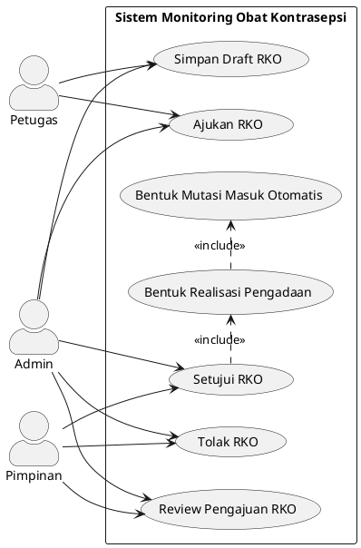

Gambar 4.1. Use case diagram proses RKO.

### 4.2.3 Sequence Diagram Proses RKO

Subbab ini menjelaskan alur interaksi pada proses RKO sebagai proses inti yang paling kompleks dalam aplikasi. Fokus utamanya adalah hubungan antara petugas sebagai pengusul, pimpinan sebagai pihak penyetuju, dan sistem sebagai pengolah data pengadaan.

Sequence diagram pada bagian ini difokuskan pada proses RKO karena proses tersebut melibatkan interaksi antara petugas, pimpinan, sistem, dan basis data pada tahap pengajuan sampai persetujuan. Ketika RKO disetujui, sistem secara otomatis membentuk realisasi pengadaan dan mutasi masuk.

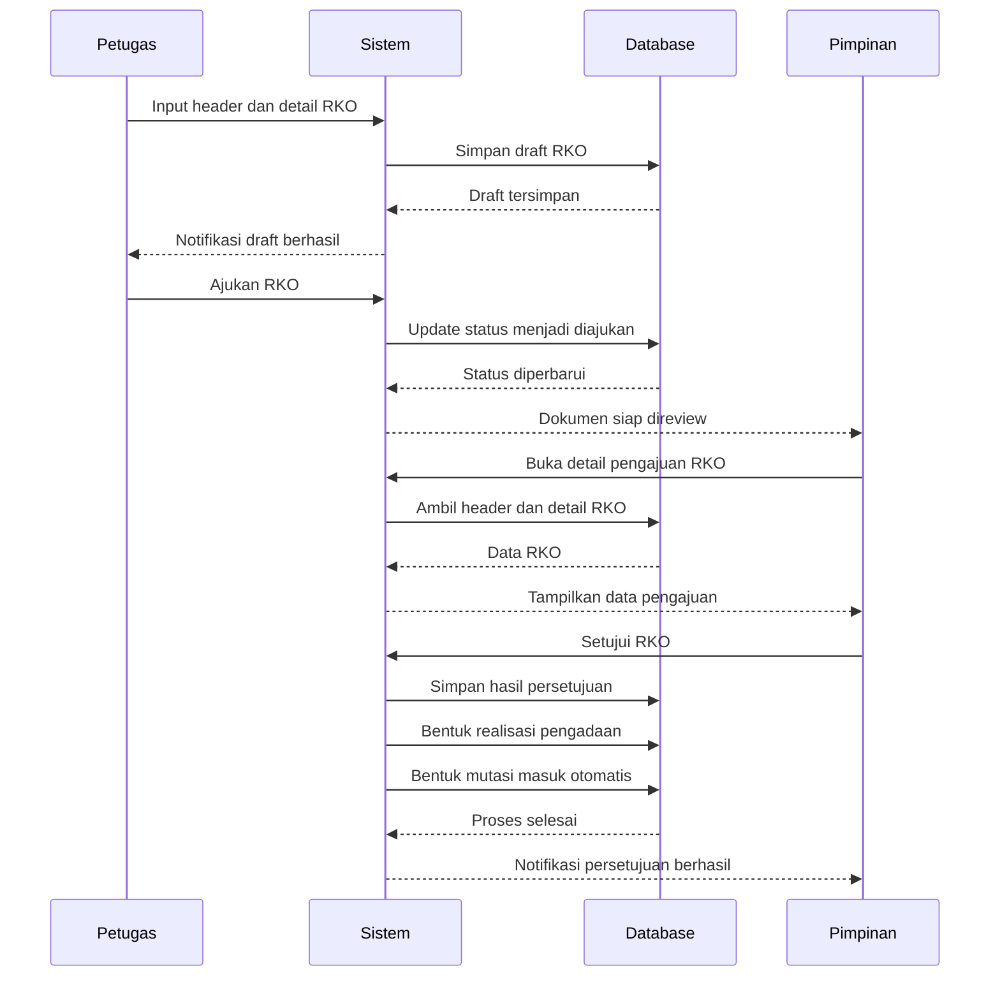

Pada sequence diagram tersebut, petugas berperan sebagai pihak yang memasukkan data header dan detail RKO ke dalam sistem. Sistem kemudian menyimpan data tersebut ke basis data sebagai draft sehingga usulan kebutuhan obat dapat dicatat terlebih dahulu sebelum diajukan secara resmi.

Setelah draft tersimpan, petugas melakukan pengajuan RKO. Pada tahap ini sistem memperbarui status dokumen menjadi diajukan, lalu menyiapkan dokumen agar dapat direview oleh pimpinan. Bagian ini menunjukkan bahwa pengajuan tidak langsung dianggap disetujui, tetapi harus melalui tahapan pemeriksaan terlebih dahulu.

Pimpinan selanjutnya membuka detail pengajuan RKO untuk meninjau isi dokumen. Sistem mengambil data header dan detail RKO dari basis data, kemudian menampilkannya agar proses evaluasi dapat dilakukan berdasarkan data usulan yang telah dimasukkan oleh petugas.

Tahap akhir pada diagram menunjukkan proses persetujuan. Ketika pimpinan menyetujui RKO, sistem menyimpan hasil persetujuan, membentuk data realisasi pengadaan, dan secara otomatis membentuk mutasi masuk. Dengan demikian, sequence diagram ini memperlihatkan keterkaitan langsung antara proses perencanaan kebutuhan obat dengan proses pengadaan dan pencatatan stok.

Gambar 4.2. Sequence diagram proses RKO.

### 4.2.4 Activity Diagram Login

Subbab ini menunjukkan proses autentikasi awal yang harus dilalui pengguna sebelum dapat mengakses fitur-fitur pada aplikasi.

Activity diagram berikut menggambarkan alur login pengguna ke dalam sistem.

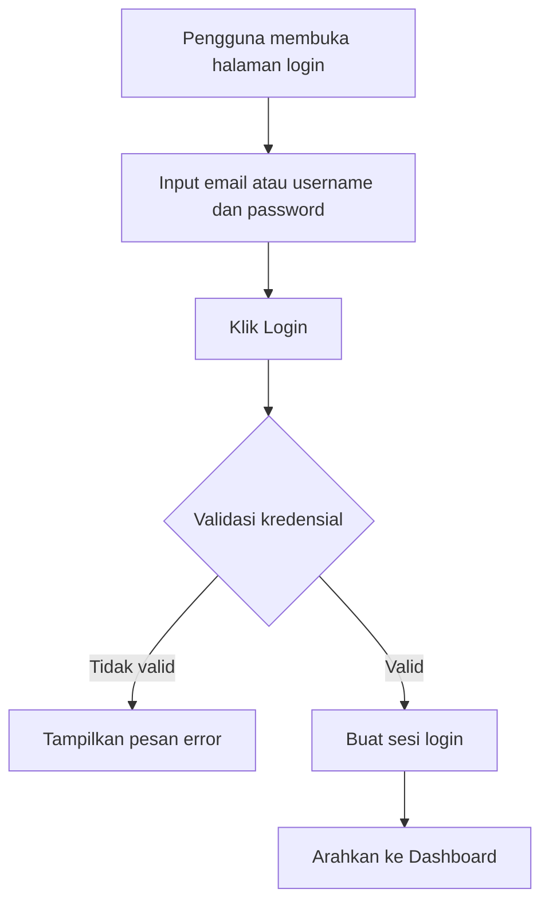

Gambar 4.3. Activity diagram proses login.

### 4.2.5 Activity Diagram Kelola Master Data

Subbab ini menjelaskan alur dasar pengelolaan data referensi yang menjadi fondasi bagi modul-modul lain di dalam sistem.

Activity diagram berikut menggambarkan alur pengelolaan data master seperti obat, faskes, dan sumber dana.

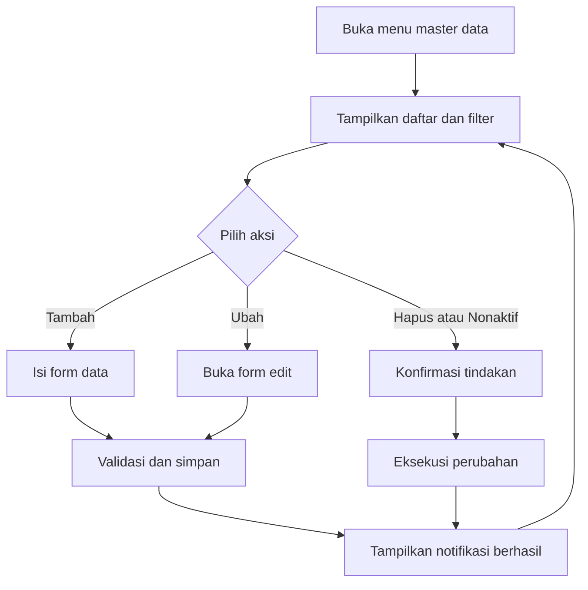

Gambar 4.4. Activity diagram kelola master data.

### 4.2.6 Activity Diagram Realisasi Pengadaan

Subbab ini menggambarkan bagaimana pengguna meninjau data realisasi pengadaan yang terbentuk dari hasil persetujuan RKO.

Activity diagram berikut menggambarkan alur pengguna saat melihat data realisasi pengadaan yang telah dibentuk dari hasil persetujuan RKO.

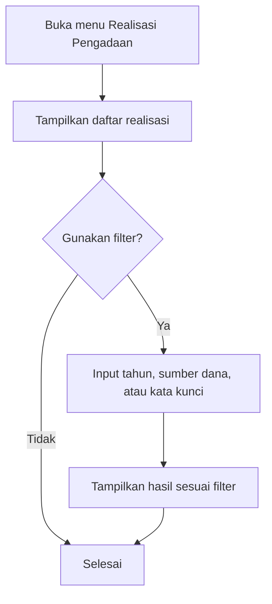

Gambar 4.5. Activity diagram realisasi pengadaan.

### 4.2.7 Activity Diagram Mutasi Keluar

Subbab ini menjelaskan alur pencatatan penyaluran obat keluar agar pergerakan stok dapat tetap terpantau secara sistematis.

Activity diagram berikut menggambarkan pencatatan mutasi keluar obat ke faskes tujuan.

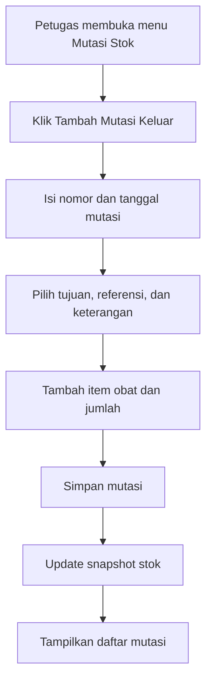

Gambar 4.6. Activity diagram mutasi keluar.

### 4.2.8 Activity Diagram Monitoring Stok

Subbab ini menunjukkan proses pemantauan stok berjalan yang menjadi inti fungsi monitoring pada aplikasi.

Activity diagram berikut menggambarkan alur monitoring stok obat pada sistem.

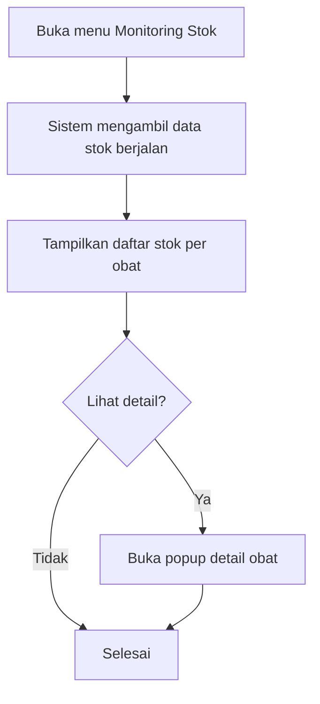

Gambar 4.7. Activity diagram monitoring stok.

### 4.2.9 Activity Diagram Laporan

Subbab ini menjelaskan alur penyajian laporan sebagai hasil akhir dari proses pencatatan, pengolahan, dan monitoring data.

Activity diagram berikut menggambarkan proses pengguna saat menampilkan laporan monitoring.

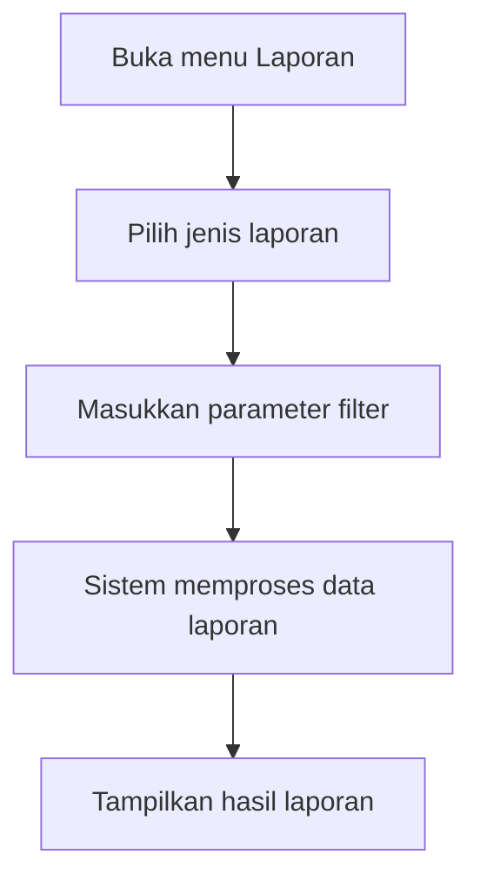

Gambar 4.8. Activity diagram laporan.

### 4.2.10 Activity Diagram Manajemen Pengguna

Subbab ini menggambarkan proses pengelolaan akun pengguna untuk menjaga pengaturan akses sistem tetap terkontrol.

Activity diagram berikut menggambarkan proses pengelolaan akun pengguna oleh admin.

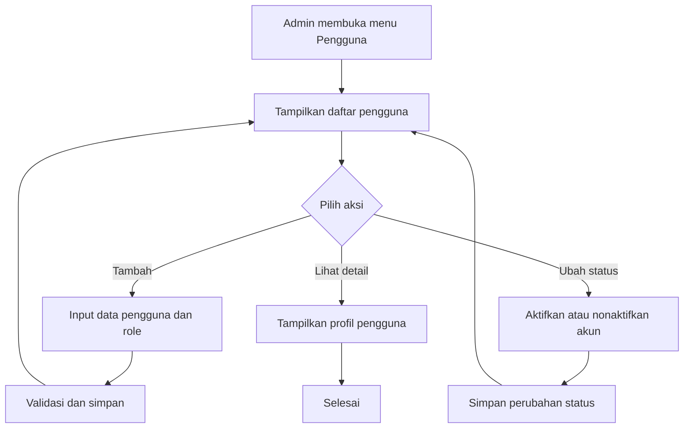

Gambar 4.9. Activity diagram manajemen pengguna.

### 4.2.11 Activity Diagram Log Aktivitas

Subbab ini menjelaskan bagaimana aktivitas penting pengguna dicatat oleh sistem dan kemudian dapat ditinjau kembali untuk kebutuhan pengawasan.

Activity diagram berikut menggambarkan alur pencatatan dan penayangan log aktivitas sistem.

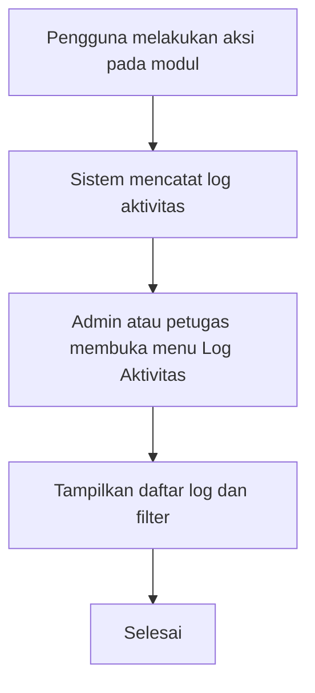

Gambar 4.10. Activity diagram log aktivitas.

## 4.3 Implementasi Sistem

### 4.3.1 Implementasi Perangkat Lunak

Implementasi perangkat lunak pada penelitian ini menggunakan pendekatan pengembangan aplikasi web. Sistem dibangun menggunakan bahasa pemrograman PHP dengan framework Laravel, sedangkan antarmuka dikembangkan menggunakan Blade Template, CSS, dan JavaScript yang terintegrasi pada ekosistem Laravel. Basis data yang digunakan adalah MariaDB/MySQL.

Perangkat lunak yang digunakan dalam implementasi sistem ini meliputi:

- sistem operasi untuk pengembangan,
- web server Apache atau Laravel development server,
- PHP,
- Composer,
- Node.js dan NPM,
- framework Laravel,
- database MariaDB/MySQL, dan
- web browser.

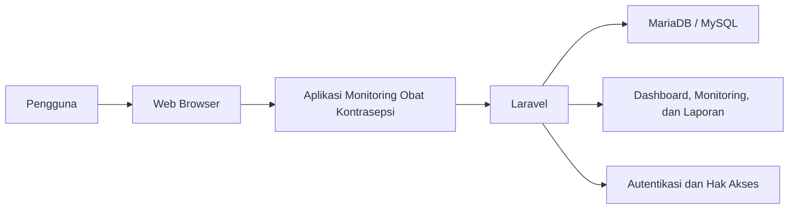

Gambar 4.11. Arsitektur umum implementasi perangkat lunak aplikasi.

### 4.3.2 Implementasi Basis Data

Basis data pada aplikasi ini dirancang untuk mendukung kebutuhan monitoring obat kontrasepsi, mulai dari data master, perencanaan kebutuhan, realisasi pengadaan, mutasi obat, hingga pemantauan stok per periode. Struktur basis data tidak hanya menyimpan data pokok, tetapi juga menyediakan relasi yang memudahkan proses pencarian, penyaringan, dan penyusunan laporan.

Secara umum, kelompok tabel yang digunakan dalam implementasi sistem ini meliputi:

- tabel master: `roles`, `users`, `medicine_categories`, `units`, `medicines`, `funding_sources`, `distribution_destinations`,
- tabel perencanaan: `rko_headers`, `rko_details`,
- tabel transaksi dan monitoring: `procurement_realizations`, `stock_mutations`, `stock_mutation_items`, `medicine_stocks`,
- tabel audit: `activity_logs`.

Dalam implementasinya, tabel `medicines` digunakan untuk menyimpan data obat. Tabel `rko_headers` dan `rko_details` digunakan untuk menyimpan rencana kebutuhan obat, termasuk pemisahan data usulan (estimasi) dan data persetujuan (jumlah serta harga disetujui). Saat RKO disetujui, sistem membentuk data `procurement_realizations` sebagai catatan realisasi pengadaan. Selanjutnya, transaksi stok pada sistem dicatat pada tabel `stock_mutations` sebagai header mutasi dan tabel `stock_mutation_items` sebagai rincian item obat. Tabel `medicine_stocks` digunakan untuk menyimpan stok terkini (snapshot) per obat yang dapat diperbarui berdasarkan mutasi.

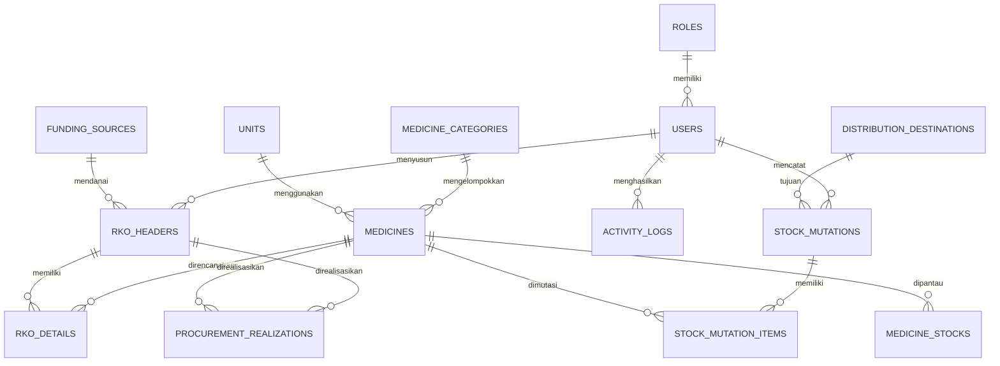

Gambar 4.12. Diagram konseptual relasi data pada aplikasi.

### 4.3.3 Implementasi Hak Akses Pengguna

Hak akses pengguna pada aplikasi ini dibedakan berdasarkan peran masing-masing pengguna. Pembagian hak akses dilakukan agar pengguna hanya dapat mengakses menu dan fungsi yang sesuai dengan tugasnya.

Hak akses utama dalam aplikasi ini terdiri atas:

- `admin`, yaitu pengguna yang memiliki akses penuh terhadap seluruh modul sistem,
- `petugas_gudang`, yaitu pengguna yang berfokus pada pengelolaan data master, RKO, realisasi pengadaan, mutasi obat, monitoring, dan laporan,
- `pimpinan`, yaitu pengguna yang berfokus pada pemantauan dashboard, monitoring, laporan, dan log aktivitas.

Implementasi hak akses dilakukan melalui autentikasi dan middleware pada Laravel, sehingga sistem dapat membatasi route, menu, dan tindakan tertentu berdasarkan role pengguna.

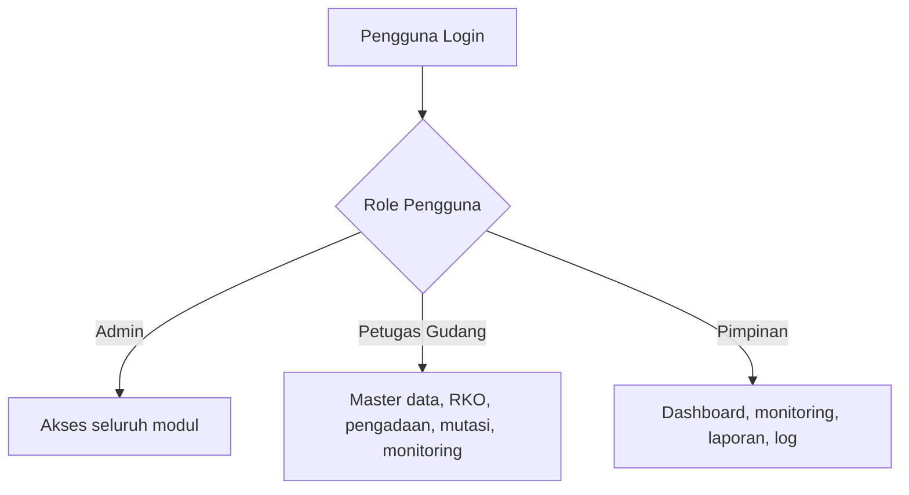

Gambar 4.13. Diagram pembagian hak akses pengguna.

## 4.4 Pembahasan Fitur Aplikasi

### 4.4.1 Halaman Login

Halaman login berfungsi sebagai pintu masuk pengguna ke dalam sistem. Pada halaman ini, pengguna harus memasukkan kredensial yang sesuai agar dapat mengakses aplikasi. Fitur login penting untuk menjaga keamanan data dan memastikan bahwa hanya pengguna yang berwenang yang dapat menggunakan sistem.

Ketika proses login berhasil, pengguna akan diarahkan ke dashboard sesuai hak akses yang dimilikinya. Sebaliknya, apabila data login tidak sesuai, sistem akan menampilkan pesan kesalahan.

Tempat screenshot halaman login.

Gambar 4.14. Tampilan halaman login aplikasi.

Tempat screenshot halaman dashboard.

Gambar 4.15. Tampilan dashboard setelah login berhasil.

### 4.4.2 Dashboard Monitoring

Dashboard merupakan halaman utama setelah pengguna berhasil login. Dashboard menampilkan ringkasan informasi penting yang dibutuhkan pengguna secara cepat, seperti jumlah obat aktif, total stok yang tercatat, jumlah dokumen RKO, realisasi pengadaan, mutasi obat, serta indikator kondisi stok.

Dashboard membantu pengguna memperoleh gambaran umum kondisi obat kontrasepsi tanpa harus membuka setiap halaman secara terpisah. Dengan demikian, dashboard berfungsi sebagai media monitoring awal bagi admin, petugas, maupun pimpinan.

### 4.4.3 Manajemen Data Faskes

Modul data faskes digunakan untuk menyimpan data fasilitas kesehatan yang menjadi tujuan mutasi obat. Data ini meliputi identitas faskes, jenis faskes, informasi kontak, serta status aktif atau nonaktif.

Data faskes penting karena menjadi acuan pada proses mutasi obat. Dengan data faskes yang terkelola dengan baik, proses pencatatan mutasi menjadi lebih rapi dan tujuan penyaluran obat dapat ditelusuri dengan lebih mudah.

Tempat screenshot halaman data faskes.

Gambar 4.16. Halaman manajemen data faskes.

### 4.4.4 Manajemen Master Obat

Modul master obat digunakan untuk mengelola data obat kontrasepsi yang akan dipantau dalam sistem. Data yang dikelola meliputi kode obat, nama obat, jenis obat, kategori, satuan, harga standar, status aktif, dan stok minimum.

Ketersediaan master obat yang akurat sangat berpengaruh terhadap modul lain, terutama RKO, realisasi pengadaan, mutasi obat, monitoring stok, dan laporan. Oleh karena itu, modul ini menjadi fondasi utama dalam implementasi sistem.

Tempat screenshot halaman data obat.

Gambar 4.17. Halaman manajemen data obat.

Tempat screenshot form tambah data obat.

Gambar 4.18. Form tambah data obat.

Tempat screenshot halaman sumber dana.

Gambar 4.19. Halaman manajemen sumber dana.

### 4.4.5 Rencana Kebutuhan Obat (RKO)

Modul RKO digunakan untuk mencatat rencana kebutuhan obat pada periode tertentu. Implementasi RKO dibagi menjadi dua bagian, yaitu header dan detail. Bagian header berisi informasi umum seperti nomor RKO, periode, tahun, sumber dana, total anggaran usulan, status dokumen, tanggal pengajuan, tanggal persetujuan, dan catatan. Sementara itu, bagian detail berisi rincian item obat, jumlah rencana, estimasi harga satuan, prioritas, serta catatan item.

Pada implementasi aplikasi ini, proses RKO dibuat dalam dua alur form agar data usulan dan data persetujuan tidak tercampur, yaitu:

- form *pengajuan RKO* untuk memasukkan data usulan (jumlah rencana dan estimasi harga satuan), dan
- form *persetujuan RKO* untuk memasukkan data hasil persetujuan (jumlah disetujui dan harga disetujui).

Dengan adanya modul ini, proses perencanaan kebutuhan obat dapat didokumentasikan secara sistematis. RKO juga berperan sebagai acuan dalam proses realisasi pengadaan sehingga hubungan antara rencana dan pelaksanaan dapat dipantau.

Tempat screenshot halaman daftar RKO.

Gambar 4.20. Halaman daftar RKO.

Tempat screenshot form input RKO.

Gambar 4.21. Form input RKO.

### 4.4.6 Realisasi Pengadaan

Modul realisasi pengadaan digunakan untuk menampilkan data obat yang terealisasi pada suatu periode berdasarkan hasil persetujuan RKO. Pada implementasi ini, realisasi pengadaan dibentuk otomatis saat RKO disetujui, sehingga pengguna tidak perlu melakukan input transaksi pengadaan secara manual.

Informasi yang ditampilkan pada modul ini meliputi nomor RKO, periode, sumber dana, item obat, jumlah realisasi, harga satuan disetujui, total nilai, serta catatan item. Dengan demikian, modul ini menjadi jembatan antara perencanaan dan kondisi persetujuan yang kemudian digunakan untuk monitoring.

Tempat screenshot halaman realisasi pengadaan.

Gambar 4.22. Halaman daftar realisasi pengadaan.

Tempat screenshot form realisasi pengadaan.

Gambar 4.23. Form input realisasi pengadaan.

### 4.4.7 Mutasi Obat

Modul mutasi obat digunakan untuk mencatat perpindahan atau penyaluran obat ke fasilitas kesehatan. Pada implementasi ini, transaksi manual pada menu mutasi stok dibatasi untuk *mutasi keluar* agar aplikasi tetap fokus pada monitoring (bukan inventory detail). Mutasi masuk dibentuk otomatis saat dokumen RKO disetujui.

Data mutasi obat sangat penting dalam konteks monitoring karena menunjukkan bagaimana obat yang telah diterima kemudian disalurkan. Riwayat mutasi tersebut juga menjadi salah satu sumber data bagi penyusunan snapshot stok dan histori pergerakan obat.

Tempat screenshot halaman mutasi obat.

Gambar 4.24. Halaman daftar mutasi obat.

Tempat screenshot form mutasi obat.

Gambar 4.25. Form input mutasi obat.

### 4.4.8 Monitoring Stok

Modul monitoring stok berfungsi untuk menampilkan kondisi stok obat secara ringkas dan terstruktur. Pada aplikasi ini, monitoring berfokus pada stok per obat dan stok per periode, bukan pada pelacakan teknis yang terlalu rinci. Dengan pendekatan ini, aplikasi lebih menekankan fungsi pemantauan, evaluasi, dan pelaporan.

Monitoring stok menampilkan jumlah stok yang tersedia, status kondisi stok, dan ringkasan mutasi yang terjadi. Selain itu, pengguna juga dapat melihat detail obat melalui popup sehingga informasi penting tetap dapat diakses dengan cepat tanpa harus berpindah halaman.

Tempat screenshot halaman stok terkini.

Gambar 4.26. Halaman monitoring stok terkini.

Tempat screenshot popup detail obat.

Gambar 4.27. Tampilan detail obat pada monitoring.

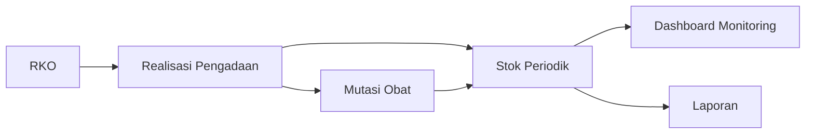

Gambar 4.28. Diagram alur utama data monitoring pada aplikasi.

### 4.4.9 Laporan

Modul laporan digunakan untuk menyajikan data dalam bentuk yang lebih terstruktur dan mudah dibaca. Laporan yang tersedia pada aplikasi ini meliputi laporan stok, laporan realisasi pengadaan, laporan mutasi obat, dan laporan RKO vs realisasi.

Khusus laporan RKO vs realisasi, sistem menampilkan perbandingan antara kebutuhan yang direncanakan dan realisasi pengadaan yang telah dicatat. Fitur ini menjadi bagian penting dari monitoring karena membantu pengguna melihat capaian pengadaan serta selisih yang masih perlu ditindaklanjuti.

Tempat screenshot halaman laporan stok.

Gambar 4.29. Halaman laporan stok.

Tempat screenshot halaman laporan realisasi pengadaan.

Gambar 4.30. Halaman laporan realisasi pengadaan.

Tempat screenshot halaman laporan mutasi obat.

Gambar 4.31. Halaman laporan mutasi obat.

Tempat screenshot halaman laporan RKO vs realisasi.

Gambar 4.32. Halaman laporan RKO vs realisasi.

### 4.4.10 Manajemen Pengguna

Modul manajemen pengguna digunakan untuk mengelola akun yang dapat mengakses sistem. Admin dapat menambah pengguna baru, mengubah data pengguna, melihat detail pengguna, serta mengatur status aktif atau nonaktif akun.

Pengelolaan akun penting untuk menjaga keamanan sistem dan memastikan bahwa pembagian hak akses berjalan sesuai kebutuhan organisasi.

Tempat screenshot halaman manajemen pengguna.

Gambar 4.33. Halaman manajemen pengguna.

Tempat screenshot form tambah pengguna.

Gambar 4.34. Form tambah pengguna.

### 4.4.11 Log Aktivitas

Modul log aktivitas digunakan untuk mencatat tindakan penting yang dilakukan oleh pengguna di dalam sistem. Informasi yang dicatat meliputi nama pengguna, modul yang diakses, aksi yang dilakukan, deskripsi aktivitas, waktu kejadian, dan alamat IP.

Keberadaan log aktivitas membantu proses pengawasan dan audit, serta mempermudah penelusuran apabila terjadi perubahan data tertentu pada sistem.

Tempat screenshot halaman log aktivitas.

Gambar 4.35. Halaman log aktivitas.

## 4.5 Pengujian Sistem

### 4.5.1 Metode Pengujian

Pengujian sistem dilakukan menggunakan metode *black box testing*. Metode ini digunakan untuk menguji fungsi sistem berdasarkan masukan dan keluaran yang dihasilkan tanpa melihat kode program secara langsung.

Fokus pengujian pada penelitian ini meliputi:

- validasi login,
- pengelolaan master data,
- pengelolaan RKO,
- pencatatan realisasi pengadaan,
- pencatatan mutasi obat,
- monitoring stok,
- pembuatan laporan,
- manajemen pengguna, dan
- log aktivitas.

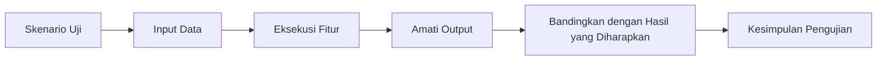

Gambar 4.36. Diagram alur pengujian sistem dengan metode black box.

### 4.5.2 Hasil Pengujian Login

Tabel 4.1. Hasil pengujian login.

| No | Skenario Pengujian | Input | Hasil yang Diharapkan | Hasil Pengujian | Kesimpulan |
| --- | --- | --- | --- | --- | --- |
| 1 | Login dengan data valid | Email dan password benar | Sistem menampilkan dashboard | Sesuai harapan | Berhasil |
| 2 | Login dengan password salah | Email benar, password salah | Sistem menolak login dan menampilkan pesan kesalahan | Sesuai harapan | Berhasil |
| 3 | Login dengan akun nonaktif | Data login akun nonaktif | Sistem menolak akses | Sesuai harapan | Berhasil |

### 4.5.3 Hasil Pengujian Master Data

Tabel 4.2. Hasil pengujian master data.

| No | Skenario Pengujian | Input | Hasil yang Diharapkan | Hasil Pengujian | Kesimpulan |
| --- | --- | --- | --- | --- | --- |
| 1 | Menambah kategori obat | Data kategori baru | Data kategori tersimpan | Sesuai harapan | Berhasil |
| 2 | Menambah satuan obat | Data satuan baru | Data satuan tersimpan | Sesuai harapan | Berhasil |
| 3 | Menambah data obat | Kode, nama, jenis, kategori, satuan, dan harga standar | Data obat tersimpan | Sesuai harapan | Berhasil |
| 4 | Mengubah data obat tanpa mengubah kode | Edit data obat, kode tidak diubah | Sistem menyimpan perubahan tanpa error validasi kode duplikat | Sesuai harapan | Berhasil |
| 5 | Menambah data faskes | Data identitas faskes baru | Data faskes tersimpan | Sesuai harapan | Berhasil |
| 6 | Mengubah data faskes | Edit data faskes | Data faskes diperbarui | Sesuai harapan | Berhasil |
| 7 | Menonaktifkan faskes | Ubah status faskes menjadi nonaktif | Faskes tidak muncul pada pilihan tujuan mutasi keluar (jika sistem memfilter hanya yang aktif) | Sesuai harapan | Berhasil |
| 8 | Menambah sumber dana | Kode, nama, jenis, status | Data sumber dana tersimpan | Sesuai harapan | Berhasil |
| 9 | Mengubah sumber dana | Edit data sumber dana | Data sumber dana diperbarui | Sesuai harapan | Berhasil |
| 10 | Menonaktifkan sumber dana | Ubah status sumber dana menjadi nonaktif | Sumber dana tidak muncul pada pilihan sumber dana saat membuat RKO (jika sistem memfilter hanya yang aktif) | Sesuai harapan | Berhasil |

### 4.5.4 Hasil Pengujian RKO

Tabel 4.3. Hasil pengujian RKO.

| No | Skenario Pengujian | Input | Hasil yang Diharapkan | Hasil Pengujian | Kesimpulan |
| --- | --- | --- | --- | --- | --- |
| 1 | Membuat pengajuan RKO | Data header dan detail item obat (rencana + estimasi) | Pengajuan RKO tersimpan dengan status draft/diajukan | Sesuai harapan | Berhasil |
| 2 | Menghitung total estimasi | Jumlah rencana dan estimasi harga satuan | Sistem menghitung total estimasi item | Sesuai harapan | Berhasil |
| 3 | Melakukan persetujuan RKO | Status persetujuan, qty disetujui, harga disetujui | Data persetujuan tersimpan terpisah dari pengajuan | Sesuai harapan | Berhasil |
| 4 | Membentuk output approval | RKO disetujui | Sistem membentuk realisasi pengadaan dan mutasi masuk otomatis | Sesuai harapan | Berhasil |

### 4.5.5 Hasil Pengujian Realisasi Pengadaan

Tabel 4.4. Hasil pengujian realisasi pengadaan.

| No | Skenario Pengujian | Input | Hasil yang Diharapkan | Hasil Pengujian | Kesimpulan |
| --- | --- | --- | --- | --- | --- |
| 1 | Membentuk realisasi pengadaan otomatis | RKO disetujui | Sistem membuat baris realisasi sesuai item yang disetujui | Sesuai harapan | Berhasil |
| 2 | Menampilkan daftar realisasi | Membuka menu realisasi pengadaan | Sistem menampilkan daftar data realisasi | Sesuai harapan | Berhasil |
| 3 | Filter realisasi pengadaan | Filter sumber dana/tahun/pencarian | Sistem menampilkan data sesuai filter | Sesuai harapan | Berhasil |

### 4.5.6 Hasil Pengujian Mutasi Obat

Tabel 4.5. Hasil pengujian mutasi obat.

| No | Skenario Pengujian | Input | Hasil yang Diharapkan | Hasil Pengujian | Kesimpulan |
| --- | --- | --- | --- | --- | --- |
| 1 | Menambah mutasi keluar | Data faskes tujuan (opsional) dan item obat | Data mutasi keluar tersimpan | Sesuai harapan | Berhasil |
| 2 | Membatasi mutasi masuk manual | Memilih jenis mutasi masuk pada form | Sistem menolak karena mutasi masuk hanya melalui approval RKO | Sesuai harapan | Berhasil |
| 3 | Menampilkan detail mutasi | Memilih transaksi mutasi tertentu | Sistem menampilkan detail mutasi | Sesuai harapan | Berhasil |

### 4.5.7 Hasil Pengujian Monitoring

Tabel 4.6. Hasil pengujian monitoring.

| No | Skenario Pengujian | Input | Hasil yang Diharapkan | Hasil Pengujian | Kesimpulan |
| --- | --- | --- | --- | --- | --- |
| 1 | Menampilkan stok terkini | Membuka menu monitoring stok | Sistem menampilkan stok per obat | Sesuai harapan | Berhasil |
| 2 | Menampilkan detail obat | Memilih tombol detail pada data obat | Sistem menampilkan popup detail obat | Sesuai harapan | Berhasil |
| 3 | Menampilkan status stok | Data snapshot stok tersedia | Sistem menampilkan status aman, kurang, atau berlebih | Sesuai harapan | Berhasil |

### 4.5.8 Hasil Pengujian Laporan

Tabel 4.7. Hasil pengujian laporan.

| No | Skenario Pengujian | Input | Hasil yang Diharapkan | Hasil Pengujian | Kesimpulan |
| --- | --- | --- | --- | --- | --- |
| 1 | Menampilkan laporan stok | Filter laporan stok | Sistem menampilkan data stok sesuai filter | Sesuai harapan | Berhasil |
| 2 | Menampilkan laporan realisasi pengadaan | Filter tanggal dan sumber | Sistem menampilkan data pengadaan sesuai filter | Sesuai harapan | Berhasil |
| 3 | Menampilkan laporan mutasi obat | Filter tanggal dan faskes | Sistem menampilkan data mutasi sesuai filter | Sesuai harapan | Berhasil |
| 4 | Menampilkan laporan RKO vs realisasi | Filter periode dan status | Sistem menampilkan perbandingan rencana dan realisasi | Sesuai harapan | Berhasil |

### 4.5.9 Hasil Pengujian Manajemen Pengguna

Tabel 4.8. Hasil pengujian manajemen pengguna.

| No | Skenario Pengujian | Input | Hasil yang Diharapkan | Hasil Pengujian | Kesimpulan |
| --- | --- | --- | --- | --- | --- |
| 1 | Menambah pengguna baru | Data akun dan role | Data pengguna tersimpan | Sesuai harapan | Berhasil |
| 2 | Mengubah status pengguna | Aktif atau nonaktif | Status pengguna diperbarui | Sesuai harapan | Berhasil |
| 3 | Menampilkan detail pengguna | Memilih salah satu akun | Sistem menampilkan profil pengguna | Sesuai harapan | Berhasil |

### 4.5.10 Hasil Pengujian Log Aktivitas

Tabel 4.9. Hasil pengujian log aktivitas.

| No | Skenario Pengujian | Input | Hasil yang Diharapkan | Hasil Pengujian | Kesimpulan |
| --- | --- | --- | --- | --- | --- |
| 1 | Menampilkan daftar log aktivitas | Membuka menu log aktivitas | Sistem menampilkan catatan aktivitas pengguna | Sesuai harapan | Berhasil |
| 2 | Filter log aktivitas | Filter modul, pengguna, dan tanggal | Sistem menampilkan log sesuai filter | Sesuai harapan | Berhasil |

## 4.6 Pembahasan Hasil Sistem

Berdasarkan hasil implementasi dan pengujian yang telah dilakukan, aplikasi monitoring obat kontrasepsi berbasis web ini mampu mendukung proses pencatatan dan pemantauan data secara lebih terstruktur dibandingkan dengan metode manual. Sistem tidak hanya menyimpan data master, tetapi juga menghubungkan proses perencanaan kebutuhan obat dengan realisasi pengadaan dan mutasi obat.

Penerapan modul RKO memberikan nilai tambah karena sistem dapat digunakan bukan hanya untuk mencatat kondisi saat ini, tetapi juga untuk memantau hubungan antara rencana kebutuhan dan pengadaan yang benar-benar terjadi. Selain itu, keberadaan laporan RKO vs realisasi membantu pengguna melihat tingkat ketercapaian pengadaan secara lebih jelas.

Fitur monitoring stok, mutasi obat, dan laporan periodik juga menunjukkan bahwa sistem telah menjalankan fungsi monitoring secara nyata. Informasi yang ditampilkan tidak lagi sekadar data mentah, tetapi telah diolah menjadi ringkasan yang dapat membantu proses evaluasi dan pengambilan keputusan.

## 4.7 Kelebihan dan Keterbatasan Sistem

Kelebihan aplikasi yang berhasil diimplementasikan dalam penelitian ini antara lain:

- mendukung pencatatan master data obat, faskes, dan sumber dana,
- mendukung penyusunan RKO beserta detail kebutuhan obat,
- mendukung proses persetujuan RKO dengan pemisahan data estimasi dan data persetujuan,
- membentuk realisasi pengadaan otomatis berdasarkan persetujuan RKO,
- mendukung pencatatan mutasi keluar obat ke fasilitas kesehatan,
- menyediakan monitoring stok per obat dan snapshot stok per periode,
- menyediakan laporan monitoring, termasuk laporan RKO vs realisasi,
- menyediakan hak akses pengguna dan log aktivitas.

Adapun keterbatasan sistem pada implementasi saat ini antara lain:

- integrasi otomatis dengan sistem lain belum diterapkan, sehingga data masih diinput pada aplikasi ini,
- snapshot stok per periode masih bergantung pada proses pencatatan dan pembaruan data yang dilakukan pengguna,
- fitur notifikasi otomatis untuk status stok belum menjadi fokus utama,
- ekspor laporan ke format dokumen tertentu belum menjadi fokus implementasi utama penelitian ini.

## 4.8 Kesimpulan Bab

Berdasarkan pembahasan pada bab ini dapat disimpulkan bahwa aplikasi yang dibangun telah berhasil diimplementasikan sebagai aplikasi monitoring obat kontrasepsi berbasis web. Implementasi sistem telah mencakup modul utama yang dibutuhkan, yaitu master data, RKO, realisasi pengadaan, mutasi obat, monitoring stok, laporan, manajemen pengguna, dan log aktivitas.

Hasil pengujian menunjukkan bahwa fungsi-fungsi utama sistem dapat berjalan sesuai dengan kebutuhan. Dengan demikian, aplikasi ini dapat digunakan sebagai sarana untuk membantu Dinas Pengendalian Penduduk dan Keluarga Berencana dalam memantau data obat kontrasepsi secara lebih efektif, terstruktur, dan mudah dilaporkan.
