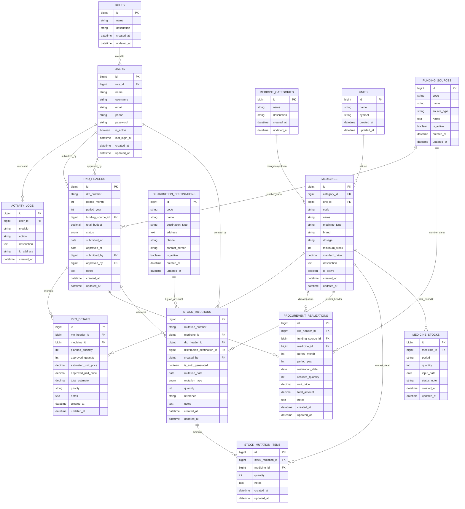

# DB Diagram Monitoring Obat Kontrasepsi

Dokumen ini berisi diagram basis data inti untuk aplikasi monitoring obat kontrasepsi. Diagram difokuskan pada tabel operasional utama aplikasi dan tidak memasukkan tabel bawaan Laravel seperti `cache`, `jobs`, `sessions`, dan `password_reset_tokens`.

## Entity Relationship Diagram

## Keterangan Singkat

- `rko_headers` berfungsi sebagai dokumen utama pengajuan kebutuhan obat per periode.
- `rko_details` menyimpan rincian item obat yang diajukan dan hasil persetujuannya.
- `procurement_realizations` menyimpan data realisasi pengadaan yang terbentuk dari RKO yang disetujui.
- `stock_mutations` menjadi header transaksi mutasi obat, baik mutasi masuk otomatis dari persetujuan RKO maupun mutasi keluar manual.
- `stock_mutation_items` menyimpan rincian item per transaksi mutasi.
- `medicine_stocks` menyimpan snapshot stok per periode untuk kebutuhan monitoring.

## Catatan Implementasi

- Pada schema saat ini, tabel `stock_mutations` masih memiliki `medicine_id` dan `quantity`, sementara rincian transaksi juga disimpan pada `stock_mutation_items`. Jadi, struktur mutasi yang berjalan masih bersifat hybrid antara header ringkas dan detail item.
- Jika diagram ini akan dimasukkan ke BAB IV, bagian ini paling cocok ditempatkan pada subbab analisa basis data atau perancangan basis data.
