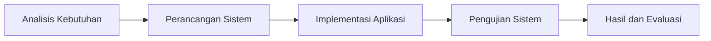
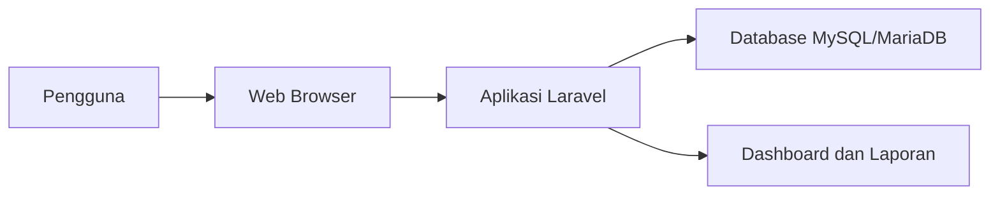
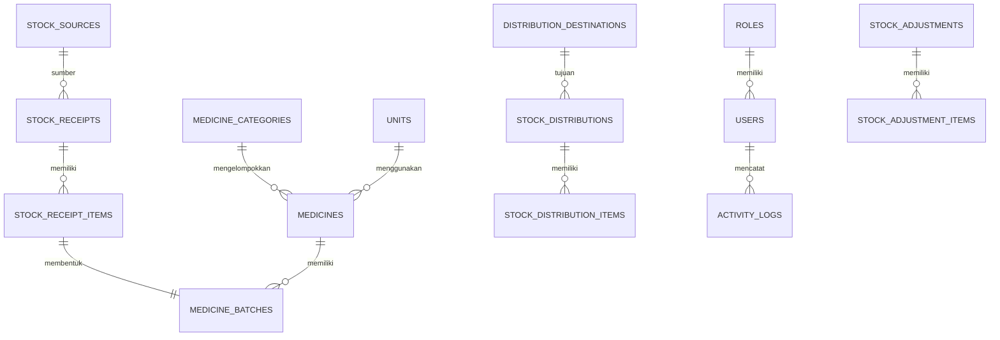
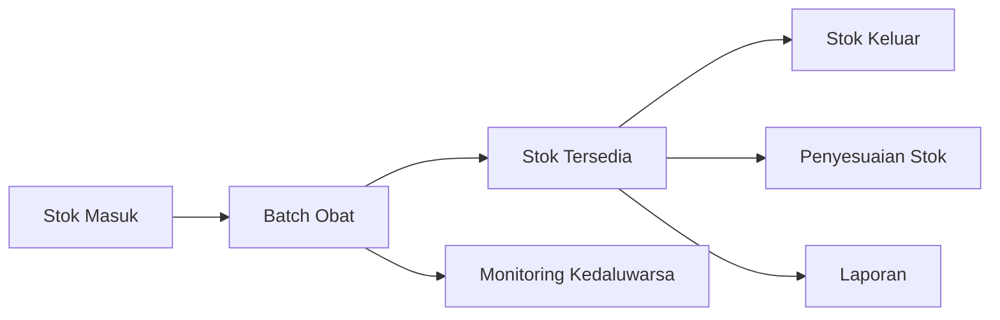
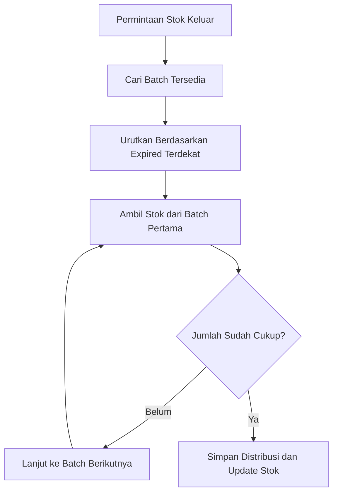

# Rancang Bangun Aplikasi Monitoring Obat Kontrasepsi Berbasis Web Menggunakan Laravel dan MySQL

**Nama Penulis**  
Nama Mahasiswa

**Instansi**  
Program Studi Diploma III, Nama Kampus

**Email**  
email@kampus.ac.id

## Abstrak

Pengelolaan stok obat kontrasepsi pada instansi pelayanan publik memerlukan pencatatan yang akurat, cepat, dan terintegrasi. Proses pengelolaan yang masih dilakukan secara manual berpotensi menimbulkan kesalahan pencatatan, keterlambatan pelaporan, serta kesulitan dalam melakukan monitoring stok secara real-time. Penelitian ini bertujuan untuk merancang dan membangun aplikasi monitoring obat kontrasepsi berbasis web menggunakan framework Laravel dan database MySQL/MariaDB. Metode pengembangan sistem dilakukan melalui tahapan analisis kebutuhan, perancangan basis data, implementasi sistem, dan pengujian fungsional. Hasil penelitian menunjukkan bahwa aplikasi yang dibangun mampu mendukung manajemen data obat, pencatatan stok masuk, pencatatan stok keluar, penyesuaian stok, monitoring batch dan kedaluwarsa, pembuatan laporan, serta pengelolaan pengguna. Dengan adanya aplikasi ini, proses pengelolaan stok obat kontrasepsi menjadi lebih terstruktur, informasi stok dapat diperoleh lebih cepat, dan risiko kesalahan pencatatan dapat diminimalkan.

**Kata kunci:** monitoring stok, obat kontrasepsi, Laravel, MySQL, aplikasi berbasis web

## 1. Pendahuluan

Perkembangan teknologi informasi mendorong berbagai instansi untuk beralih dari sistem manual menuju sistem terkomputerisasi. Salah satu bidang yang membutuhkan dukungan sistem informasi adalah pengelolaan persediaan obat, termasuk obat kontrasepsi. Obat kontrasepsi merupakan bagian penting dalam program keluarga berencana, sehingga ketersediaan stok, ketepatan distribusi, dan pengawasan masa kedaluwarsa perlu dikelola secara baik.

Pada beberapa instansi, pengelolaan stok obat kontrasepsi masih dilakukan menggunakan pencatatan berbasis kertas atau aplikasi spreadsheet sederhana. Cara tersebut memiliki beberapa kelemahan, seperti tingginya risiko kesalahan input, sulitnya melakukan pemantauan stok secara real-time, serta lamanya proses penyusunan laporan. Kondisi ini dapat berdampak pada keterlambatan pengambilan keputusan dan menurunnya efektivitas pelayanan.

Berdasarkan permasalahan tersebut, diperlukan suatu aplikasi monitoring obat kontrasepsi berbasis web yang mampu mendukung proses pencatatan, pengelolaan, monitoring, dan pelaporan dalam satu sistem terintegrasi. Aplikasi ini dibangun menggunakan Laravel sebagai framework backend dan MySQL/MariaDB sebagai basis data.

Secara khusus, penelitian ini menitikberatkan pada kebutuhan pengelolaan stok yang tidak hanya berfokus pada jumlah total obat, tetapi juga pada riwayat pergerakan stok, pencatatan per batch, dan pemantauan masa kedaluwarsa. Karakteristik ini penting karena obat kontrasepsi termasuk barang yang harus dikelola secara hati-hati agar distribusi tepat sasaran dan tidak menimbulkan pemborosan akibat stok kedaluwarsa.

### 1.1 Rumusan Masalah

Permasalahan yang diangkat dalam penelitian ini dapat dirumuskan sebagai berikut:

- bagaimana merancang aplikasi monitoring obat kontrasepsi berbasis web yang mampu mendukung pengelolaan stok secara terintegrasi,
- bagaimana membangun sistem yang dapat mencatat stok masuk, stok keluar, dan penyesuaian stok secara akurat,
- bagaimana menampilkan informasi stok dan kedaluwarsa secara cepat untuk membantu monitoring dan pengambilan keputusan.

### 1.2 Tujuan Penelitian

Tujuan dari penelitian ini adalah:

- merancang sistem informasi monitoring obat kontrasepsi berbasis web,
- membangun aplikasi yang dapat mengelola master data, transaksi stok, dan laporan,
- menyediakan informasi stok obat secara lebih cepat, akurat, dan terstruktur.

### 1.3 Manfaat Penelitian

Manfaat yang diharapkan dari penelitian ini adalah:

- membantu petugas dalam mengelola stok obat kontrasepsi secara lebih efektif,
- mengurangi risiko kesalahan pencatatan dan keterlambatan pelaporan,
- menyediakan informasi yang mendukung proses monitoring dan evaluasi distribusi obat.

## 2. Metode Penelitian

Metode penelitian yang digunakan dalam pengembangan aplikasi ini meliputi beberapa tahapan sebagai berikut:

- analisis kebutuhan sistem, yaitu mengidentifikasi pengguna, proses bisnis, serta fitur utama yang dibutuhkan,
- perancangan sistem, yaitu menyusun struktur basis data, alur proses, dan rancangan antarmuka,
- implementasi sistem, yaitu membangun aplikasi menggunakan Laravel, Blade, dan MySQL/MariaDB,
- pengujian sistem, yaitu menguji fungsi aplikasi dengan metode *black box testing*.

Tahapan penelitian tersebut dilakukan secara berurutan agar sistem yang dibangun sesuai dengan kebutuhan pengguna dan dapat diimplementasikan secara efektif.

Gambar 1. Tahapan penelitian dan pengembangan sistem.

### 2.1 Teknik Pengumpulan Data

Dalam penelitian ini, kebutuhan sistem diperoleh melalui pengamatan terhadap proses bisnis pengelolaan stok, identifikasi data yang diperlukan, serta analisis dokumen pencatatan stok. Teknik pengumpulan data yang dapat digunakan dalam konteks penelitian seperti ini meliputi:

- observasi terhadap alur kerja pengelolaan stok,
- wawancara dengan petugas atau pihak yang terlibat,
- studi pustaka mengenai sistem informasi persediaan, Laravel, dan basis data relasional.

### 2.2 Metode Pengembangan Sistem

Pengembangan aplikasi ini dilakukan dengan pendekatan terstruktur melalui tahap analisis, desain, implementasi, dan pengujian. Pendekatan ini dipilih karena sesuai untuk pembuatan aplikasi administrasi yang memiliki kebutuhan data dan proses bisnis yang jelas.

Tahap analisis dilakukan untuk memahami kebutuhan pengguna dan alur bisnis. Tahap desain digunakan untuk menyusun rancangan basis data, struktur menu, dan modul aplikasi. Tahap implementasi dilakukan dengan menerjemahkan rancangan menjadi kode program. Tahap pengujian dilakukan untuk memastikan setiap fungsi berjalan sesuai tujuan.

### 2.3 Metode Pengujian

Metode pengujian yang digunakan adalah *black box testing*. Pengujian ini dilakukan dengan menguji fungsi-fungsi sistem berdasarkan input, proses, dan output yang dihasilkan. Fokus pengujian ditujukan pada validitas proses simpan data, perubahan stok, tampilan informasi monitoring, dan hasil laporan.

## 3. Hasil dan Pembahasan

### 3.1 Hasil Implementasi Sistem

Hasil dari penelitian ini adalah aplikasi monitoring obat kontrasepsi berbasis web yang dapat diakses melalui browser. Aplikasi yang dibangun memiliki beberapa modul utama, yaitu:

- login dan autentikasi pengguna,
- dashboard ringkasan stok,
- master data obat,
- transaksi stok masuk,
- transaksi stok keluar,
- penyesuaian stok,
- monitoring batch dan kedaluwarsa,
- laporan stok,
- manajemen pengguna,
- log aktivitas.

Sistem juga menerapkan pengelolaan stok berbasis batch sehingga setiap penerimaan obat dapat ditelusuri berdasarkan nomor batch, jumlah stok, dan tanggal kedaluwarsa. Pada proses distribusi stok keluar, sistem menerapkan pendekatan FEFO (*First Expired First Out*), yaitu stok dari batch dengan tanggal kedaluwarsa terdekat akan diprioritaskan terlebih dahulu.

### 3.2 Rancangan Arsitektur Sistem

Aplikasi dibangun dengan arsitektur web berbasis client-server. Pengguna mengakses aplikasi melalui browser, kemudian permintaan diproses oleh aplikasi Laravel pada sisi server. Data transaksi dan master data disimpan ke dalam basis data MySQL/MariaDB. Arsitektur ini dipilih karena mudah diimplementasikan, mendukung akses multi-user, dan sesuai untuk aplikasi administrasi internal.

Gambar 2. Arsitektur umum aplikasi monitoring obat kontrasepsi.

### 3.3 Rancangan Data dan Proses

Rancangan data pada aplikasi dibagi ke dalam tiga kelompok utama, yaitu data master, data transaksi, dan data pendukung audit. Data master terdiri atas data obat, kategori, satuan, sumber stok, tujuan distribusi, role, dan pengguna. Data transaksi terdiri atas stok masuk, batch obat, stok keluar, dan penyesuaian stok. Data audit terdiri atas log aktivitas pengguna.

Struktur data tersebut dibangun agar setiap transaksi dapat ditelusuri kembali. Misalnya, transaksi penerimaan obat akan membentuk batch baru, lalu batch tersebut menjadi sumber pengurangan stok saat distribusi dilakukan. Dengan pola ini, sistem tidak hanya mengetahui total stok, tetapi juga asal stok, umur simpan, dan sisa stok per batch.

Gambar 3. Diagram konseptual data utama aplikasi.

### 3.4 Pembahasan Fitur Utama

Modul master data digunakan untuk mengelola informasi obat, kategori obat, satuan, sumber stok, dan tujuan distribusi. Modul stok masuk digunakan untuk mencatat obat yang diterima dan otomatis membentuk data batch. Modul stok keluar digunakan untuk mencatat distribusi obat ke fasilitas kesehatan dengan pengurangan stok berdasarkan batch. Modul penyesuaian stok digunakan untuk mencatat selisih antara stok sistem dan stok fisik. Sementara itu, modul monitoring digunakan untuk menampilkan kondisi stok terkini, status batch, dan informasi obat yang mendekati masa kedaluwarsa.

Gambar 4. Alur utama pengelolaan stok pada aplikasi.

Fitur login dan hak akses berfungsi untuk memastikan bahwa pengguna hanya dapat mengakses menu yang sesuai dengan perannya. Admin memiliki akses ke seluruh modul, petugas gudang berfokus pada pengelolaan data dan transaksi, sedangkan pimpinan difokuskan pada akses dashboard, monitoring, dan laporan. Pembagian hak akses ini membantu menjaga keamanan data dan keteraturan penggunaan sistem.

Pada modul stok masuk, setiap transaksi penerimaan akan menghasilkan satu atau lebih data batch. Data batch memuat informasi nomor batch, jumlah diterima, jumlah tersisa, dan tanggal kedaluwarsa. Data ini menjadi dasar utama dalam monitoring stok dan distribusi obat. Pada modul stok keluar, sistem memilih batch dengan kedaluwarsa paling dekat menggunakan pendekatan FEFO. Hal ini membantu menurunkan risiko akumulasi obat yang mendekati masa kedaluwarsa.

Pada modul penyesuaian stok, sistem memungkinkan petugas melakukan koreksi berdasarkan hasil stok opname. Proses ini menyimpan jumlah stok menurut sistem, jumlah stok aktual di lapangan, dan selisih keduanya. Dengan demikian, histori perubahan stok tetap tercatat dan bisa digunakan untuk evaluasi.

### 3.5 Implementasi Antarmuka Sistem

Antarmuka sistem dirancang agar mudah digunakan oleh pengguna administratif. Struktur menu disusun berdasarkan kelompok modul, yaitu dashboard, master data, transaksi, monitoring, laporan, manajemen pengguna, dan log aktivitas. Setiap modul menyediakan fitur pencarian dan filter untuk mempermudah pengguna dalam menelusuri data.

Pada halaman dashboard, pengguna dapat melihat ringkasan jumlah stok, obat yang menipis, batch yang hampir kedaluwarsa, serta aktivitas terbaru. Halaman master data digunakan untuk melakukan pengelolaan data referensi. Halaman transaksi digunakan untuk mencatat stok masuk, stok keluar, dan penyesuaian. Halaman monitoring digunakan untuk melihat stok terkini, informasi batch, dan kartu stok. Halaman laporan digunakan untuk melihat hasil rekapitulasi data berdasarkan periode tertentu.

### 3.6 Hasil Implementasi Logika FEFO

Implementasi FEFO menjadi salah satu poin penting dalam aplikasi ini. Pada saat pengguna melakukan transaksi stok keluar, sistem tidak langsung mengurangi stok total pada data obat, melainkan mencari batch yang masih tersedia dan memiliki tanggal kedaluwarsa paling dekat. Jika jumlah permintaan melebihi stok pada batch pertama, sistem akan melanjutkan pengambilan ke batch berikutnya sampai jumlah permintaan terpenuhi.

Dengan pendekatan tersebut, aplikasi tidak hanya berfungsi sebagai pencatat transaksi, tetapi juga sebagai alat bantu pengambilan keputusan operasional. Penerapan FEFO sangat relevan untuk barang medis karena kualitas pengelolaan stok sangat dipengaruhi oleh masa simpan produk.

Gambar 5. Proses pengeluaran stok berdasarkan metode FEFO.

### 3.7 Pengujian Sistem

Pengujian sistem dilakukan menggunakan metode *black box testing* untuk memastikan bahwa setiap fungsi berjalan sesuai kebutuhan. Pengujian dilakukan pada fitur login, pengelolaan master data, pencatatan stok masuk, pencatatan stok keluar, penyesuaian stok, monitoring, laporan, dan manajemen pengguna.

Secara umum, hasil pengujian menunjukkan bahwa fitur-fitur utama sistem dapat berjalan dengan baik. Sistem mampu mencatat transaksi stok, memperbarui stok secara otomatis, menampilkan informasi stok secara real-time, dan menghasilkan laporan sesuai data yang tersimpan.

Tabel 1. Ringkasan hasil pengujian sistem.

| No | Modul | Skenario Uji | Hasil |
| --- | --- | --- | --- |
| 1 | Login | Pengguna masuk dengan akun valid | Berhasil |
| 2 | Master Data | Tambah dan ubah data obat | Berhasil |
| 3 | Stok Masuk | Simpan transaksi penerimaan obat | Berhasil |
| 4 | Stok Keluar | Simpan distribusi dan kurangi stok batch | Berhasil |
| 5 | Adjustment | Simpan penyesuaian stok | Berhasil |
| 6 | Monitoring | Tampilkan stok dan batch kedaluwarsa | Berhasil |
| 7 | Laporan | Tampilkan laporan stok dan transaksi | Berhasil |

Selain pengujian ringkas di atas, dilakukan pula pengujian fungsional pada proses-proses yang berkaitan langsung dengan perubahan stok. Pengujian ini penting karena kualitas aplikasi tidak hanya ditentukan oleh kemampuan menyimpan data, tetapi juga oleh kemampuan sistem menjaga konsistensi jumlah stok setelah transaksi dilakukan.

Tabel 2. Ringkasan skenario pengujian fungsional.

| No | Skenario Pengujian | Hasil yang Diharapkan | Status |
| --- | --- | --- | --- |
| 1 | Simpan stok masuk dengan data batch | Batch baru terbentuk dan stok tersimpan | Berhasil |
| 2 | Simpan stok keluar dengan stok cukup | Stok batch berkurang sesuai jumlah distribusi | Berhasil |
| 3 | Simpan stok keluar dengan stok tidak cukup | Sistem menolak transaksi | Berhasil |
| 4 | Simpan penyesuaian stok | `qty_remaining` berubah sesuai stok aktual | Berhasil |
| 5 | Tampilkan monitoring batch | Sistem menampilkan status aman, hampir kedaluwarsa, atau kedaluwarsa | Berhasil |
| 6 | Tampilkan laporan periode tertentu | Sistem menampilkan data sesuai filter | Berhasil |

### 3.8 Analisis Hasil Pengujian

Berdasarkan hasil pengujian, aplikasi menunjukkan bahwa fungsi utama berjalan sesuai kebutuhan. Modul master data mampu menyimpan dan memperbarui data dengan baik. Modul transaksi mampu mengubah stok sesuai proses bisnis yang ditetapkan. Modul monitoring mampu menyajikan informasi stok yang berguna bagi pengguna. Modul laporan juga dapat menampilkan data rekapitulasi yang mendukung proses evaluasi.

Dari sisi integritas data, penggunaan basis data relasional dan relasi antartabel membantu menjaga konsistensi antara data obat, batch, dan transaksi. Dari sisi operasional, pendekatan batch dan FEFO memberikan nilai tambah dibanding pencatatan stok total biasa, karena pengguna dapat mengetahui stok secara lebih rinci dan akurat.

Namun demikian, sistem ini masih dapat dikembangkan lebih lanjut, misalnya dengan penambahan fitur ekspor laporan, notifikasi stok minimum, notifikasi batch hampir kedaluwarsa, atau integrasi dengan sistem eksternal lain.

### 3.9 Keterangan Gambar yang Dapat Ditambahkan

Bagian ini dapat diisi dengan screenshot hasil implementasi aplikasi saat jurnal akan difinalkan. Beberapa gambar yang disarankan antara lain:

- Gambar 6. Tampilan halaman login aplikasi.
- Gambar 7. Tampilan dashboard monitoring stok.
- Gambar 8. Halaman transaksi stok masuk.
- Gambar 9. Halaman transaksi stok keluar.
- Gambar 10. Halaman monitoring batch dan kedaluwarsa.
- Gambar 11. Halaman laporan stok obat.

## 4. Kesimpulan

Berdasarkan hasil penelitian, dapat disimpulkan bahwa aplikasi monitoring obat kontrasepsi berbasis web yang dibangun menggunakan Laravel dan MySQL/MariaDB mampu membantu proses pengelolaan stok obat secara lebih terstruktur dan terintegrasi. Sistem ini mendukung pencatatan stok masuk, stok keluar, penyesuaian stok, monitoring batch dan kedaluwarsa, serta penyusunan laporan. Dengan adanya aplikasi ini, proses monitoring stok menjadi lebih cepat, risiko kesalahan pencatatan dapat dikurangi, dan informasi yang dibutuhkan pengguna dapat diperoleh secara lebih efektif.

Secara teknis, penerapan Laravel mempermudah pengembangan aplikasi dari sisi struktur kode, pengelolaan route, validasi data, serta integrasi dengan basis data. Penggunaan MySQL/MariaDB mendukung penyimpanan data transaksi dan relasi antarentitas secara konsisten. Implementasi batch dan metode FEFO juga memberikan nilai praktis yang penting pada pengelolaan stok obat kontrasepsi, karena sistem dapat membantu distribusi stok secara lebih tepat.

Dengan demikian, aplikasi yang dibangun tidak hanya berfungsi sebagai alat pencatatan, tetapi juga sebagai media monitoring dan pengendalian stok yang lebih sistematis. Aplikasi ini dapat dijadikan dasar untuk pengembangan sistem yang lebih luas pada pengelolaan logistik kesehatan.

## 5. Saran

Saran pengembangan untuk penelitian selanjutnya antara lain:

- menambahkan fitur ekspor laporan ke PDF atau Excel,
- menambahkan notifikasi otomatis untuk stok minimum dan batch hampir kedaluwarsa,
- menambahkan grafik statistik distribusi obat,
- mengintegrasikan sistem dengan modul logistik atau pelaporan lainnya.

## Daftar Pustaka

- Abdul Kadir. 2003. *Pengenalan Sistem Informasi*. Yogyakarta: Andi.
- Jogiyanto. 2005. *Analisis dan Desain Sistem Informasi*. Yogyakarta: Andi.
- Romney, Marshall B. dan Paul John Steinbart. 2015. *Accounting Information Systems*. Pearson.
- Pressman, Roger S. 2010. *Software Engineering: A Practitioner’s Approach*. New York: McGraw-Hill.
- Dokumentasi Laravel. [https://laravel.com/docs](https://laravel.com/docs)
- Dokumentasi MariaDB. [https://mariadb.com/docs](https://mariadb.com/docs)
